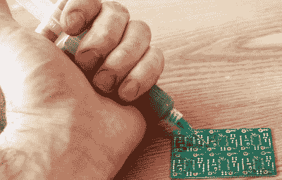
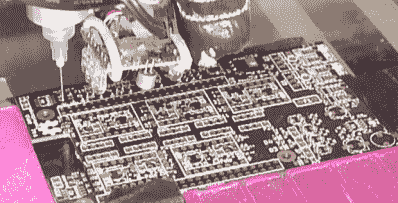
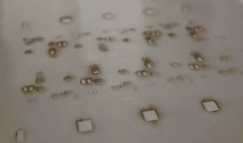
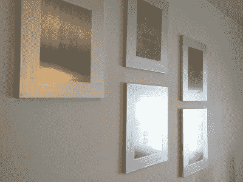
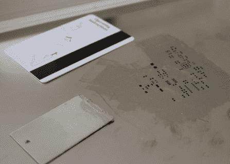
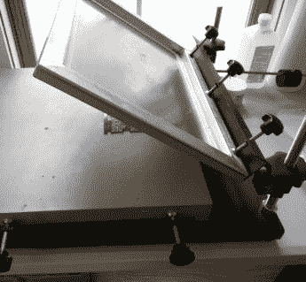

# 行业工具-锡膏分配

> 原文：<https://hackaday.com/2016/03/10/tools-of-the-trade-solder-paste-dispensing/>

电路板组装的一般过程是这样的:你订购你的印刷电路板。您还可以订购组件。对于表面贴装元件，将焊膏涂在焊盘上，将元件放在上面，然后加热电路板，使焊膏流动并进行焊接。然后，对于通孔元件，将引线穿过通孔，用烙铁或焊料波或浸液焊接。然后你检查缺陷，给微控制器编程，最后测试完成的电路板以确保一切正常运行。

棘手的部分在于数量。如果你只做几块板，手工组装通常是最简单的。在你通常外包的数千个中。但是新工具和廉价的黑客工具，使得小批量自动化变得更加容易，并且在外包组装之前扩大到数千个。

在这个新系列中，我们称之为*行业工具*，我们将涵盖各种用于构建产品的工具，我们将从电路板组装开始。让我们研究一下我们的行业工具:锡膏分配。

一般理论是，你需要一桶(或注射器)锡膏，它基本上是焊剂和焊料的粘性悬浮液，并将其以一致的厚度施加到 PCB 的焊盘上。事实证明有很多方法可以做到这一点。

## 手动注射器

将焊膏放在 PCB 上最简单的方法就是使用注射器，小心地在焊盘上放一小滴。不需要额外工具。

在间距很小的微控制器上，你可以沿着边的长度用一个小珠逃脱，一般来说，锡膏会直接流到焊盘上，然后分开，没有太多桥接。这种快速简单的方法的缺点是注射器不容易用拇指按压。用大板子会很累，你的手会变成抽筋的手臂残肢。有些人通过使用[一个线性杆和开关来做推动动作](http://hackaday.com/2016/02/03/solder-paste-dispenser-has-no-3d-printed-parts/)来解决这个问题，这是一个很好的解决方案，但我认为当你需要这个解决方案时，你应该升级到其他东西。

## 自动注射器

其他人则着眼于能够将组件精确放置在正确位置的拾取和放置机器，以及便宜且易于制造、非常擅长挤压材料的 3D 打印机。他们想:为什么不让 3D 打印机把浆糊放下来呢？一些[公司已经尝试了这种](http://hackaday.com/2015/01/09/circuit-printers-voltera-and-voxel8/)，有几家公司甚至铺设了整个 PCB 和走线。这对于小批量和原型非常有用，并且与 PCB 布局软件的集成使得从计算机设计到粘贴电路板的过渡非常顺利。

然而，注射器的问题在于它们既慢又不精确。很难控制分配的浆料量，如果喷嘴对于精细间距的元件来说足够小，它将无法在较大的焊盘上快速分配。将注射器握在手中加热到它自己渗出的程度，但如果温度不够高(因为你将其储存在冰箱中以延长寿命)，那么将它从注射器中取出就像用拇指做卧推，自动化注射器也有类似的问题。这种未知的粘度使得以任何精度自动分配都非常困难。让我们跳过注射器，转到屏幕上。

## 屏幕

屏幕背后的想法是有一个薄的材料，在你想要粘贴的地方有孔。你拿一滴焊锡膏和一个橡胶滚轴，把焊锡膏放进孔里。在电路板上对齐屏幕并保持对齐有点棘手，但应用速度非常快，不管电路板是密集分布还是只有几个元件，这都是非常有效的粘贴应用方法。

## 3D 打印屏幕

是的，这是可能的。你可以做一个 0.1 毫米厚的层，这是正确的厚度，但它真的只适合大焊盘，当你有很多这样的密集板。否则做点别的。

## 聚酯薄膜屏幕

A test run on a mylar screen that turned out poorly.

这种方法包括激光切割大约 0.005”厚的聚酯薄膜片。如果你有激光切割机，并且只做几块板，那么[这种方法非常棒(尤其是阅读评论)](http://hackaday.com/2014/06/27/how-to-laser-cut-mylar-solder-stencils/)。你导出粘贴层到 DXF，导入到你的刀具，然后开始。应该注意几件事:焦点需要对准，否则你的边角不会很好，功率水平需要足够高，以消除聚酯薄膜，但又不能高到熔化边缘。我还发现雕刻比切割效果更好，因为它只是炸开你不想要的部分，而不会花任何时间停留在会融化边缘的地方。

这种方法的缺点是屏幕很脆弱。对于精细间距，你最好只做一个整个边大小的矩形，因为单个焊盘上的分隔符会断开。我已经成功地重复使用了一个聚脂薄膜屏幕大约 100 次，但是你不应该期望使用超过 25-50 次，直到橡胶滚轴的压力最终将它损坏。

如果你没有激光切割机，网上有[服务](https://www.oshstencils.com/)，[会为你制作聚酯薄膜屏幕](https://www.pololu.com/product/446)。

## 铝罐屏

我们已经介绍了聚酯薄膜的下一个步骤，蚀刻铝罐或铣削铝罐。这为焦炭和酸或磨的成本提供了一个强有力的金属屏障。不过，这种方法有两个明显的问题；你被限制在一块罐头大小的木板上，但你还必须想出如何将一个圆柱体变成一个喜欢保持扁平的平板。

## 不锈钢屏

Photo courtesy of Austin Bialk

一些 PCB 制造商开始提供与电路板一起运输的不锈钢激光切割屏幕，只要多付几美元，它们甚至会装在铝框架中。就节省的成本和精力而言，这是目前最好的选择。屏幕经久耐用，极其精确，这是大公司在工厂里使用的技术。这是商业方法真正变得对业余爱好者开放的地方。我会提供一些缺点，但没有。他们甚至制作长城艺术品。

## 将浆糊涂到屏幕上

假设你有一个屏幕，有相当多的技术将粘贴到屏幕上。最简单的方法是在你刮的时候用胶带把东西固定住。只需用胶带将一块裸露的电路板粘住，然后用胶带将屏幕覆盖在上面。橡胶扫帚可以是任何东西，从剃须刀片(我最喜欢的)到油灰刀，甚至是一把旧的酒店钥匙，效果出奇的好。

    

当你达到一个点，体积是重要的，有丝网印刷夹具将举行屏幕。他们可能很难调整一个完美的平面和可重复的粘贴体验，但他们做的工作。幸运的是，位置精度不必绝对完美，因为焊料会流向焊盘。在工厂里，他们通常会使用自动机器用橡胶滚轴来涂膏。这些机器也是直列式的，这意味着你把一个裸露的 PCB 放在一边的槽里，它就在传送带上通过机器，从另一边出来，直接进入取放机。

一旦你在板上粘贴好了，就该放置组件了，这是下一篇文章的主题。