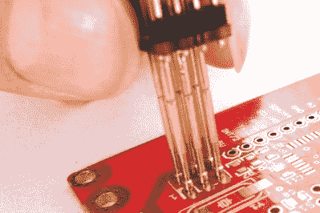
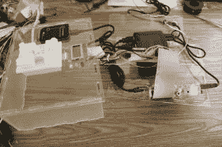
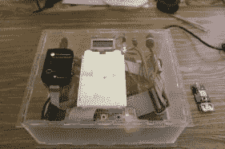
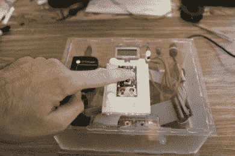
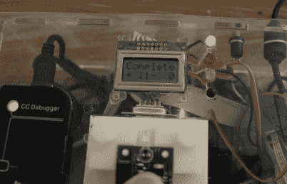
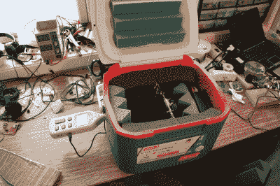

# 行业工具——测试和编程

> 原文：<https://hackaday.com/2016/08/24/tools-of-the-trade-test-and-programming/>

在行业工具的最后一部分(关于电路板组装)，我们将看看电路板是如何测试和编程的。在此过程中，电路板已经与通孔和表面贴装元件完全组装在一起，需要在装运或放入机箱之前进行验证。我们可能已经在之前的[电路板](http://hackaday.com/2016/06/29/tools-of-the-trade-inspection/)检查中处理了一些验证步骤，但这一步是测试最终的 PCB。根据规模、预算和复杂程度，有各种方法来剥这只猫的皮。

## 希望

这是 PCB 测试和验证最不可靠的方法，但基本上意味着一旦电路板组装完成，你不需要测试，只需假设它会工作。诚然，一些电路足够简单，它们的装配足够可靠，这可能会工作一段时间，并且故障率是可以接受的，不需要花钱测试。或者，产品很便宜，而你是从中国销售的，所以如果它到了，但不起作用，消费者会很恼火，但不会要求退款。有多少次你在阿里巴巴或易贝上买了东西，到货后却发现无法使用？是的，他们可能使用了 PCB 测试的“希望”方法。

## 插上电源

接通电源。它打开并闪烁吗？你可以走了。这是最简单的功能测试形式，适用于简单的电路。功能测试意味着应用输入并验证输出。如果该板有一个简单的电源，只有一两个功能，并且没有微控制器或代码需要上传，那就太好了。

## 测试夹具

这比插上电源要复杂得多；在这种情况下，一个特殊的硬件被设计成以某种方式与电路板匹配，并通过一些测试。如果船上有某种传感器，它可以测试该传感器并验证输出。例如，烟雾报警器的测试夹具可以是一个充满烟雾的盒子。你把电池放进去，放进盒子里，看看它是否会发出嗡嗡声。一个更复杂的夹具可能有弹簧针或伺服驱动开关或其他方式与电路板互动，以验证它的工作。

 [https://www.youtube.com/embed/QnO6NLGidKI?version=3&rel=1&showsearch=0&showinfo=1&iv_load_policy=1&fs=1&hl=en-US&autohide=2&wmode=transparent](https://www.youtube.com/embed/QnO6NLGidKI?version=3&rel=1&showsearch=0&showinfo=1&iv_load_policy=1&fs=1&hl=en-US&autohide=2&wmode=transparent)

## 编程；编排

上述方法对于便宜的电路是有用的，并且可能是足够的。但许多 PCB 都有微控制器，这增加了整体难度，因为微控制器需要编程，电路在不同状态下会有不同的表现。测试和编程夹具很快变得有趣多了。应该注意的是，通过让芯片制造商装运已经具有固件的芯片，可以完全避免部分复杂性。大多数主要制造商都提供这项服务。这有几个原因:它降低了装配线的复杂性，它确保了芯片来自单一的可信供应商，并且没有额外的单元在鬼班中制造，它防止了工厂窃取设计或将其出售给其他人，因为他们永远无法访问固件。不过，这种方法是有成本的，一般来说，除非您的卷非常大，并且您的固件被锁定并且不会更改，否则您不会这样做。这是大男孩的做法。低于这个，就要自己编程了！

Pogo pin adapter for programming AVR. This one was [designed by Femtocow and is sold on Tindie](https://www.tindie.com/products/FemtoCow/pogo-pin-icsp-spi-programmer-adapter/)

那么，如何对你的设备进行编程呢？这个嘛，要看芯片厂商了。Atmel，Microchip，TI，飞思卡尔；他们都有自己喜欢的编程方法，无论是 AVRISP、CC 调试器、JTAG 还是其他什么。大多数情况下会有某种类型的头部接口，有时用连接器填充。最好不要使用该连接器，因为它可能只使用一次，是一个额外的元件，会占用大量电路板空间。更好的选择是边缘连接器或弹簧针排列。与常规连接器相比，pogo 引脚选项的便利之处在于，您可以在 PCB 上留下一些裸露的焊盘，并使用带有一些弹簧引脚的特殊器件来按压 PCB 并上传代码。

用于进行编程的硬件通常在逐个设备的基础上进行处理。在某些情况下，可以将一块 PCB 板(可能是 2×2)压在一个大弹簧针床上，所有的 PCB 同时被编程，使这一步变得很快。在其他情况下，单个 PCB 的夹具处理工作。通常没有固件编程的记录，程序员只是在每次插入芯片时盲目地将代码转储到芯片上。

根据我的经验，我已经制作了相当智能的夹具，价格大约为 100 美元。raspberry pi 或廉价的 android 平板电脑运行它，python 脚本充当 UI，带有弹簧针的定制 3D 打印夹具是 PCB 的接口，通过 CC 调试器或 AVRISP 编程器连接。一个非常有用的特性是日志记录；每个设备都有一个 MAC 地址或唯一的 ID，在编程过程中，Python 脚本获取该 ID 并创建一个记录，记录时间、固件版本和任何其他有用的信息。然后，该记录会被添加到我们的主器件数据库中，这样我们就可以从 PCB 首次编程的那一刻起就对其进行跟踪和支持。

  The complete programmer  Disassembled, the programmer contains a Raspberry Pi, USB hub, CC-Debugger, USB thumb drive, custom electronics, and the pogo pin 3D printed holder.  Ready and waiting for another device to program.  The device is automatically detected and programming starts immediately.  Once complete, the LED changes to Red or Green, and the display updates the success counter.

查看这一步的周期时间很重要。每一秒钟加起来都很快，所以这一步执行得越快越好。这意味着不要每次都编译它(就像用 Arduino 编程一样)。程序员通常有一个可选的验证步骤，以确保微控制器获得代码，但需要 20 秒或更长时间。如果您成功地对每个器件进行了编程，您真的需要执行验证步骤吗？稍后的功能测试将显示代码是否失败。寻找 10 秒或更短范围内的编程周期时间。这就是为什么同步编程会如此吸引人。虽然它增加了程序员的成本，但它可以大大减少所需的时间。

## 功能测试

一旦设备被编程，最好对其进行额外的测试。一般来说，你可以假设软件不需要在每个设备上测试；它已经在实验室进行了彻底的测试，应该可以正常工作(对吗？对吗？).你想要的是确保硬件的所有特性正确地执行软件。仔细检查 PCB 并开发一个测试来检查每个模块。首先，检查设备是否通电。如果没有，就没有必要测试 PCB 的其余部分。向操作者警告失败和原因，让他们把它扔进返工箱中以备后用。下一步测试微控制器是否正常工作。然后让它通过预期使用的不同端口进行通信，如 UART、USB、I2C 或其他端口。然后让它与传感器交互，并验证传感器是否按预期返回值。翻转所有输出并验证其工作正常，施加输入并确保其读数正确。让它打开船上的任何无线组件，通过无线与设备通信，并验证它是否工作。对于电路的每一个部分，你都应该做一些测试来验证它的工作，并且你可以用你的测试夹具来发挥你的创造力。如果你不能测试它，你应该首先长时间地问为什么它会出现在黑板上。

The calibrator runs all the functional tests once the device is placed in the container; testing a microphone, verifying sensors and communication over Zigbee and USB. The cycle time is about 3 minutes, but two devices go in the box at a time.

在一个项目中，我有一个带 LED 和光敏电阻的传感器。在测试过程中，我们将器件放入测试夹具(一个暗箱)中，并在 LED 打开和关闭的情况下测量光敏电阻的值。通过这种方式，我们验证了两个组件都在工作。虽然我们可以在测试夹具上放置一个 LED 和光敏电阻来独立验证这两个组件，但这是一个简单的解决方案，可以降低硬件要求，并将任何潜在问题缩小到两个组件中的一个，如果测试失败，这两个组件都很容易调试。这个盒子还播放各种音量的音调来测试和校准麦克风，检查 I2C 上的温度和湿度传感器的合理值，连接到 ZigBee 网络，并在通过 USB 与测试人员交谈的同时完成所有这些工作，有效地验证硬件的每个组件，并将所有校准值存储到数据库中，同样与设备的 MAC 地址相关联。

## 边界扫描检查，JTAG

一些更好的芯片将会有更好的测试能力。BGA 器件很难成功测试。边界扫描检查是通过单个 JTAG 接口测试这些小芯片的方法之一。它允许您运行测试，在更低的级别控制每个引脚的值。只有与 JTAG (IEEE 1149.1 兼容设备)兼容的芯片才能成为边界扫描的一部分，因为这些芯片具有特殊的引脚，当连接到 JTAG 时，这些引脚会覆盖核心逻辑，并将其引脚暴露给 JTAG 测试。通过测量走线另一端的值，边界扫描检查可以测量是否存在短路、开路，测试一些不符合 1149.1 的电路板元件，甚至验证连接到引脚的无源器件是否存在。如果你正在做高兆赫处理器，FPGAs，或者昂贵的芯片，或者你的主板已经使用 JTAG 编程，那么这种测试方法可能适合你。

## 其他类型

我们现在不包括 X 射线、AOI 或飞针测试。对于流程的这个阶段，这些都是完全正常的测试类型，但是我们已经在关于检查的贸易文章的[之前的工具中讨论过它们。](http://hackaday.com/2016/06/29/tools-of-the-trade-inspection/)制造商将根据电路板的复杂程度和客户的规格，在流程的不同阶段采用不同的测试方法。

## 简化测试/编程的技巧

*   知道如何对设备进行编程，并公开所需的连接，这样就很容易做到。这可能是电路板边缘连接器、. 1”接头或 pogo 引脚的裸焊盘，但在电路板布局布线时应考虑到这一点。
*   制定测试电路每个元件的计划。
*   在测试阶段收集数据。你以后可能需要这个。
*   把你的测试点放在黑板的一边。对吉格舞来说，两边都做真的很难。

如果您对本系列贸易文章中的其他工具感兴趣，我们有:

[行业工具——锡膏点胶](http://hackaday.com/2016/03/10/tools-of-the-trade-solder-paste-dispensing/) [行业工具——元件贴装](http://hackaday.com/2016/05/10/tools-of-the-trade-component-placing/) [行业工具——回流](http://hackaday.com/2016/06/02/tools-of-the-trade-reflow/) [行业工具——检验](http://hackaday.com/2016/06/29/tools-of-the-trade-inspection/) [行业工具——通孔组装](http://hackaday.com/2016/07/22/tools-of-the-trade-through-hole-assembly/)