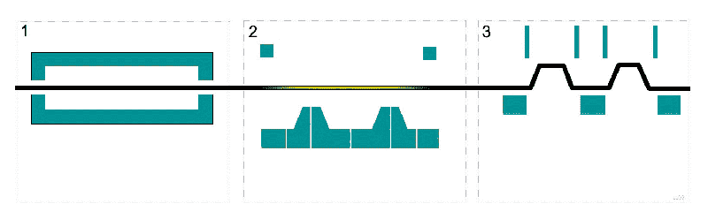
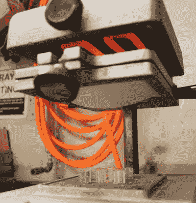
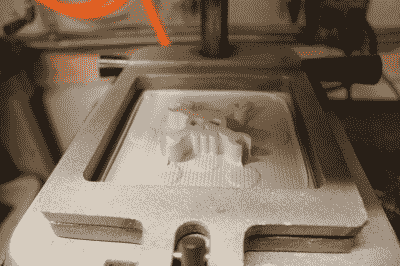

# 行业工具–热成型

> 原文：<https://hackaday.com/2016/12/22/tools-of-the-trade-thermoforming/>

很有可能你已经因为热成型失去了一些血液，热成型是一种塑料制造工艺，它将平板材料变成无法打开的蛤壳包装、盒子里的托盘、塑料杯或剩余的食物容器。除了是拆箱危险的一个来源之外，它实际上是你的制造工具箱中的一个有用的技术。在这一期的《行业工具》中，我们来看看热成型技术是如何应用在产品中的，以及你如何自己动手。

工艺简单；取一张塑料材料，通常很薄，但可以厚到 1/8 英寸，加热使其柔软柔韧，放在模具上，说服它接受模具的所有轮廓，冷却，从模具中取出，然后从板材上切下。细节就不用说了。

[https://commons.wikimedia.org/wiki/File:Thermoforming_animation.gif](https://commons.wikimedia.org/wiki/File:Thermoforming_animation.gif)

## 塑料的

用于热成型的塑料是热塑性塑料:在一定温度以上变软，冷却后变硬的塑料。如果你看看你的食物容器，你会看到体育家庭。ABS 和 PLA 因其精确的热塑性而成为 3D 打印的最爱，也常用于热成型。如果你想做一个只有几个平面的外壳，可以考虑用一层毛细胞 ABS。(“毛细胞”是指一面的纹理，它隐藏了塑料中的缺陷。)对于薄塑料，材料是成卷的，但是对于较厚的材料，原料是切片的。

## 热

In this tiny thermoforming machine, the heating element is above the plastic, which has bowed, indicating it is ready.

After the sheet is heated, it drops down onto the mold and a vacuum sucks out the air.

在大多数热成型机中，有一个大烤箱悬浮在板材上方。烤箱的加热元件将位于材料上方，这一点很重要，因为当材料变热时，它会在自身重量的作用下下陷。如果元素在下面，塑料在升温时会越来越靠近，这就更有可能在其余材料达到温度之前燃烧。

温度对热塑性塑料来说至关重要，因为塑料是固态还是燃烧状态的范围很窄。这很容易破坏材料，尤其是如果它是透明的或白色的，并且由于过热而变色。

可以用热风枪或吹风机加热，但是不要在任何一点上停留太久，尽量让所有东西均匀受热。手动热成型的时候，一般看一下下垂多少就知道什么时候可以上模了。

## 模子

[https://videopress.com/embed/AaCfVGSn?hd=1&cover=1&loop=0&autoPlay=0&permalink=1&muted=0&controls=1&playsinline=0&useAverageColor=0](https://videopress.com/embed/AaCfVGSn?hd=1&cover=1&loop=0&autoPlay=0&permalink=1&muted=0&controls=1&playsinline=0&useAverageColor=0)