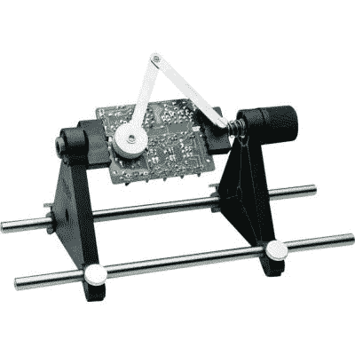
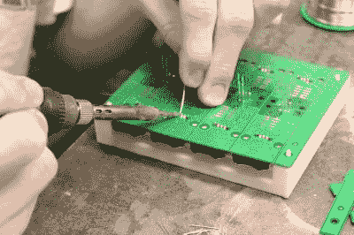

# 行业工具——通孔组件

> 原文：<https://hackaday.com/2016/07/22/tools-of-the-trade-through-hole-assembly/>

在我们上一期的行业工具中，我们刚刚完成了对 PCB 表面贴装部分的[检查。下一步是通孔元件。根据 PCB 的不同，顺序可能略有不同，但一般来说，在进行通孔工作之前完成所有 SMT 工作更有意义。](http://hackaday.com/2016/06/29/tools-of-the-trade-inspection/)

通孔曾经是标准，但是随着尺寸减小和自动化需求的增加，SMT 获得了青睐。然而，仍然有很多理由使用通孔元件，所以它们不会完全消失(至少不会很快消失)。THT 的最大优势之一是机械强度，这使得它比 SMT 更适合连接器。如果你曾经通过深呼吸将 microusb 连接器从 PCB 上弹出，你就会明白了。那么，我们如何最有效地获得 PCB 上的通孔元件，大公司是如何做到的呢？

## 用手

大多数人都是这样开始的，甚至在大规模生产中仍然出奇的普遍。其中一个工具是帮手，它可以在你焊接时握住你的印刷电路板。不过，这些工具很快就会变得笨重，所以下一步是专用的 PCB 夹持工具，它有导轨和开槽橡胶件，可以夹持 PCB 的边缘。

A PCB holder with arm for holding a component in place while soldered.

不过，这两种方法的一个问题是，通常必须将元件放在一侧，然后在另一侧焊接，因此当您翻转 PCB 时，元件很容易掉出。有很多方法可以解决这个问题，从插入时弯曲引线(或 DIP 封装上的对角)，到在顶部简单焊接以将其固定，然后在另一侧完成。

其他人则采用了更具创造性的解决方案，包括[钉床方法](http://hackaday.com/2016/06/27/pinjig-soldering-clamp-has-pins-seized-by-airport-security/)，或者在 PCB 翻转并用手焊接时将零件固定在适当位置的泡沫。

有时，您需要将一个元件从电路板上移开，并且它必须与电路板保持相同的高度。在这种情况下，一种选择是在一根或多根引线周围使用支架。另一种方法是设计一个夹具，作为 PCB 的负片。它是机械加工或 3D 打印的，然后将夹具放置在 PCB 上。当线对翻转过来时，元件下降到正确的高度(或停留在原来的位置)，可以用手焊接。

A 3D printed jig with pockets for components at the correct depths holds everything in place while being soldered.

## 自动放置

令人惊讶的是，有工具可以自动放置通孔元件。如果你考虑 LED 面板的话，这也许并不奇怪。这些户外标志使用通孔 led，一些快速的数学运算使人得出结论，自动放置 led 是必要的。

一些发光二极管贴在胶带上，机器在胶带处切断引线，将发光二极管放在需要的地方。然而，许多 led 装在袋子里，放在一个漏斗里，漏斗旋转并吐出一排 led，所有的 led 都朝向正确的方向。在这两种情况下，LED 都被传送到切割引线并将 LED 放入孔中的台架上。电阻器或其他轴向引线元件也是如此。

 [https://www.youtube.com/embed/2sm_qdeconI?version=3&rel=1&showsearch=0&showinfo=1&iv_load_policy=1&fs=1&hl=en-US&autohide=2&wmode=transparent](https://www.youtube.com/embed/2sm_qdeconI?version=3&rel=1&showsearch=0&showinfo=1&iv_load_policy=1&fs=1&hl=en-US&autohide=2&wmode=transparent)

## 焊料罐

想象一个咖啡杯大小的容器，周围有加热元件。然后在里面放一条焊料。没有助焊剂，只有一块焊料。加热直到它融化，你就有了一个焊料锅。这有利于将 PCB 的边缘浸入(不是全部，只是底部)以使连接器的引脚焊接。你需要先在 PCB 上涂上助焊剂，因为焊料罐里没有助焊剂。这种方法非常适合某些体积和尺寸，在这种情况下，您可能只有一两个连接器需要连接到完全 SMT PCB，但如果您想要在更大的 PCB 上进行大量连接，则需要使用波峰焊机。

顺便说一句，锡罐也是从 PCB 中回收元件的好工具，因为它们可以从底部快速加热整个元件，使其易于拆卸、清洁，并且元件过热的危险最小。

我们之前已经讨论过[危险的自制焊料罐](http://hackaday.com/2012/04/25/homebrew-solder-pot-is-too-dangerous-even-for-us/)，但是如果你想要的话，你应该买一个二手的。

## 波浪

波峰焊机用泵将熔化的焊料推过一个长通道，这样就有一个细长的焊料喷泉上升几毫米。然后，沿着某种传送带拖动 PCB，使喷泉刚好接触到涂有助焊剂的 PCB 的底部，波立即附着在通孔焊盘和引脚上，使连接非常漂亮。如果底部没有组件，这是一个容易自动化的过程。如果底部有组件，则需要首先对其进行遮罩。

 [https://www.youtube.com/embed/CaKHGVoLWMM?version=3&rel=1&showsearch=0&showinfo=1&iv_load_policy=1&fs=1&hl=en-US&autohide=2&wmode=transparent](https://www.youtube.com/embed/CaKHGVoLWMM?version=3&rel=1&showsearch=0&showinfo=1&iv_load_policy=1&fs=1&hl=en-US&autohide=2&wmode=transparent)

波峰焊机和焊料池之间的私生子是浸焊机。你把你的 PCB 放在一个金属框架上，框架浸到一片熔化的焊料上，直到底部接触到焊料，然后抬起来。这是一个非常简单的机制，不占用太多空间，但电路板仍然需要在下面涂上助焊剂。

## 结论

通孔还是有位置的，即使在大规模生产中也很常见。虽然世界正朝着表面贴装发展，但使用通孔仍有完全合理的理由(尤其是连接器和高功率应用)。手工操作特别容易，随着生产规模的扩大，有一些工具可以让这变得更容易。我们还没有看到自制的波峰焊工具；焊料锅是大规模生产通孔零件的 DIY 工具，但它们完全能够处理相当大的量。