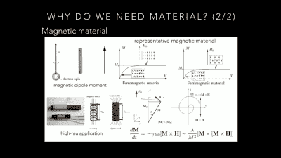
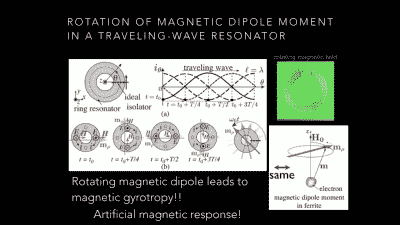
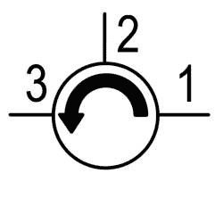
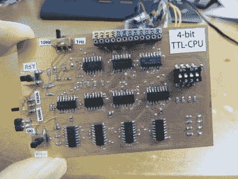

# 小寺俊郎:电磁陀螺

> 原文：<https://hackaday.com/2017/01/04/toshiro-kodera-electromagnetic-gyrotropes/>

通过观看黑客日超级大会的演讲，我们学到了很多东西。尽管如此，学习全新的东西还是很少见的。微波工程师、教授和疯狂黑客[Toshiro Kodera]就他目前正在做的一些研究做了一个演讲:用工程超材料取代天然磁性旋向材料，以制造双向波束控制天线等。

如果你已经完全理解了最后一句话，你可能不会像我们一样从[俊郎]的演讲中学到很多。如果你对奇怪的无线电频率现象、整洁的材料属性感兴趣，或者只是好奇，戴上你的物理向导的帽子，观看他的演示。就在视频下面，我们将尝试给你悬崖的笔记。

 [https://www.youtube.com/embed/dt0s0Rou_Yg?version=3&rel=1&showsearch=0&showinfo=1&iv_load_policy=1&fs=1&hl=en-US&autohide=2&wmode=transparent](https://www.youtube.com/embed/dt0s0Rou_Yg?version=3&rel=1&showsearch=0&showinfo=1&iv_load_policy=1&fs=1&hl=en-US&autohide=2&wmode=transparent)

## 该死的磁铁，它们是怎么工作的？

最终，【小寺博士】追求的是一种类似二极管的东西，但对于微波来说:一种能让波向一个方向通过但不能向另一个方向通过的材料。这种材料已经存在，并在非常专业的应用中使用，但制造所需的特定铁氧体是昂贵的，并且对环境有害，因为它们需要钇，钇与放射性矿石一起出现。无论如何，钇铁石榴石与硅技术不兼容，所以它永远不会被集成到集成电路中。

但是钇铁石榴石*所做的*表现出磁旋性，这是我们的第一堂物理课。磁铁之所以能工作，是因为具有相似自旋的电子畴。就像电感器中的绕组一样，旋转电荷产生磁场。如果你用外部磁场撞击某些磁性材料，它会有效地对它们施加一个扭矩。

 如果你把旋转的电子想象成一个陀螺仪，并且你记得一些关于矢量叉积的东西，你会回忆起当你给陀螺仪施加一个外部力矩时，它开始摆动或者[进动](https://en.wikipedia.org/wiki/Precession)。电子中的等效现象是*磁旋性*，让自旋电子进动破坏了材料磁性的对称性。而这反过来又是使单向波传播成为可能的关键。

在“波二极管”中使用自然磁旋性的另一个缺点是，电子进动的频率取决于施加的磁场强度。特别是，它们的进动速度为每特斯拉外加磁场 28 GHz。你可以在钕磁铁的表面获得[特斯拉](https://en.wikipedia.org/wiki/Orders_of_magnitude_(magnetic_field))左右，但如果你想用电磁体产生它，这就变得很有挑战性——核磁共振成像系统以 1 到 3 特斯拉的速度运行，而欧洲粒子物理研究所大型强子对撞机中的探测器只能运行 8 吨。简而言之，在微波范围内使用天然磁陀螺需要大磁铁。

## 超颖物质

【Kodera 博士】的方法是用非奇异材料构建小电路，当作为一个集合体来看时，这些材料具有相同的磁旋性。如果单个子电路与感兴趣的波长相比足够小，就设计者而言，超材料将表现得像一种均匀材料，但可以避免使用稀土元素或需要强大的磁场。

Kodera 博士]调查的基本单位是一个有缺口的环。就像赫兹早期电磁实验中的开口环一样，这个环会在特定的共振频率下振荡得最好。到目前为止，还算对称。但随后一个二极管(或用作二极管的 FET)被放置在环的间隙中，打破了对称性，并允许这种基本元素成为类似二极管的电磁超材料的构建模块。

 在演讲中，【Kodera 博士】展示了一种循环器，一种波束可控天线，以及一种使用这种技术制造的双工天线。[循环器](https://en.wikipedia.org/wiki/Circulator)是一个三端口设备，具有奇怪的特性，即进入端口 1 的信号从端口 2 出来，而不是端口 3，进入端口 2 的信号从端口 3 出来，而不是端口 1，进入端口 3 的信号从端口 1 出来，而不是端口 2。

他的双工天线基本上是一个循环器的辐射延伸——通过使用这种单向属性，他能够在同一天线上同时发送*和*接收，而不会混淆信号。疯狂。演讲中有更多关于应用和物理学的细节。

## 克拉克·肯特？还是超人？

 在这次演讲之前，我们只知道【Toshiro Kodera】是【kodera2t】，他是 Hackaday.io 和 Tindie 的多产贡献者。我们之前在博客上报道过他的一些项目。我们知道他对[极简微控制器项目](https://hackaday.io/project/10116-minimalist-a-go-go)感兴趣，能够[惊人的小型化](https://hackaday.io/project/6435-sd-card-sized-board-lets-say-sduino)，并且是质量[自制 PCB](https://hackaday.io/project/8442-ttl-based-4-bit-cpu)的建造者。我们非常确定他[实际上不是豚鼠](https://hackaday.io/microwavemont)，但很高兴看到这一点在舞台上得到证实。

我们经常对 Hackaday 社区成员在不从事黑客活动时和从事黑客活动时所做的事情印象深刻。毫不奇怪，一些真正出色的黑客来自那些以出色谋生的人，但看到我们这里实际上有多么丰富的人才，仍然令人鼓舞。谢谢，Kodera 博士]让我们一窥你生活的另一面。但是保持微控制器黑客太多！