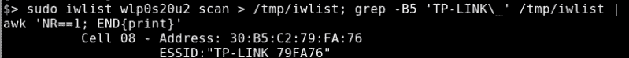

# TP-LINK 的 WiFi 默认为有史以来最差的唯一密码

> 原文：<https://hackaday.com/2016/01/27/tp-links-wifi-defaults-to-worst-unique-passwords-ever/>

这种“安全”是如此离谱，我们不得不寻找隐藏的摄像头，以确保我们没有被恶作剧。我们不想破坏你的掌脸意识，所以在点击突破之前，仔细看看上面的图片，看看你是否能发现漏洞。一目了然，但你可能需要一秒钟才能明白。

在等待了几个星期从 TP-LINK 得到关于这一发现的反馈后，[漏洞被发布在了【Mark C .的】Twitter feed](https://twitter.com/LargeCardinal/status/682591420969029632) 上。他们没有回应，所以他把信息公之于众。

这张图片中显示的是 WR702N ，这是一款漂亮的小路由器，由于相对低功耗、低成本和小尺寸，在许多黑客中很受欢迎。在设计阶段，有人有先见之明，做了一个不仅仅是默认的 WiFi AP 密码。但这就是事情偏离正轨的地方。他们做了第二糟糕的事情，就是分配一个公开传播的密码:MAC 地址的最后八个字符。这对于每个设备都是唯一的，但是它也会被任意广播给任何想要收听的设备。显而易见，下一步是编写一个扫描例程，由[Mark]用一行程序来处理:

我们知道你在想什么。无论如何，用户都应该更改默认密码。但是我们的设备需要默认安全。

[谢谢凯勒]