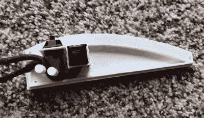

# 轨迹球获得螺栓按钮升级

> 原文：<https://hackaday.com/2018/06/20/trackball-gets-bolt-on-button-upgrade/>

是否使用鼠标还是轨迹球的问题是 Vi 和 Emacs 之间的一场圣战。我们在 Hackaday 不想参与这种事情，想用什么就用什么，别把我们扯进来。但是我们甚至可以说轨迹球团队似乎对事情非常认真。我们从来没有遇到过一个普通的轨迹球用户:如果他们的桌子上有一个轨迹球，那就准备好去听它的一切吧。

 考虑到这一点，[【layered designs】所做的只是在他的 CST 轨迹球](https://imgur.com/a/LMR63ul)上增加几个额外的按钮，让它看起来更有意义。显然，他迷恋于这种特殊的指点技术，他设计了一个 3D 打印的“边斗”，可以安装在普通轨迹球的左侧。与原始外壳的形状非常接近，这个附加模块目前拥有一对 MX 机械钥匙，但计划并未就此停止。

[LayeredDesigns]提到，这个两个按钮修改的外壳内的所有自由空间让他想到他还可以在那里放些什么。合乎逻辑的选择是一个模仿 USB HID 设备的小东西，它可以允许各种酷的可编程输入的可能性。他提到的一个潜在功能是增加一个滚轮，青少年可以很容易地与操作系统交互并呈现给操作系统。

我们已经看到了 3D 打印键盘和键盘修改的公平份额，但我们不能对传说中的轨迹球说同样的话。当然是纸板做的。把[从一个军事设施里拉出来黑进去加 USB](https://hackaday.com/2013/06/12/ditch-that-boring-mouse-for-a-military-grade-trackball/) ？你打赌。这个项目进一步证明了用 [3D 打印机、卡尺和一些耐心](https://hackaday.com/2018/03/27/how-to-reverse-engineer-mechanical-designs-for-3d-modeling/)可以做什么。

[通过 [/r/functionalprint](https://www.reddit.com/r/functionalprint/comments/8ocsao/any_trackball_users_out_there/)