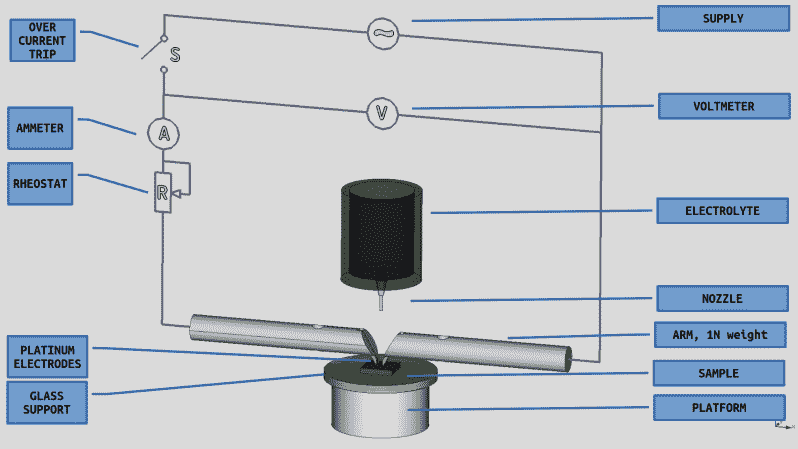
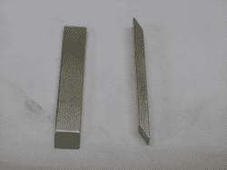
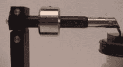
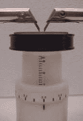
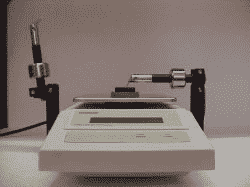
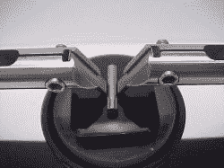
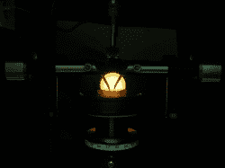

# 跟踪指数测试

> 原文：<https://hackaday.com/2017/04/06/tracking-index-test/>

在之前的一篇文章中，我介绍了构成电子/电气产品安全测试重要部分的[火灾危险测试](http://hackaday.com/2017/03/15/fire-hazard-testing/)。我们查看了用于异常热量、灼热丝和火焰测试的标准和设备。一份典型的电器(如烤面包机)符合性测试报告将是一份相当长的文件，报告大量测试的结果。其中，“热和火”部分通常会有第三个测试的结果——“T2”跟踪。这是我们大多数人都观察到的现象，但需要一些解释来理解它的含义。

## 什么是跟踪？

漏电起痕是绝缘材料的表面现象。当两个高压(高于 100 VAC)导电端子或走线被绝缘体隔开时，灰尘、湿气和热循环等环境因素的综合作用可能会导致微小的漏电流在导体之间的表面流动。随着时间的推移，沉积物碳化，表面电流增加。最终，在绝缘体的表面上形成碳轨迹，使其在特定的“跟踪”电压下导电。最后，两个导体之间产生短路，这也可能导致火灾。更糟糕的是，跟踪电流可能低于电器中保护保险丝的额定值，这将防止电源被切断，从而造成火灾危险。通过使用正确的绝缘材料和足够的爬电距离和间隙距离，可以避免漏电。在 PCB 上的相邻高压端接或走线之间增加一个槽的原因之一是为了走线。

## 测试标准

根据真实世界的条件进行这样的测试是不可能的，所以需要一个标准化的程序来产生可以比较不同材料的结果。IEC 的技术分委员会 15E 以前负责创建和维护跟踪指数方法和标准。考虑到本标准的重要性及其广泛的影响，这项工作现在由[TC 112——电绝缘材料和系统的评估和鉴定](http://www.iec.ch/dyn/www/f?p=103:7:0::::FSP_ORG_ID,FSP_LANG_ID:1310,25)负责。

TC 112 的文件 [IEC 60112](https://webstore.iec.ch/publication/763) 为高达 600 VAC 的电压定义了“确定固体绝缘材料的验证和比较跟踪指数的标准化方法”,并提供了如何设计合适的测试设备的信息。美国材料试验标准有一个等效的文件——UL[UL 746 a-24](http://ulstandards.ul.com/standard/?id=746a_6)也有一个等效的文件 [ASTM D3638](https://www.astm.org/Standards/D3638.htm) 。在 [IEC 60587](https://webstore.iec.ch/publication/2526) —“恶劣环境条件下使用的电绝缘材料——评估抗漏电和腐蚀的试验方法”中包含了更为严格的试验。该测试通常被称为斜面跟踪和侵蚀测试，规定测试电压高达 6 kV。但是现在，让我们看看 IEC 60112 的低电压测试。

## 程序

测试需要至少 20 mm x 20 mm 的样品，最小厚度为 3 mm，每次测试一组五个样品。如果测试产品不能提供这些尺寸的样品，那么需要使用与实际生产中使用的相同的模制工艺专门生产隔热材料的瓷砖。样品被支撑在水平玻璃平台上。将两个凿边铂电极放置在样品上，间隔 4 mm。将 100-600 VAC 的可调电压施加到这些电极上。电极通过静重以 1 N 的力压在样品上。

电极的电源需要限流。对于 100 V 至 600 V 之间的所有电压，电极间的短路电流必须限制在 1 A，这通常通过串联可变电阻(变阻器)来实现。在某些设备设计中，用于调节电压的自耦变压器(Variac)与变阻器机械耦合，确保短路电流始终限制在 1 A 以内。额外的较小值变阻器用于微调。该标准进一步规定，在设置开路电压后，在 1 A 电流下测得的电压下降不应超过 10%(负载调节)。这使得变压器设计有点棘手。在低电压下，绕组之间没有足够的磁耦合，导致电压越低压降越大。一种解决方案是使用两个大约 350 V 的次级绕组，对于低于 300 V 的测试电压，这两个绕组并联连接，对于更高的电压，这两个绕组串联连接。但是也有其他方法来满足这个要求。这只是一个例子，说明设计人员需要考虑标准中的每一项要求，然后找出如何在测试设备中实现这些要求。

短路电流只是连接到电极的电源的限制要求。更关键的设置是“跳闸”电流，需要设置为 0.5 A，高于该值时，电源必须与电极断开。跳闸传感器在跳闸前需要有两秒钟的延时，这种设置的原因稍后会变得清楚。

环境污染由盐溶液模拟——通常是浓度为 0.1%的氯化铵。为更严格的测试规定了替代解决方案。在电极之间施加测试电压的同时，每 30 秒在电极之间的测试样品上滴一滴电解质，总共 50 滴。每个水滴的大小需要调整，使得 50 滴大约重 1.075 克，20 滴重 0.430 克。这可以通过仔细选择用于滴剂的针直径以及输送机构来实现。一些设计使用重力进料、螺线管操作的装置，而另一些使用蠕动泵。另一种方法是使用气泵，通过将空气压入容器来将液体压出容器。如果经受 50 次跌落而不触发过电流传感器，则测试样品通过。如果过电流传感器被触发或着火，样品就会失效，此时需要立即断开电源。

当液滴穿过电极落在样品上时，由于液体是导电的，因此大部分电流会流过液体。这导致电流尖峰，迅速蒸发掉大部分盐溶液，通常持续一两秒钟。在这两秒钟的持续时间内，过流装置被编程为不跳闸。随着大部分水分蒸发，一些盐作为沉积物留在样品上，这导致“跟踪”电流流过其表面。过一会儿，你还会注意到一些闪烁效应(火花),因为当电流流过时，剩余的盐晶体会烧尽。

跟踪测试的结果以两种不同的方式报告。验证跟踪指数测试(PTI)通常在 175 V 下进行，以确认样品能够经受 50 次跌落。另一方面，在一个电压范围内执行比较跟踪指数测试，对于每个后续测试，测试电压增加 25 V。下降次数始终设置为 50 次。CTI 值被确定为样品经受 50 次跌落的最高电压。在某些情况下，样品还必须在比 CTI 电压低 25 V 的电压下持续 100 次跌落才能通过测试。根据 CTI 值，绝缘体被分配一个性能级别类别，其中 PLC0 最高，PLC5 最低。

看着样品进行跟踪指数测试总是令人着迷——请看下面的视频。当您查看塑料材料的数据手册时，漏电起痕指数值总是在其电气特性下报告。酚醛纸是玻璃纤维出现之前使用的 PCB 基板，通常具有非常低的漏电起痕指数值(取决于其成分)，范围在 100 V 至 175 V 之间。另一方面，取决于成分和填充材料，FR4 等玻璃纤维基板的 CTI 值可在 175 V 至约 300 V 或更高的范围内。

如果你曾经见过 PCB(而不是上面的元件)散发出神奇的烟雾，那么你已经看到了跟踪的效果。通过良好的设计，考虑适当的爬电距离和电气间隙，这是可以避免的故障模式之一。

Platinum test electrodes

dead weight for applying 1N force on test sample

support platform, adjustable height

verification of force exerted by the electrode

electrode gap adjustment

 [https://www.youtube.com/embed/zn9xpMTPVb4?version=3&rel=1&showsearch=0&showinfo=1&iv_load_policy=1&fs=1&hl=en-US&autohide=2&wmode=transparent](https://www.youtube.com/embed/zn9xpMTPVb4?version=3&rel=1&showsearch=0&showinfo=1&iv_load_policy=1&fs=1&hl=en-US&autohide=2&wmode=transparent)

