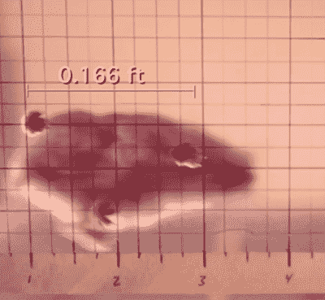

# 追踪仓鼠马拉松

> 原文：<https://hackaday.com/2015/11/02/tracking-the-hamster-marathon/>

[Michelle Leonhart]有两只 Roborovski 仓鼠(尽管有这个名字，但它们是有机动物，不是机械的)。她发现它们似乎总是在仓鼠轮子上跑。维基百科上的一点研究发现了一个有趣的事实:这种特殊品种的仓鼠是最活跃的，每晚跑相当于四场人类马拉松。当然，我们总是相信我们在维基百科上看到的一切，但不相信[米歇尔]。她着手[确定这是否是一个准确的陈述](https://opensource.com/life/15/10/tracking-hamster-activity-raspberry-pi?utm_source=PiHunt&utm_medium=post)。

她已经拆了一台旧录像机，在小动物的轮子上加了一个滚珠轴承来消音。她需要的是相当于仓鼠计步器的东西。树莓派和霍尔效应传感器做到了这一点。至少对于原始测量来说是这样。但它仍然留下了一个问题:仓鼠马拉松有多远？

 【米歇尔】在问题上走了一切科学方法。她确定女性的平均步幅是 2.2 英尺，相当于每英里 2400 步。一场马拉松有 26.2 英里(基于马拉松之战后菲迪皮德斯跑去告知雅典胜利的距离)。这仍然留下了仓鼠步幅的问题。令人惊讶的是，没有确定的答案，[米歇尔]提议让他们在墨水中奔跑，然后追踪他们的足迹。幸运的是，[Zed Shaw]在 Twitter 上听说了她的计划，并建议通过笼子的塑料底部安装一个网络摄像头和一个秤。这成功了，[米歇尔]测得她的仓鼠的步幅约为 0.166 英尺(见右图)。

现在，一个简单的数学问题就是确定一个仓鼠马拉松赛跑不到 10，500 步。通过 ThingSpeak 将数据记录到 SQLite 一个月之后，米歇尔得出结论:她的仓鼠一夜跑不了 4 个马拉松的步数。事实上，他们从来没有真正跑过两次马拉松。

[米歇尔]有懒惰的仓鼠吗，或者她只是增加了我们关于啮齿动物的科学知识？我们不知道。但是我们不得不佩服她的方法，她的开源数据记录代码可能对一些非仓鼠活动有用。

如果你非常有竞争力，你可以利用[米歇尔的]数据来限制自己，并挑战你的宠物参加比赛。但是为他们建造自己的[星舰骑兵风格的步行机](http://hackaday.com/2011/02/07/hamster-powered-strandbeest/)可能会更酷。不管怎样，你都可以在下面的视频中看看米歇尔的小马拉松选手。

 [https://vine.co/v/enpFetTQD75/embed/simple](https://vine.co/v/enpFetTQD75/embed/simple)

