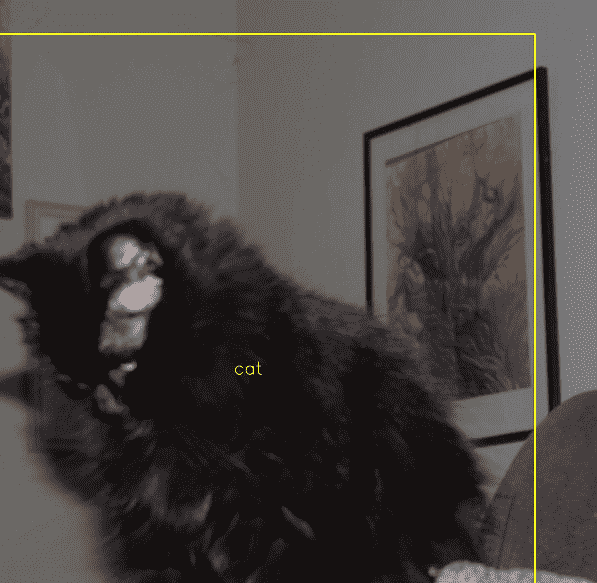

# 训练松鼠终结者

> 原文：<https://hackaday.com/2018/04/30/training-the-squirrel-terminator/>

取决于你现在是从地球的哪个半球读到这篇文章的，夏天终于开始向地表进发了。对于更“绿色”的读者来说，这意味着是时候开始为夏季园艺制定计划了。但是任何种植过可食用的东西的人都会告诉你，像松鼠这样的花园害虫会非常有效地把你所有的辛勤劳动变成一片荒地。找到让它们远离你的庄稼的方法可能是一项全职工作，但幸运的是，如果自动化从人类那里偷走了东西，没有人会介意这项工作。

Kitty gets a pass

[Peter Quinn]写信告诉我们他今年打算如何让毛茸茸的掠夺者远离他的西红柿。从长远来看，他计划建立一种非致命的哨兵枪来吓跑它们，但在这之前，他需要完善自动瞄准猎物的科学。与此同时，他想把这个系统训练得足够好，使它不会对人类或其他动物开火，比如可能参观他花园的猫和鸟。

一个带有廉价网络摄像头的树莓 Pi 3 被用来监视花园和检测运动。当检测到包含运动的帧时，它们会被转发到一台笔记本电脑，这台电脑有足够的马力通过[暗网 YOLO](https://pjreddie.com/darknet/yolo/) 来处理松鼠检测。[Peter]承认这不是实时瞄准哨兵炮塔的理想架构，但对于训练系统来说已经足够好了。

这也是[Peter]在该项目的 Hackaday.io 页面上花费最多时间解释的内容。从建立并运行软件环境的传奇故事到决定他应该为训练提供多少张他院子里松鼠的照片，这是一个滚动你自己的图像识别系统的极好的案例研究。经过大约 18 个小时的训练，他现在有了一个能够从树叶中分辨出松鼠的系统。下一步是连接炮塔。

我们已经在 Hackaday 上报道过其他自动炮塔，我们以前也见过用于恐吓松鼠的自动装置，但这是我们第一次看到这些概念混合在一起。