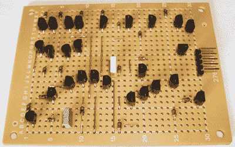

# 晶体管逻辑时钟有 777 个晶体管

> 原文：<https://hackaday.com/2016/06/01/transistor-logic-clock-has-777-transistors/>

有时候，零件清单说明了一切。777 个晶体管、1223 个电阻、136 个发光二极管、455 个压接连接器、41 块原板和 500 克焊料。这就是这个[晶体管逻辑时钟](http://transistorlogicclock.weebly.com/)的构造。

虽然在这个项目中允许使用额外的二极管和电容，但分立晶体管逻辑时钟的后续实现当然不包含 quarz 振荡器。相反，它从其电源中的市电频率提取时钟信号。因为电源频率很低，它可以通过一个简单的计数器单元降低到时钟适用的 1 Hz，该计数器单元已经将其分立晶体管分布在 4 个原型板上。

  This is a 555 timer  Flip Flop for counters

总共有 28 个触发器被组装在单独的板上。他们中的大部分人都进入了数小时、数分钟和数秒的计数器。计数器由复位板协调，复位板知道每个计数器应该计数多远，并在必要时复位它们，同时递增下一个计数器，这是一种基于晶体管的溢出中断。计数器的输出馈入多路复用器(3 块板)，由基于 555 定时器的 300 Hz 定时电路计时，也由分立元件实现。最终，7 段解码器(2 块板)将数字发送到显示器。

微调时钟速度~~可能需要快速呼叫电力供应商~~甚至没有必要，因为在世界大部分地区，市电频率的[长期稳定](https://en.wikipedia.org/wiki/Utility_frequency#Stability)(谢谢汤姆！).最终结果是一个制作精美的模块化晶体管逻辑时钟！

对于那些一直渴望 MOnSter6502 项目的人来说，这是一个好消息。在你试图重现一个电路板布局项目的怪物之前，用这个项目练习你的 SMD 晶体管 PCB 布局。

感谢[BB]的提示！