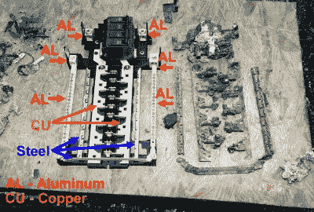

# 跳闸:电路保护现场指南

> 原文：<https://hackaday.com/2016/10/19/tripping-out-a-field-guide-to-circuit-protection/>

我在八岁时开始接触电路保护。作为一个好奇的小伙子，我有一种创新的——显然是自我毁灭的——倾向，我决定给我的母亲做一盏灯。我把一个软管夹在一个小灯泡的底座上，剥去一根旧延长线的绝缘层，把电线的两端塞在夹子下面。当我把我的发明插到书房的一个插座上时，就在整个房子变暗之前，我看到绝缘体从电线上脱落了。不知何故，分支电路上的断路器失灵了，我触动了 200 安培面板上的主断路器。我的母亲从来没有像我一样对这一壮举印象深刻，特别是现在我对电的工作原理有了更多的了解，我差一点就成为达尔文奖获得者了。

为了帮助你避免类似的命运，我想带你去旅行(嘻嘻！)通过典型的家用电源板，看看一些每天待命的设备，等待拯救我们自己的机会。作为一名北美人，我将重点关注这里最常见的住宅电力系统标准。尽管有很多技术是作为最后手段来保护你的安全的，但你墙上的电仍然可以杀死你。不要对电源电流漫不经心！

### 分手吧

很久以前的那一天救了我的是一个*断路器*。最简单的形式是，断路器只是一种机电设备，用于在流经电路的电流超过设计点时切断电源，从而保护电路。断路器需要感应电流，并将其转化为机械动作，以便触点可以快速安全地物理分离。最常见的机制是电磁机制，其中更多的过电流会产生磁场来拉开触点，以及双金属机制，其中过载会加热双金属片并使其弯曲，从而激活开关。

北美的住宅断路器有几种不同的风格。分支电路断路器用于保护每个分支电路，即并联回主面板的插座、灯具和电器。每个分支电路的额定电流通常为 15 或 20 安培，除非它运行的是像电动干燥机或井泵这样的大负载，否则它将是一个 120 伏的电路。除了分支断路器，一个面板将有一个主断路器，以捕捉有缺陷的分支断路器遗漏的任何故障，就像我发生的情况一样。这通常是一个 4 极事件——一个用于每条热线，一个用于中性线，一个用于地线。主断路器也可作为切断所有分支电路的开关，使在面板中工作更加安全——但要小心主断路器的接线片！这些总是很热，下一个断路器可能是电线杆上的大断路器。

Arrangement of bus bars in a distribution panel (L), and what can happen when a contractor really screws up (R). Source: [Electrical Forensics.com](http://www.electrical-forensics.com/CircuitBreakers/CircuitBreakers.html)

这里的主断路器面板有一个有趣的安排，允许 120 和 240 伏电路。电力在[一个*分相*装置](https://en.wikipedia.org/wiki/Split-phase_electric_power)中分配，其中电杆上的变压器有一个中心抽头的 240 伏次级绕组。这导致两个热段相对于中性线各为 120 伏，或者两个热段之间为 240 伏。在配电板内部，两个 hot 通过交错的指状物连接到汇流条。这允许安装单极断路器(连接到单个 120 伏热管段)或双极断路器(桥接 240 伏电路的两个热管段)。

如果你遇到一个问题，在你的面板上所有其他单极电路都在工作，而没有一个 240 伏的电路在工作，你就会知道其中一个热管由于某种原因没有通电。在这种情况下，你可能想给电力公司打电话。

### 杀人的是电流

在大学电气工程实验室课程的第一天，老师给我们做了一个发人深省的安全讲座，题目是“电流杀人。”他引用的关于杀人实际需要的电流有多小的数字让我震惊——在我经历的各种线路电压冲击中，我怎么没有在某个时刻获得至少 30 毫安的令人心跳停止的电流呢？事实证明，我得到的电流可能比这少得多，而且它可能没有通过我的心脏，但仍然很高兴知道现代住宅服务面板中的许多电路都受到接地故障电路断路器的保护。在美国被称为 GFCIs 或 GFIs，在英国被称为*剩余电流装置* (RCDs)，这些装置能够切断电流，只要热线中有 5 毫安的电流泄漏。它的速度非常快，大约 25 到 40 毫秒，比 30 毫安的电流使人类心脏发生心室颤动所需的时间还短。

A GFCI built into a circuit breaker. Source: [G. Fretwell](http://gfretwell.com/)

GFCIs 的工作原理是利用电流互感器检测两个导体之间的电流不平衡。火线和零线都穿过电流互感器的环形线圈。通常情况下，电流会相互抵消，但如果由于泄漏而出现不平衡，变压器中会感应出电流，该电流可用于触发电磁断路器。有一个芯片来处理大部分的传感和跳闸并不奇怪；令人意想不到的是第一个 GFCI 芯片 [LM1851](http://www.alldatasheet.com/view.jsp?Searchword=LM1851) 如何在 20 世纪 70 年代中期诞生的迷人故事。剧透:许多研究生在制作第一个 GFCI 时触电身亡。

在美国，只要有一丁点水电混合的可能性，法规就要求安装 GFCIs。GFCIs 最初用于浴室和厨房插座，现在也用于地下室、车库和任何户外插座，尤其是游泳池和温泉。虽然 gfci 最常见的外形是内置在双工插座中，但一些断路器也内置了 gfci。当然，现在每一个吹风机和卷发器的电源线上都长出了壁疣 GFCIs。

### 好弧线，坏弧线

一种更新的电路保护形式是*电弧故障断路器* (AFCI)。为了防止高温电弧引起的火灾，自 21 世纪初以来，AFCIs 已被规范要求用于服务客房的分支电路。早期的 AFCIs 容易受到“正常”电弧的干扰而跳闸，就像真空吸尘器电机中的电刷一样。随着技术的进步和有害跳闸的减少，重新编写了代码要求，因此现在所有分支电路都需要 AFCIs，为房屋中的每个房间提供服务。

Typical voltage (black) and current (green) arc waveforms. Note the “shoulders” at zero-crossing on the current trace, and the way the resultant voltage waveform approaches a square wave. Source: [Electrical Installation Wiki](http://www.electrical-installation.org/enwiki/Arc_Fault_Detection_Devices_(AFDD))

虽然 AFCIs 像 GFCIs 一样检测电流异常，但相似之处也仅此而已。AFCIs 还需要监控电压，并分析受监控电路的波形，寻找潜在破坏性电弧正在发生的迹象。除了识别火线和中性线或地线之间的电弧，AFCIs 还需要检测串联电弧，当火线在松动的端子内自由摆动时，可能会发生串联电弧。所有这些电弧都具有特征波形，微控制器分析这些波形以确定是否存在故障，同时忽略来自正常运行设备的电弧。这是很复杂的东西，难怪制造商花了一段时间才弄清楚。检测算法细节的良好处理可以在[本文](https://www.downloads.siemens.com/download-center/Download.aspx?pos=download&fct=getasset&id1=BTLV_40672) (PDF 链接)中找到。

当然，还有很多其他设备可以保持电力供应的清洁，比如电涌保护器、噪音过滤器和不间断电源。但这些主要是为了让你的设备保持健康和快乐。断路器、GFCIs 和 AFCIs 是生命安全设备，无论是通过保护你周围的结构不着火，还是当你把吹风机掉到厕所里时防止你被许多愤怒的小精灵咬伤。但是请记住，它们是最后一道防线——在一天结束的时候，主要是由你来确保你不会做一些像我很久以前做的那样愚蠢的事情。