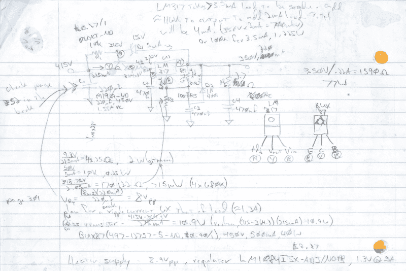

# 2018 年管 amp 还是管

> 原文：<https://hackaday.com/2018/01/09/tube-amps-are-still-tubular-in-2018/>

我们的朋友[Pete]正在用他那台又旧又破的古董 Grundig Majestic 游戏机回忆过去的黄金时光，这时他意识到它应该好好翻新一下了。现在，任何普通的立体声唱机可能不值得花时间和精力去修理，但这不是任何普通的立体声唱机。[Pete]继承的 Grundig Majestic 是他童年的最爱，因为它从用作活动元素的电子管中发出独特的声音。[所以他着手在系统内部安装两个电子管放大器](https://www.sparkfun.com/news/2576)。

[Pete]过去有一些使用音频设备的经验。他做了我们所有人都渴望做的事情，并通过创造电子管放大器作为副业获得报酬。当他终于受够了我们为了方便而忍受的蓝牙扬声器的劣质质量时，他决定最终修理他最喜欢的收音机，它已经躺在那里太久了。他立即在笔记本上开始工作，寻找重启所需的部件。该构建最终由 350V 调节的 HT 电源、6.3V 半 DC 调节的 LT 电源、12AX7 输入/低音/高音部分、6922 个手风琴式电子管和 EL34 超线性输出部分组成。最终结果产生了一个听起来就像他年轻时一样的放大器，一个还没有完全到位的放大器。

然而，格朗迪格雄伟建筑还没有完工。[皮特]计划在他不太忙着照顾孩子的时候，对他的美貌做一些额外的修饰。首先，完善第二个放大器是当务之急。之后，安装红色发光二极管照亮下面的管道将表明低电压的存在，而蓝色照明将表明 HT 被锁定和加载。偏置监控使他了解电路状况的状态，这将确保一路畅通无阻。将扬声器的继电器连接添加到输出变压器将最小化 HT 最初打开时扬声器中当前产生的爆音。这些小的改进仅仅是——小的——但是这是家庭项目如此有价值的部分原因。家里用的东西越多，就越意识到哪些东西需要进一步细化，所以也在不断学习更多。这是一个令人欣慰的经历，我希望我们所有的读者都有机会遇到。

电子管放大器对黑客来说并不陌生。我们中的一些人甚至自己建造了一些。

谢谢[索菲]

通过斯派普夫