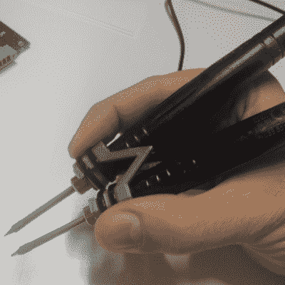

# 把便宜的 USB 烙铁变成镊子

> 原文：<https://hackaday.com/2016/12/07/turn-cheap-usb-soldering-irons-in-to-tweezers/>

这是 2016 年，现在几乎每个黑客都涉足 SMD 部件，不像以前了。这意味着至少投资一些专门的工具和设备来使这项工作变得更容易。一个方便的工具是 SMD 焊接镊子——它不仅适用于手动焊接零件，还适用于快速脱焊，不会损坏零件或电路板。通常，尤其是在修理东西的时候，如果你只想移除一个微小的零件，使用热风枪会变得很棘手。

【adria . jun yent-ferre】拿了一把便宜的 5 USB 烙铁，把它们变成了一把俏皮的 [SMD 焊钳](https://hackaday.io/project/18706-cheap-smd-soldering-tweezers-from-ebay)。这两个铁杆通过一个简单的 3D 打印部件连接在一起。[adria]已经经历了几次迭代，所以最终版本应该工作得很好。休息后的视频显示，他快速连续地对一堆 0805 SMD 电阻进行脱焊。

今年早些时候，我们发布了[BigClive]对这些 8 瓦[USB 烙铁的拆卸，这些烙铁被证明具有惊人的能力](http://hackaday.com/2016/04/25/usb-soldering-iron-is-surprisingly-capable/)，这促使[adria]订购了几个来试用它们。

3D 打印零件在 [SolveSpace](https://hackaday.com/2016/06/18/solvespace-a-parametric-cad-tool/) 中建模，这是一个参数化 2D 和 3D CAD 软件，我们不久前在博客中提到过。

[https://videopress.com/embed/Bacqy7VH?hd=1&cover=1&loop=0&autoPlay=0&permalink=1&muted=0&controls=1&playsinline=0&useAverageColor=0](https://videopress.com/embed/Bacqy7VH?hd=1&cover=1&loop=0&autoPlay=0&permalink=1&muted=0&controls=1&playsinline=0&useAverageColor=0)