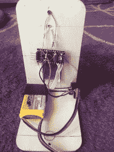

# 把坏掉的玩具变成激光打靶练习

> 原文：<https://hackaday.com/2016/10/18/turning-broken-toy-into-laser-target-practice/>

[马修]用他的[激光打靶练习游戏](http://fuvlab.org/wordpress/creations/laser-gun-target-pracice/)写的。这并不是黑客历史上最令人惊讶的一次攻击，但它是一个很好的例子，说明只需要一点点微控制就可以做简单有趣的事情。

F  首先，这把枪是一把坏掉的玩具枪，用来发射红色准直光束以外的东西。内部的 Arduino 仿制品对扳机的拉动做出反应，并发射激光约 200 毫秒。这种枪还有一个“气压计”，可以在重复射击时充满气体，并随着时间的推移而冷却。这就是游戏——一场简单的十人赛跑，每个玩家在一段时间内只有固定的投篮次数。

目标只是一个光传感器，记分牌 LED 显示屏，以及一个蜂鸣器，当倒计时器开始计时时，它会发出哔哔声来营造紧张感。这些身体是由 3D 打印的角落组成的，这些角落连接着一些[马修]多余的木制山羊奶酪盖子。

所有的代码都在 GitHub 上，所以你可以用你放在家里的东西做你自己的。“枪”可以是任何你可以嵌入激光使其具有瞄准能力的东西。好干净好玩！