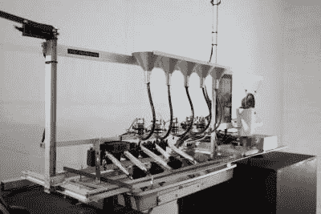

# 把电视变成简单的挂毯

> 原文：<https://hackaday.com/2017/02/01/turning-television-into-a-simple-tapestry/>

莫斯科艺术家【vtol】的创意，是一个有趣的项目。一方面，它没有编织任何传统意义上有用的东西，但另一方面，它试图将广播媒体的复杂任务解构为一种更简单的信息传输形式。

Teleknitting 的三个主要组件是处理和显示模块——由天线、Android 平板电脑和扬声器组成——染色机及其墨水、海绵、致动器和 Arduino Uno，以及祭祀对象的旋转平台。平板电脑上运行的一个程序分析接收到的信号，然后——如其屏幕上显示的那样——逐渐将图像中的像素数量减半，直到只剩下一个基本的图像颜色。从那里，线经过五个海绵，这些海绵给它染上适当的颜色，并带有一个电枢，它对广播的音量做出响应，指示线将在哪里绑定对象。

[https://player.vimeo.com/video/200281141](https://player.vimeo.com/video/200281141)

 从功能上来说，远程针织接收电视信号，并将其转换成一维线，慢慢地诱捕选定的对象。[vtol]的目标是将我们周围的数据重新解释成一种完全不同的媒介——一种不同的数据流，如果你愿意的话。远程编织可能是一个令人信服的建议，表明我们——实际上——太过于沉迷于我们周围的媒体，有时我们需要放慢或减少我们接收的无用数据量。

如果你正在寻找一些更实用的编织技巧，我们之前已经在 Hackaday 上展示了一些编织项目——比如这个[开源针织机](http://hackaday.com/2014/02/20/openknit-the-open-source-knitting-machine/)，或者如何与一个针织机接口以便让它[制作像素艺术](http://hackaday.com/2010/11/08/make-a-knitting-machine-print-pixel-art/)。