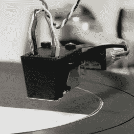
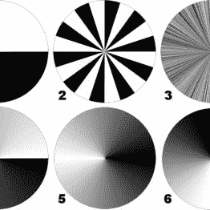
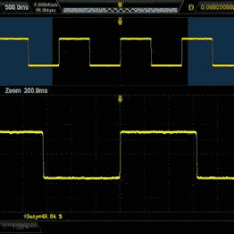

# 转盘转动波形发生器

> 原文：<https://hackaday.com/2016/08/19/turntable-turns-waveform-generator/>

另一个项目需要一个波形发生器，[戴维·库克]把旧的转盘改造成一个方便的黑客:通过在拾音器上添加一个简单的反射传感器，他把它变成了一个波形发生器，可以从印刷的纸光盘上光学播放任意波形。

在他的黑客技术中，[Dave]创造了一个 3D 打印底座，将一个 LED 和一个光电二极管连接到转盘的拾音器上。该支架还阻挡了大部分环境光，只允许纸盘的反射光通过一个小狭缝到达传感器。一个小试验板电路为 LED 供电，并通过调整电位计将传感器的光电流转换为可测量的电压。改造后的转盘允许[戴夫]播放由他编写的一个小程序生成的带有灰度图案的印刷光盘。方波、三角波、正弦波、噪声——你在实验室需要的一切都在那里。

      

批评者可能会说，便宜的现成波形发生器会提供更清晰的信号，但从转盘回放波形会给任何测量设置带来不可替代的独特体验。这里有一点噪声，那里有一些非线性，这些都不会影响你拥有波形的感觉。请欣赏视频，其中[Dave]展示了他的黑客技术！

 [https://www.youtube.com/embed/-uzPPjD-4Ro?version=3&rel=1&showsearch=0&showinfo=1&iv_load_policy=1&fs=1&hl=en-US&autohide=2&wmode=transparent](https://www.youtube.com/embed/-uzPPjD-4Ro?version=3&rel=1&showsearch=0&showinfo=1&iv_load_policy=1&fs=1&hl=en-US&autohide=2&wmode=transparent)

感谢[Aaron]的提示！