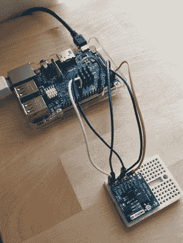

# 推特闪电的力量！

> 原文：<https://hackaday.com/2017/07/08/tweet-the-power-of-lightning/>

你会多快同意被授予控制闪电的权力？好吧，既然到目前为止这是不可能的，那么检测和发微博通知附近的任何雷击呢？

 渴望以某种形式与闪电的可怕力量联系起来，[Hexalyse]将 AMS 的闪电传感器芯片与树莓 Pi 和一点 Python 代码结合起来，以推特发布潜在风暴的逼近。由于信任芯片能够正确计算撞击数据，[Hexalyse]的探测器只能每隔五分钟发一次微博——因为没有人喜欢垃圾邮件——但在宣布风暴正在酝酿之前，它会在给定的时间框架内等待至少五次撞击。每条推文都宣布了雷击能量、离芯片的距离以及自上次更新以来的雷击次数。如果一个小时内附近没有任何雷击，twitter feed 就会宣布风暴已经过去。

碰巧的是，当[Hexalyse]完成他们的项目时，一场雷雨降临到他们位于法国图卢兹的小镇，让他们的项目面临考验——取得积极的成功。查看探测器的推文(法语)。

我们最近推出了另一种类型的闪电探测器，一旦暴风雨来临，[会自动部署避雷针](http://hackaday.com/2017/03/11/automatic-deploying-lightning-rod/)！