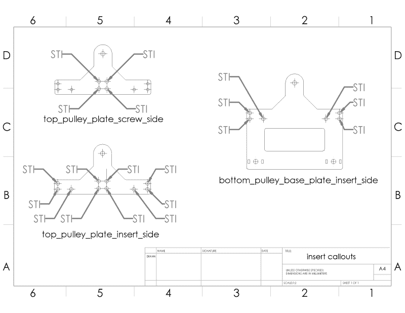

# 两级触须机构第三部分:把它们放在一起

> 原文：<https://hackaday.com/2016/10/21/two-stage-tentacle-mechanisms-part-iii-putting-it-all-together/>

欢迎回到我们探索两阶段触手机制之旅的最后一章。在这里，我们用工具和技术武装你，让这些白痴在你的客厅里活蹦乱跳。在这最后一部分中，我将引导我们完成构建我们自己的触手控制器*和*的步骤，这两个控制器与我们在过去几周中讨论的控制器完全相同。正如承诺的那样，这篇文章附带了一些奖励:

Nothing like a fresh batch o’ parts.

## [设计文件](https://grabcad.com/library/delrin-cable-controller-1)

1.  万能的[材料清单](https://docs.google.com/spreadsheets/d/1LeeB5BPr6AzM87uwkL1KV0k9X3DrusPlTtMXaytvhZU/edit?usp=sharing)
2.  激光切割矢量图
    1.  DXF 文件预偏移(0.003 英寸)
    2.  DXF 档案原件
3.  用于 3D 打印的 STL 模型
4.  原始触手 CAD 模型文件
5.  原始控制器 CAD 模型文件

根据您的情况，有些设计文件可能比其他文件更重要。如果你只是想得到的部分，赔率是好的，你可以简单地从正确的板厚度切割预偏移 DXF，并开始滚动。当然，如果你需要为光束直径稍有不同的激光调整文件，我已经包括了原始的 DXF 文件。对于重量级人物来说，如果这个设计中有什么值得调整的地方，我还包括了原始文件。开始吧！(当然，让我们知道你是如何改进它的！)

好了，现在我们手头上已经有了一大堆零件，让我们来完成让这个木偶工作的最后一英里的调整:组装和调优。此时，我们已经收集了一些零件，有些是激光切割的，有些是现成的。现在是时候把它们串在一起了。

## 向“如何做”的标志脱帽致敬

去年， [Crazyflie 汇编指令](https://www.bitcraze.io/getting-started-with-the-crazyflie-2-0/)和 [Formlabs](https://formlabs.com/support/finishing/removing-support-marks/) 打印机维护文档都用他们的分步指令做了一些新奇的事情。他们将视频剪辑混合到他们的说明中，以更好地展示过程。无论是将电机滑动到四轴飞行器框架上，还是将构建平台从打印机中滑出进行清洁，这些片段都准确地钉在了一件事情上:一个简短过程的具体步骤。在写这些文件的时候，我向这些人脱帽致敬，他们向我展示了一个适时的视频剪辑可以提供多少信息。

好吧，让我们开始吧！

# 控制器组件

每个控制器基本上是两个滑轮旋转，并堆叠在对方的顶部。我们在这里自己组装一切，但不要担心，我会强调细节，让你感觉足够舒适，在家里建立一个。(想知道我为什么选择机械解决方案吗？查看本系列的第二部分。)

### 1.组装 4x 皮带轮

为了得到正确的操作顺序，请看右边的快速剪辑。不幸的是，那些零件不会自己安装！安装这些部件需要使用正确的工具。

**组件:**

#### 

*   数量 2: 4-40 螺纹热固嵌件
*   数量 16: M2 螺纹热固嵌件
*   数量 44: 9/16 英寸长、直径 0.125 英寸的半管状铆钉
*   数量 8:外滑轮板
*   数量 8:内滑轮板
*   数量 16: 612K-ND 角码
*   数量 16: 3/16 英寸 4-40 圆头内六角螺钉
*   数量 16:小垫圈

**工具:**

*   [半管状铆钉用铆压机](http://rivetsonline.com/solid-rivet-semi-tubular-rivet-press-ci70r.html)(或手持铆接工具)
*   烙铁

**细节:铆钉**

我在家里的商店里用的是微型铆钉压力机，但是你可以在当地的 hackerspace 上花些时间使用它。

**细节:热定形嵌件**

将热定形嵌件放入零件看起来可能有点令人畏惧，但实际上非常简单。将烙铁设置为 250°C，轻轻将嵌件插入零件中。不要压在熨斗上！相反，轻轻地摆动尖端，让熨斗的重量将插入物压入零件。每次插入大概需要 15-20 秒定型，不要觉得太草率！

**细节:线夹**

要正确了解此功能的操作顺序，请快速浏览一下组装视频。请记住，在后面的步骤中，钢丝绳会在垫圈和上角撑架之间滑动。

### 2.在 3x 滑轮板中安装嵌件

注意了。我们的三个板有几个插入特征。再次加热烙铁；是时候在将黄铜熔化成塑料的同时获得更多令人满意的刺激了。我在下图中标出了每个“螺纹插件”(STI)的位置。这些孔的尺寸被设计成专门容纳热定形插件。

**组件:**

*   数量 40: 4-40 个热定形嵌件
*   数量 2:顶部 _ 滑轮 _ 板 _ 插入 _ 侧面
*   数量 2:顶部 _ 滑轮 _ 板 _ 螺钉 _ 侧面
*   数量 2:底部 _ 滑轮 _ 底座 _ 板 _ 插入 _ 侧面

安装这些插件就像我们以前安装滑轮一样。给自己几分钟完成这些，但要像以前一样温柔。

### 3.埋头支架板

这些板将是控制器上下滑轮之间的主要连接点。在以下位置创建埋头孔。

**组件:**

*   数量 4:把手板
*   数量 4:接头 _ 连接器 _ 外板

**工具:**

*   埋头孔+埋头孔笼和手钻(或钻床)或
*   带有硬停止功能的钻床埋头钻

 **细节:埋头孔深度公差**

穿过这些板中的孔的螺钉需要接合一个或两个板深的螺纹插件。埋头钻这些板，使螺钉至少与板齐平。太深是可以的，只要螺丝不触底超过螺纹插件。

更详细地说，埋头孔的深度有相当大的回旋余地，原因如下。我们的板以 3.175 毫米的增量出现。我们的 6mm 螺钉将在穿过 1 个板后啮合螺纹。我们的 8 毫米螺钉需要穿过两块板，然后才能与第三板中的插入物接合。这意味着 6 毫米螺钉的总行程是两块板的厚度，即 6.35 毫米，3 块板的厚度，即 8 毫米螺钉的 9.525 毫米。因此，虽然 6 毫米螺丝有大约 0.35 毫米的回旋余地，而 8 毫米螺丝在任何一个螺丝见底之前都有 1.5 毫米的回旋余地。

### 4.连接滑轮部分

**组件:**

*   数量 4:组装好的滑轮
*   数量 2:顶部 _ 滑轮 _ 板 _ 插入 _ 侧面
*   数量 2:顶部 _ 滑轮 _ 板 _ 螺钉 _ 侧面
*   数量 2:底部 _ 滑轮 _ 底座 _ 板 _ 插入 _ 侧面
*   数量 2:底部 _ 滑轮 _ 底座 _ 板 _ 螺钉 _ 侧面
*   数量 4:皮带轮垫片
*   数量 4:接头 _ 垫片
*   数量 4:接头 _ 连接器 _ 外部
*   数量 16:6 毫米 M2 内六角平头螺钉
*   数量 16:8 毫米 M2 内六角平头螺钉
*   数量 4:带肩螺钉
*   数量 2: 8-32 螺母
*   数量 4: 3D 打印电缆 _ 插入 _ 带插入套圈的支架
*   数量 4: .5 英寸 4-40 英寸内螺纹支座
*   数量为 12:25 英寸 4-40 内六角螺钉
*   数量 32: 3/16 4-40 圆头内六角螺钉
*   数量 16: 612K-ND 角码

**工具:**

*   公制艾伦内六角扳手
*   帝国艾伦键(我试图不混合搭配侏罗纪和公制…但是现成的组件并不是每种口味都有。)

**细节:操作顺序**

对于每个控制器，我建议分别构建上半部分和下半部分，然后将它们连接在一起。为了保护这两半，我们将使用我在上一期中提到的经典的 612K-ND 角撑。

**细节:滑轮孔径公差**

带肩螺钉应能轻松穿过滑轮。如果不是这样，可以用 0.1875 英寸的钻头把它们钻出来。

**细节:VSlot 挤压配合点**

组装后，这些电缆控制器可以非常容易地连接到两个开放式 VSlot 20×20 挤压件的导轨上。这个功能让用户找到一个适合他们肩膀的控制器间距。

好了——我们可以去拿控制器了！让我们移动到触手。

# 触手组件

在下一节中，我们将逐步组装触手，并将其连接到手动控制器上。

### 1.准备轮毂

**组件:**

*   数量 18:轮毂+固定螺钉
*   数量 18: Delrin 椎骨块
*   数量 2 x 18: 4-40 x 3-16 英寸。圆头螺钉

**工具:**

*   钻床
*   0.125”或 4 毫米钻头，取决于触手核心直径
*   老虎钳

每个椎骨节由一个轮毂、一个 delrin 板和两个螺钉组成。(是的，如果你愿意，你可以把四个螺丝都放进去，但最后两个是不必要的，只是增加了额外的重量。)为自己打造 18 个这样的金块。

**细节:轮毂直径**

根据你使用的是什么尺寸的核心(4 毫米软轴对 3.175 毫米速度计电缆)，你可能需要扩大轮毂轴直径，以适应核心。通过将这些轮毂夹在老虎钳中，您可以将它们钻成更大的直径。

### 2.将钢丝绳切割成一定长度

**组件:**

*   数量约 25 英尺(7.62 米):直径为 1/32 英寸的钢丝绳
*   数量 4:电线“端接式”压接套圈

**工具:**

*   钢丝绳切割器*这些必须是钢丝绳切割器。不要毁掉你的电子剪刀却发现它们不工作*
*   仅用于弹簧导轨的重型钢丝钳
**   小套圈用钢丝绳压接钳*   可选:迷你喷灯*

 *1.  剪下八段钢丝绳，每段长度为 3 英尺(914 毫米)。
2.  **可选:**在每根钢丝绳的一端，用喷灯将顶端烧至白热化，持续约 8 秒钟；然后让它冷却。这种快速“热处理”将防止尖端磨损。
3.  收集 8 根电缆中的 4 根。在未喷灯的一端(或者任何一端，如果你没有喷灯的话)，压接一个“终端式”套圈。

### 3.组装拐点椎骨

**组件:**

*   数量 4:线环套圈
*   数量 4:未卷曲的剩余钢丝绳长度

**工具:**

*   电线压接钳

1.  收集剩余的 4 根*未卷曲的*钢丝绳。
2.  在每一端，将金属丝穿过椎骨的四个水平段(见上图)，然后回到自身上。
3.  将套环滑到绳索上，将绳索的短端套回套环并卷曲

### 4.准备上级电缆

**组件:** 

*   8 块椎骨(正负几块)
*   数量 4:带有末端止动型卷曲的钢丝绳
*   数量 1:车速表电缆或(更好的)柔性轴，切割至 24 英寸(610 毫米)
*   数量 4:24 英寸(610)长的连续长度拉伸弹簧(又名:弹簧导杆)

**工具:**

*   1.5 毫米内六角扳手

好的，这个部门有两个 TODOs:电线和套管。

1.  将一块椎骨滑到你的弹性核心材料的顶端。
    用内六角扳手将其牢牢固定在尖端。
2.  将剩余的(7)椎骨滑入核心材料中，并使它们均匀间隔大约一英寸。用
    内六角扳手，轻轻固定*。(我们将在以后更永久地保护它们。)此时，核心材料应该用椎骨填充其总长度的大约 1/3。*
**   对于四根钢丝绳中的每一根，将未弯曲的一端从顶部椎骨的孔中向下滑动穿过每个连续椎骨的相应孔。移除所有松弛部分，使套圈与顶部椎骨连接。*

 *### 5.准备带有拐点的低级电缆

**组件:**

*   7 块椎骨(正负几块)
*   附着钢丝绳的椎骨拐点

1.  将拐点椎骨滑入核心材料，轻轻固定，像其他椎骨一样均匀间隔。
2.  滑入另外 7 块椎骨，像之前一样轻轻固定。将从椎骨开始的 4 根钢丝绳穿过每个较低椎骨节段的相应孔。在这一点上，椎骨总数应该跨越柔性核心材料总长度的大约 2/3。

### 6.连接底座夹具

一个好的木偶表演的关键是让触手根部牢牢扎根。现在，我有一个临时的解决方案，一个额外的方形夹子，固定在底座上。这里没有魔术，只是一个额外的轮毂和板都紧密对接底部部分。

### 7.调整椎骨间距/排列

好了，现在是时候拧紧这些椎骨了，但是，首先，我们要给自己一个机会更好地对齐它们。对于触手的每一半，确保每一段都与该阶段的其他段对齐。必要时松开并调整。然后，拧紧每一段。

### 8.套筒钢丝绳

**组件:**

*   数量 4:24 英寸(610)长的连续长度拉伸弹簧(又名:弹簧导杆)
*   数量 4:18 英寸(457 毫米)长的连续拉伸弹簧(你可以用一把大钢丝钳切断)

**工具:**

*   一把大钢丝钳

快到了！我们上面选择的拉伸弹簧将成为本设计中的电缆导管外壳。四个电缆导管外壳将在触手的底部终止。其他四个将在拐点处触手的一半处终止，沿着路径穿过较低的部分。

1.  将四根较长的电缆导管滑入四根较长的电线中。这些外壳中的每一个都将滑动*到*下部触手的身体穿过它的四个大缺口中的每一个。将这些电缆导管外壳向上滑动到拐点，使其不能再延伸。
2.  将四根较短的电缆导管外壳滑入四根较短的电线中，直到它们终止于电线的底部。

很好——是时候把它连接到控制器上了！

### 9.连接到控制器

在我们的触手上，每个自由度得到两条互补的电缆，每个阶段得到两个自由度。在控制器侧，每个滑轮将连接一对互补的电缆，以使该自由度具有全范围的运动。(迷茫？别担心！查看第一部分[。)](http://hackaday.com/2016/09/13/the-bootup-guide-to-homebrew-two-stage-tentacle-mechanisms/)

现在我们手上有一大堆电缆和外壳，仔细检查一下，挑出每个自由度的电缆对。(Zippy 暂时将它们绑在一起或用胶带粘在一起，以防止混乱。)

对于这些线对中的每一对，将电缆及其配件滑入相对的 3D 打印导管固定器中，并将它们串在滑轮电线压接中的第一个角撑架下。把这些缆绳上的所有松弛部分都解开。这些需要紧一点！也就是说，不断将钢丝绳穿过电线压褶，直到电缆管碰到 3D 打印的导管固定器。暂时拧紧焊线夹钳，不必太担心张力。对每对电缆重复此程序。

      Use this as a cheat sheet

### 10.张力电缆

此时，将控制器分解成两个主要组件可能会有所帮助。

从这里开始，用你的双手，对反作用的钢丝绳施加一些张力，用你的犯罪伙伴的一只手用内六角扳手拧紧线夹。唉，这是我第二次在做黑客的时候发现自己在思考他们什么时候会最终发布“第三手”手术。(第一种情况，当然是焊接…手 1 拿着焊料。第二只手握着熨斗。第 3 只手拿着装有元件的镊子。真的，这是一个没有大脑的另一只手臂。)

这种拉紧的方法足够好，但是如果你愿意多花一点钱买零件，还有一种更好的方法。相反，我建议用两个排气螺钉和一个支架构建内部拉伸弹簧张紧器。只需拧开排气螺钉，就可以增加电缆的张力。不需要第三只手！

对于图中的通风螺丝夹具，我使用的是 McMaster-Carr 的 4-40 通风螺丝部分，其通风直径比 1/32”直径的钢丝绳大*到*。这个用例*终于*值得一个合法的理由来挑选一些麦克马斯特-卡尔公司的“排气螺钉”，这些年来我每次登陆他们目录的螺钉页面都一直在盯着它们。

### 11.夹紧底座

不要忘记:获得令人信服的、流畅的触手运动来自于将基部牢牢扎根，这样整个脊柱就能抵抗基部的扭曲。我现在用一个小老虎钳夹住剩余的触手长度来完成这个动作，但是这个部分需要更多的设计努力。虽然老虎钳完全可以工作，但请随时让我们了解更多巧妙的固定方法！

## 结尾部分

如果你已经带着闪亮的新触须走了这么远——恭喜你！现在去组建一支 20 人的军队，给他们装上几十个伺服系统，让他们跟上 70 年代迪斯科的节奏。对于已经读到这里的人，我希望你可以带走一些新的技术，你可以把它们带到下一个下班后的机器人设计马拉松中。最后，感谢你在过去的几周里和我一起游览这些奇怪的动物。写这最后几个帖子是一个爆炸。**