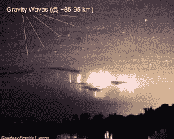

# 这两个词的意思并不像你认为的那样

> 原文：<https://hackaday.com/2016/10/09/two-words-that-dont-mean-what-you-think-they-do/>

 当你听到“重力波”或“精灵”时，你会认为你知道正在讨论什么。毕竟，爱因斯坦预言的那些时空中的[波纹是从碰撞的孪生黑洞中发出的，最近被大张旗鼓地观测到。还有谁不爱早期的 8 位](http://hackaday.com/2016/02/17/about-those-gravitational-waves/)[电脑动画](https://en.wikipedia.org/wiki/Sprite_%28computer_graphics%29)？因此，当我们在 [SpaceWeather](http://www.spaceweather.com/archive.php?view=1&day=06&month=10&year=2016) 浏览时，我们震惊地发现，在一张照片(右边)中，我们错了两次。

回想起来，我们当时想到的波其实是“引力波”。重力波是重力提供恢复力的任何波浪——想想海浪。但是你知道吗，同样的事情也发生在大气中，并且经常可以在离子现象的照片中看到，比如[气辉](http://spaceweathergallery.com/index.php?title=airglow)？

(“气辉”，对我们来说是另一个新名词，是大气中发生的化学反应发出的光，是由瑞典物理学家[安德斯·埃格斯特朗](https://en.wikipedia.org/wiki/Anders_Jonas_%C3%85ngstr%C3%B6m)发现的，他以光谱学而闻名，他名字中 A 上面那个有趣的圆圈，非常非常短:大约 10 ^(-10) 米高。)

 还有什么可以照亮重力波？[小妖精们](https://en.wikipedia.org/wiki/Sprite_(lightning))！它们基本上是闪电，但不是云对地或云对云，精灵[伸向太空](http://news.spaceweather.com/sprites-above-hurricane-matthew/)。它们可能是由宇宙射线引发的，其中一些看起来像水母。从地球表面很难看到它们，自然，因为它们在云层的另一边；你必须从正确的角度观察。这并没有阻止人们尝试 T8。

天空中发生的事情比我们想象的要多得多！我们已经学会了旧单词的新意思。对一个形象来说还不错。

标题图像和雪碧分类:[弗兰基卢切纳]。更多[见这里](http://news.spaceweather.com/sprites-above-hurricane-matthew/)。