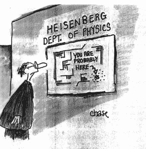
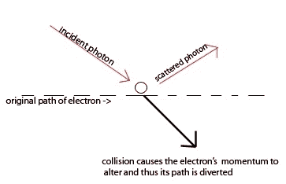

# 不确定性——量子怪异的关键

> 原文：<https://hackaday.com/2016/07/18/uncertainty-the-key-to-quantum-wierdness/>

> 这五十年有意识的沉思并没有让我更接近这个问题的答案，“什么是光量子？”如今人人都认为自己知道，但他错了。
> 
> 阿尔伯特·爱因斯坦，1954 年

当 1926 年即将结束时，物理学界赞扬了欧文·薛定谔和他的波动力学。薛定谔的纯数学工具被用来探测原子的内部结构，并提供可预测的实验结果。然而，一些深刻的问题仍然存在——主要是关于氢原子中电子不连续运动的想法。量子理论的倡导者和主要发言人尼尔斯·玻尔开发了一种解释光谱线的原子模型。这个模型要求电子在吸收光子时移动到更高的能级，当它移动到更低的能级时释放光子。争论的焦点是电子是如何运动的。玻尔称之为量子跳跃，据说是瞬间的。这并不符合包括薛定谔在内的传统物理学家的想法。

Source: [Eureka Physics](https://eurekaphysics.wordpress.com/theoretical-physics/heisenberg-uncertainty-principle/)

在这个时间点上，欧文·薛定谔支持“波包”的想法，而物质只是这些波包的集中。这使得波粒二象性的图像更加清晰。薛定谔知道这个想法有很多漏洞，但是他相信随着时间的推移这些漏洞会被解决。1926 年 8 月，他在一场辩论中遇到了玻尔和一个名叫维尔纳·海森堡的人，这场辩论将量子理论的理解推向了一个新的方向。

正如他后来回忆的那样，薛定谔与这个“该死的量子跳跃”没有任何关系。他的经典波动理论具有连续性，并且易于形象化。但是玻尔和海森堡坚持他们的哲学观点，认为这种量子现象是不可想象的。辩论激烈地进行着，双方都无法说服对方。然而，这三个人都被这场辩论所感动……尤其是沃纳·海森堡。他早就放弃了原子内部的经典时空可视化，转而依赖理论和实验室实验结果。但是薛定谔迫使他后退一步，试图至少将一些原子方面可视化。这将引领他走向量子物理学最重要的发现之一。

## 不确定

辩论之后，海森堡开始思考一个[电子穿过云室](https://www.youtube.com/watch?v=zJ-YTUDs-2w)的路径。这是一个显而易见的方法来显示电子的位置和动量。为什么他不能想象电子绕氢原子运行的路径？在与沃尔夫冈·泡利交换了一些信件后，他意识到他可以重新解释电子波函数的平方。这种重新解释不是给出处于特定状态的概率，而是给出处于原子轨道特定位置的概率。这样做使得海森堡可以利用薛定谔的波动力学和他坚持的能够可视化原子内部结构的理论，并应用他钟爱的矩阵力学。

正是泡利首次将电子的位置和动量与波动力学联系起来。观察碰撞路径上的两个电子波，人们会发现当它们相距很远时，每个都有明确的位置( *q* )和动量( *p* )。但是当它们越来越接近时，这些值就变得“模糊”了。他会写道:

> 一个人可以用 *p* 的眼睛看世界，一个人可以用 *q* 的眼睛看世界，但是如果一个人同时睁开两只眼睛，他就会变得疯狂。

海森堡继承了泡利的工作，试图描述一个电子在云室中的可见路径。在他开始问自己一些关于位置的基本问题之前，他会考虑这个问题一段时间。他意识到电子的位置只能通过凝结在它路径周围的水滴才能知道。这些液滴比电子本身大得多。虽然人们可以通过观察整个房间很容易地看到路径，但当你放大时会发生什么呢？他意识到电子的位置和动量不可能同时精确到无限。只能测量一个近似值。海森堡发现了测不准原理。

## 测量的基本极限

在做了一些快速的数学计算后，海森堡发现电子位置和动量的不确定性的乘积不能小于普朗克常数。知道电子的位置和动量有一个基本的极限。他用一些思维实验来说明他的新发现，包括以下内容:

Source: [ChemWiki](http://chemwiki.ucdavis.edu/Core/Physical_Chemistry/Quantum_Mechanics/09._The_Hydrogen_Atom/Atomic_Theory/Electrons_in_Atoms/Uncertainty_Principle)

想象一下，我们用高倍显微镜跟踪电子穿过云室，我们希望测量它的位置和速度。显微镜的分辨率会随着辐射频率的增加而增加。所以用高频伽马射线来测量电子的位置是最谨慎的。问题是伽马射线光子会影响电子的轨迹，这限制了我们测量其速度的能力。解决方法是使用较低能量的辐射，这样电子的轨迹就不会受到光子的影响。但是更低的能量意味着更低的频率。因为分辨率是由频率决定的，这限制了我们测量其位置的能力。这又让我们回到了起点。

海森堡继续证明，从根本上来说，观察(或想象)原子轨道上的电子是不可能的，他和玻尔一直都是对的。他的测不准原理及其对测量的基本限制在接下来的几十年里塑造了量子理论。它后来被应用于能量和时间的概念，允许“虚拟”粒子在存在和不存在之间闪烁，利用不确定性来逃避守恒定律。这将成为 QED 或量子电动力学的基础。

## 作者的意见

我读过几本关于量子理论的书，甚至做过一些基础实验。虽然我不会假装理解该理论背后的哪怕是一小部分严格的数学，但我可以自信地说，任何有兴趣和愿望学习该理论的大多数基本方面的人都可以这样做。

我对这些书的一个不满是，他们倾向于在第一章开始解释波粒二象性的概念，即所谓的[互补性](http://hackaday.com/2015/07/24/quantum-mechanics-in-your-processor-complementarity/)。这对于任何一个不熟悉这一理论的人来说都是完全令人困惑的。一个看起来像小棒球的东西怎么会和一个人把鹅卵石扔进池塘时看到的是同一个东西呢？我认为，他们应该首先教授不确定性原理，并把重点放在测量的局限性上。这并不令人困惑，但相当直接，任何人都可以毫不费力地理解这个想法。一旦人们理解了一个移动的“小棒球”的位置只能以小于 100%的概率被知道，那么想象波粒二象性就变得容易多了。粒子就在那里，真实存在，就像一个小棒球。但是由于测量的不确定性，不可能真的知道它在那里 ¹ 。我们不得不说，这里有可能是*，那里有可能是*。这个概率以波的形式传播出去。这就是为什么当你试图观察(或测量)微小粒子时，它们会显示出类似波浪的特征。你最终只能看到或测量到这一波概率，因为那是你能看到或测量到的全部。**

 **所以在我看来，通过理解以上内容，看待波粒二象性就容易多了。理解测量中的不确定性是所有量子怪异的关键。

即使无法知道一个量子尺度的物体是否真的“在那里”，这个问题仍然是一个持续至今的激烈争论的话题。阿尔伯特·爱因斯坦拒绝放弃因果关系，并坚持他的信念，即宇宙在本质上是确定的(这意味着物体确实存在，尽管我们无法测量它)。尼尔斯·玻尔和沃纳·海森堡认为，如果你不能测量和知道物体在那里，那么说它在那里是没有意义的。他们认为在量子尺度上，像因果关系和决定论这样的东西根本不存在。我会爬上八木说现代量子力学和实验表明爱因斯坦是错的。如果没有人听到，量子树*似乎不会发出声音。*

**来源**

吉姆·巴戈特的《量子故事》。第 9 章和第 10 章 ISBN- 978-0199566846**