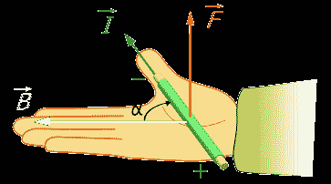

# 非常规单极电机

> 原文：<https://hackaday.com/2017/02/13/unconventional-homopolar-motor/>

作为一名黑客，你可能已经制造了一个单极电机，因为你只需要三样东西:电池、磁铁和一些铜线。YouTube 上有数不清的视频。这次我们要给大家展示的是【电子实验 Roober的版本。这绝对是你随处可见的无处不在的设计的一个新变化。他的设计有点复杂，但结果证明努力是值得的。

Right hand rule for the Lorenz force. By Jfmelero, via [Wikimedia Commons](https://commons.wikimedia.org/w/index.php?curid=6120095)

单极电动机是有史以来建造的第一台电动机。1821 年创造了迈克尔·法拉第，它的工作原理是因为[洛伦兹力](https://en.wikipedia.org/wiki/Lorentz_force)。这个力作用在任何浸入垂直于电流的磁场中的载流导体上。这些马达实际上没有什么实际用途，但却是学习电磁学基本知识的绝佳途径。

在这个设置中，有两个导电环放在一个木制底座上，连接到电池端子。钕磁铁由一个导电杆连接，导电杆在环的中心旋转，闭合电路，允许电流流动。然后洛仑兹力发挥魔力，推动棒和磁铁做圆周运动。

非常干净和编辑良好的工作，因为是由[电子实验 Roobert33]的其他视频。你可能想复制这个漂亮的马达，或者你也可以做一个更简单的版本开始实验。

 [https://www.youtube.com/embed/_5Bvn85KIo4?version=3&rel=1&showsearch=0&showinfo=1&iv_load_policy=1&fs=1&hl=en-US&autohide=2&wmode=transparent](https://www.youtube.com/embed/_5Bvn85KIo4?version=3&rel=1&showsearch=0&showinfo=1&iv_load_policy=1&fs=1&hl=en-US&autohide=2&wmode=transparent)

