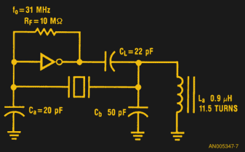

# 了解石英晶体谐振器

> 原文：<https://hackaday.com/2017/01/17/understanding-the-quartz-crystal-resonator/>

准确的时间是我们认为理所当然的许多技术的最基本要求之一，然而我们中有多少人停下来考虑使我们拥有它的组件？当我们的微处理器和其它数字电路需要价格合理、已知且稳定的时钟频率时，石英晶体是我们的首选标准。也许是时候让我们仔细看看了。

无线电频率的第一个电子振荡器依赖于调谐电路的电特性，以电感和电容为特征来保持频率。调谐电路便宜且易于生产，但其频率稳定性极易受温度和振动等外部因素的影响。因此，使用调谐电路的 RF 振荡器在其工作期间可能漂移许多 kHz，并且其定时不可靠。早在计算机需要精确计时之前，20 世纪 20 年代和 30 年代的无线电发射机就需要保持在频率上，必须付出相当大的努力才能使调谐电路发射机保持在目标上。石英晶体正等着飞过来，帮我们省下这份力气。

### 良好的振动

石英晶体的等效电路。wolfmankurd[PD]via[Wikimedia Commons](https://commons.wikimedia.org/wiki/File:Crystal_oscillator.svg)。

解决调谐电路频率稳定性问题的方法是使用石英晶体，这是一种谐振元件，其物理特性比电感或电容更不易受温度等外部因素的影响。石英晶体是压电的，也就是说，当你使它们变形时，它们产生电荷，当电荷施加到它们时，它们反过来变形。因此，你可以用电在一个精心切割的石英晶体中建立物理振动。正如音叉、锣和其他弹性固体可以显示物理共振一样，晶体可以用作电共振器。

石英晶体的电等效模型是一个与电容器并联的串联调谐电路，它具有并联和串联调谐电路的一些特性。它与由传统元件制成的调谐电路的不同之处在于具有极高的品质因数或窄带宽。它可以以与调谐电路相同的方式并入振荡器的反馈电路中，然后振荡器将以其谐振频率愉快地运行。

### 坚如磐石

![The Pierce oscillator. Omegatron [CC BY-SA 3.0], via Wikimedia Commons.](img/a3e8318ea882fdaf573854d42049347d.png)

皮尔斯振荡器。Omegatron [CC BY-SA 3.0]，通过[维基共享](https://commons.wikimedia.org/wiki/File:Pierce_oscillator.svg)。实用的晶体是由人造石英制成的精密研磨的圆盘或晶片，两边有化学沉积的金属电极。它们安装在密封包装中，以确保其稳定性。

晶体振荡器有多种配置，但如果您使用数字电路，最有可能遇到的电路是 Pierce 振荡器。你会发现它是用分立逻辑门实现的，也可以在许多微处理器和其它 ic 中实现。该晶体布置有一对电容器和高值偏置电阻器，作为从逆变器的输出到输入的相移网络。其中一个电容有时可以并联一个小的可变电容，允许进行非常小的频率调整，以校正单个晶振的容差。在晶体的谐振频率下，晶体上需要有 180 度的相移来维持振荡。

你刚刚读到的是一个非常基础的入门，关于水晶是什么，它是如何工作的，以及你可能会看到它是如何被使用的。然而，这只是故事的一部分，因为石英谐振器比第一眼看到的要多得多。

### 一切都在弦外之音中

石英晶体的谐振频率与其尺寸成比例。随着晶体变薄，频率增加。最终，随着频率的增加，材料的厚度会达到一个点，在这个点上，材料的厚度在不使晶体破裂的情况下不能再减小，所以存在一个上限频率，超过这个频率就不能制造出晶体。它因所采用的技术而异，但通常高于 20 MHz。

![A demonstration of harmonic overtones in sound waves in a closed pipe. Commator [CC BY-SA 4.0], via Wikimedia Commons.](img/e414e0faae75f6b2f05ee64c6469d406.png)

封闭管道中声波谐波泛音的演示。Commator [CC BY-SA 4.0]，通过[维基共享资源](https://commons.wikimedia.org/wiki/File:Overtones_(most_properly_numbered)_of_closed_pipe.png)。

当然，你会指出，晶振的可用频率是这个频率的许多倍，那么这是怎么回事呢？答案是，高于这个数字的晶体频率是通过谐波泛音实现的。低于 20 MHz 的频率仅仅是基本谐振，在相同的晶体中，可以在多个基本谐振上实现其他谐振。这种效应可以很容易地通过系绳中的驻波或封闭管道的声学特性来证明，如图所示。

实际上，专为泛音设计的晶体会在其基频的奇数倍处产生共振。因此，例如，基频为 10MHz 的泛音晶体也会在 30MHz 和 50MHz 产生泛音共振。

The overtone version of a Pierce oscillator, with extra tuned circuit. [Fairchild Semiconductor app note 340](https://www.fairchildsemi.com/application-notes/AN/AN-340.pdf), HCMOS Crystal Oscillators.

将泛音晶体放入上面所示的皮尔斯电路中，不会导致它以泛音频率振荡，而是以基波频率运行。泛音振荡器必须包含一个额外的调谐电路，用于抑制基频，留下最显著的泛音共振来决定振荡频率。在 CMOS 逻辑应用笔记的示例中，反相器输出网络中的电感执行此任务。

除了振荡器之外，还有另一个功能，在这个功能中你可能会遇到晶体。在无线电电路中，它们极窄的带宽意味着它们可以菊花链形式构成极具选择性的滤波器。产生单边带传输的一种方法是利用窄到足以从双边带抑制载波 AM 信号中提取一个边带的晶体滤波器。

现在，当你需要一个晶体控制的时钟时，你可能会去找现成的晶体振荡器模块，而不需要自己制作。当您需要更高频率的时钟时，您将使用具有锁相环功能的时钟发生器芯片，因此您永远不需要制作泛音振荡器。但是对于任何常用的组件来说，有一个基础是没有坏处的，晶体也不例外。

【专题及缩略图 Arduino 水晶图片:DustyDingo【公共领域】，via [维基共享](https://commons.wikimedia.org/wiki/File:Arduino_crystal-1.jpg)。]