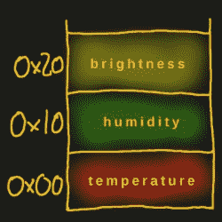
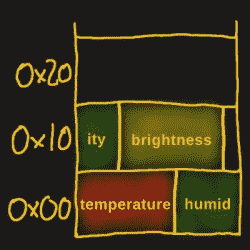

# 联合你的变量——C 语言高级数据类型介绍

> 原文：<https://hackaday.com/2018/03/02/unionize-your-variables-an-introduction-to-advanced-data-types-in-c/>

编写没有变量的 C 就像编写没有变量的 C 一样。它们对语言来说是如此重要，以至于在这里甚至不需要类比。我们可以随心所欲地声明和使用它们，但是拥有更多一点的结构，并将属于同一集合的数据组合在一起通常是有意义的。数组是捆绑相同类型数据的良好开端，尤其是当数组的索引除了值的位置之外没有特定的含义时，但是一旦您希望每个值有更有意义的关联，数组就会变得具有限制性。如果你想把不同的数据类型结合在一起，它们是没有用的。幸运的是，C 为我们提供了现成的合适的选择。

这篇文章将介绍 C 语言中的结构和`union` s，如何声明和使用它们，以及`union` s 如何作为指针和位运算的替代方法。

## 结构

[](https://hackaday.com/wp-content/uploads/2018/03/memorymap-sensors-struct-small2.jpg) 不过，在我们深入到`union` s 之前，我们将从一个更常见的关节变量类型开始——`struct`。一个`struct`是任意数量的任意数据类型的变量的集合，包括其他的`struct`，包装在一起作为它自己的数据类型。假设我们想要存储三个 16 位整数，代表温度、湿度和光传感器的值。

是的，我们可以使用数组，但是我们必须记住哪个索引代表哪个值，而使用`struct`，我们可以给每个值一个自己的标识符。为了确保我们最终得到一个无符号的 16 位整数变量，而不管底层系统是什么，我们将使用来自`stdint.h`的 C 标准库的类型定义。

```

#include <stdint.h>

struct sensor_data {
    uint16_t temperature;
    uint16_t humidity;
    uint16_t brightness;
};

```

我们现在有了一个新的数据类型，它包含三个在内存中相邻排列的整数。让我们声明一个这种新类型的变量，并给每个`struct`字段赋值。

```

struct sensor_data data;

data.temperature = 123;
data.humidity    = 456;
data.brightness  = 789;

```

或者，`struct`可以在声明时直接初始化。c 提供了两种不同的方法:假装它是一个数组或者使用*指定的初始化器*。把它当作一个数组，按照定义`struct`的顺序给子变量赋值。指定的初始化器可以通过名字任意赋值。初始化后，我们可以像刚才赋值一样访问每个单独的字段。

```

struct sensor_data array_style = {
    123, /* temperature */
    456, /* humidity    */
    789  /* brightness  */
};

struct sensor_data designated_initializers = {
    .humidity    = 456,
    .temperature = 123,
    .brightness  = 789
};

printf("Temperature: %d\n", array_style.temperature);
printf("Humidity:    %d\n", array_style.humidity);
printf("Brightness:  %d\n", array_style.brightness);

```

请注意，指定的初始化器中的字段没有按照它们原来的顺序排列，我们甚至可以省略单个字段，让它们不初始化。这允许我们稍后修改`struct`本身，而不用担心调整它以前使用的每个地方——当然，除非我们重命名或删除一个字段。

## 位字段

[](https://hackaday.com/wp-content/uploads/2018/03/memorymap-sensors-bitfield-small1.jpg) 位域是一个特例`struct`，它让我们将一个整数的一部分分割成任意位长的变量。继续以传感器数据为例，假设每个传感器值都是由 10 位分辨率的模数转换器(ADC)读取的。

因此，将结果存储在 16 位整数中会为每个值浪费 6 位，超过三分之一。使用位域将允许我们使用单个 32 位整数，并将其分成三个 10 位变量，只留下 2 位未使用。

```

struct sensor_data_bitfield {
    uint32_t temperature:10;
    uint32_t humidity:10;
    uint32_t brightness:10;
};

```

我们还可以添加一个 2 位宽的第四个字段来使用剩余的空间，而不需要额外的成本。这就是关于位域的所有知识。除了增加位长之外，位域仍然只是`struct` s，因此处理起来就像处理任何其他常规的`struct`一样。位域可能在某种程度上依赖于架构和编译器，所以[需要一些小心](https://hackaday.com/2015/08/28/firmware-factory-bit-fields-vs-shift-and-mask/)。

## 联盟

这就把我们带到了今天经常被忽视的话题`union`。从外面看，它们看起来和行为就像一个`struct`，事实上它们以完全相同的方式被声明、初始化和访问。因此，要将我们的`struct sensor_data`变成`union`，我们只需改变关键字，就大功告成了。

```

union sensor_data {
    uint16_t temperature;
    uint16_t humidity;
    uint16_t brightness;
};

```

[](https://hackaday.com/wp-content/uploads/2018/03/memorymap-sensors-union-small1.jpg) 然而，与`struct`不同的是，`union`内部的字段在存储器中不是按顺序排列的，而是全部位于同一地址。因此，如果一个`struct sensor_data`变量从内存地址`0x1000`开始，`temperature`字段将位于`0x1000`，而`humidity`字段位于`0x1010`，而`brightness`字段位于地址`0x1020`。使用`union`，所有三个字段都将位于地址`0x1000`。

一旦我们像在前面的`struct`例子中那样给所有字段赋值，这在实践中意味着什么就很容易显示了。

```

union sensor_data data;

data.temperature = 123;
data.humidity    = 456;
data.brightness  = 789;

printf("Temperature: %d\n", data.temperature);

```

与`struct`的例子不同，这里打印的值不是赋值`123`，而是`789`。由于`union`中的每个字段共享完全相同的存储位置，任何时候其中一个字段被赋值，所有其他字段先前被赋值的值都会被覆盖。出于这个原因，在一个`union`中拥有相同数据类型的字段，而是将不同的类型混合在一起是没有意义的。请注意，数据类型大小不需要匹配，所以让一个`union`包含一个 32 位和一个 8 位整数是没有问题的，如果需要的话，8 位值会被简单地截断。`union`本身的大小将等于最大字段的大小，因此对于 32 位和 8 位整数，`union`的大小将为 4 个字节。

## 使用联合

一个`union`实际上给了一个内存位置不同的名字和相应不同的大小。这似乎是一个奇怪的概念，但是让我们看看如何在一个更长的数据类型中轻松地访问不同的单字节。

```

union data_bytes {
    uint32_t data;
    uint8_t bytes[4];
};

```

这里我们有一个 32 位整数与一个 4 个 8 位整数的数组重叠。如果我们给 32 位的`data`字段赋值，并从`bytes`数组中读取一个位置，我们可以有效地从`data`字段中提取每个单独的字节。

```

union data_bytes db;
db.data = 0x12345678;
printf("0x%02x\n", db.bytes[1]);

```

实际输出将取决于您的处理器架构是小端还是大端。小端体系结构将数组索引 1 解释为整数的第二个*最低*有效字节`0x56`，而大端体系结构将它解释为整数的第二个*最高*有效字节`0x34`。

用于提取一个字节的相同原理也可以反过来工作，我们可以使用`union` s 来连接整数。让我们考虑一个涉及 ATmega328 模数转换器的真实例子。ADC 具有 10 位分辨率，查看其寄存器，转换后的值存储在两个独立的 8 位寄存器中，分别用于低位字节和高位字节的`ADCL`和`ADCH`。一个以这两个寄存器命名两个字段的`struct`似乎是一个很好的选择，因为我们也想要转换的整个 10 位值，我们将在`union`中使用`struct`和一个 16 位整数。

```

union adc_data {
    struct {
        uint8_t adcl;
        uint8_t adch;
    };
    uint16_t value;
};

```

如您所见，`struct`既没有类型名，也没有字段本身的名称，这让我们可以访问`struct`中的字段，就好像它们是`union`本身的一部分一样。

```

union adc_data adc;

adc.adch = ADCH;
adc.adcl = ADCL;

printf("0x%04x\n", adc.value);

```

请注意，只有在没有名称冲突的情况下，匿名访问`struct`字段才会起作用。如果有重复的字段名称，`struct`本身将需要一个字段名称。一旦`struct`有了自己的标识符，我们也可以给`struct`本身添加一个类型名，这样我们就可以在`union`之外使用它。

```

union adc_data {
    struct register_map {
        uint8_t adcl;
        uint8_t adch;
    } registers;
    uint16_t value;
};

union adc_data adc;
struct register_map adc_registers;

adc.registers.adch = ADCH;
adc.registers.adcl = ADCL;
printf("0x%04x\n", adc.value);

```

一旦寄存器值存储在`struct`域中，我们就可以从 16 位“值”域中读取完整的值。当然，组合这两个寄存器值并不需要`union`，我们也可以只使用按位移位和 OR 运算:

```

printf("0x%04x\n", (ADCH << 8) | ADCL);

```

说实话，`union`实际上并没有什么独特之处。无论你以何种方式使用它们，你都可以通过按位运算或指针强制转换达到同样的效果。但这种等价正是它们有趣的地方。

## 带有联合的快捷方式

让我们再看一下前面的字节提取例子，看看我们还有什么其他的方法可以从一个整数中提取一个字节。正如我们所记得的，我们有一个包含 32 位整数和四个 8 位整数的数组的`union`:

```

union data_bytes {
    uint32_t data;
    uint8_t bytes[4];
};

```

提取任何值的部分的最常见方法是将按位移位与 AND 运算相结合，但是，在这种特殊情况下，我们也可以将 32 位值转换为一系列 8 位值。好吧，让我们实现所有这些选项，看看会是什么样子。

```

uint32_t value = 0x12345678;
union data_bytes db;
db.data = value;

// shift one byte to the right and extract the LSB
printf("0x%02x\n", (value >> 8) & 0xff);
// cast to uint8_t pointer, access it as an array
printf("0x%02x\n", ((uint8_t *) &value)[1]);
// cast to uint8_t pointer, access via pointer arithmetic
printf("0x%02x\n", *(((uint8_t *) &value) + 1));
// simply take the union field
printf("0x%02x\n", db.bytes[1]);

```

仔细观察指针类型，我们基本上可以看出 32 位值的内存地址实际上是 8 位值的集合。现在，将相同的术语应用于`union`声明，我们基本上可以判断出位于`union`内存地址的是一个 32 位或四个 8 位的值，所以就像我们可以进行强制转换一样——除了使用`union`,当我们访问该值时，我们将非常明确是这两种类型中的哪一种。从某种意义上来说，`union` s 提供了一种数据类型转换的捷径，同时确保数据本身以一种有意义的方式使用，并且在其上下文中是有效的，编译器让您保持诚实。你可以说`union`是指针，就像`enums`是一堆预处理器常量。

## 研究浮点数

让我们再举一个例子，探索浮点数， [IEEE 754 单精度浮点数](https://en.wikipedia.org/wiki/Single-precision_floating-point_format)准确地说，也称为`float`。如果你想知道浮点对 CPU 来说是什么样子，就让它认为它是一个整数。显然不是以一种*“将 int 转换为 float 以去掉小数部分”*的方式，而是以一种*“原始 IEEE 754 binary32 格式”*的方式。

```

union float_inspection {
    float floatval;
    uint32_t intval;
} fi;

float f = 65.65625;
fi.floatval = f;

printf("0x%08x\n", fi.intval);
// ..or then again with pointers
printf("0x%08x\n", *((uint32_t *) &f));

```

两者都将输出`0x42835000`，如果不彻底研究二进制 32 格式，这不会告诉我们太多，二进制 32 格式是一个具有标准化位宽的*符号*、*指数*和*分数*值的组合。回想一下位域的概念，我们可以用一个`struct`来扩展`union`，帮助我们分离二进制 32 格式。为了完整起见，同样的数据也用按位运算提取，作为非`union`替代。

```

union float_inspection {
    float floatval;
    uint32_t intval;
    struct {
        uint32_t fraction:23;
        uint32_t exponent:8;
        uint32_t sign:1;
    };
} fi;

float f = 65.65625;
uint32_t i = *((uint32_t *) &f);
fi.floatval = f;

printf("%d %d 0x%x\n", fi.sign, fi.exponent, fi.fraction);
printf("%d %d 0x%x\n", (i >> 31), ((i >> 23) & 0xff), (i & 0x7fffff));

```

我将让您来决定哪个选项更容易阅读和维护。无论哪种方式，输出都会给我们一个符号值`0`、指数`133`和分数`0x35000`。根据格式的定义，我们可以从中构造初始浮点数`65.65625`。因此，如果您最终分析了一些原始数据转储或二进制 blob，并发现了一个浮点值，现在您知道如何使用`union`来找出它所代表的数字。

## 这是所有的乡亲

当使用`union`来检查其他数据类型时，还有两件事需要担心:字节序和对齐。大多数计算机和微控制器都是小端的，但是要注意摩托罗拉 68k 和 AVR32 架构是大端的。出于性能原因，不同的处理器也喜欢在 2 字节或 4 字节边界上对齐内存，这可能意味着两个`uint8_t`可能位于内存中相隔 4 个字节的位置。在 GCC 中，您可以使用`aligned`属性来控制这种行为，但是您可能会受到速度惩罚，这超出了本文的范围。

我们对`struct` s 和`union` s 的考察到此结束。希望我们能给你一些关于如何安排变量的新见解和想法，以及一些处理它们的方便的替代方法。让我们知道你是否能想出其他方法来利用所有这些，以及你以前用什么特殊的方式使用过或遇到过`union` s。