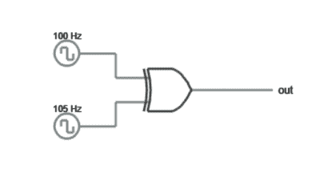
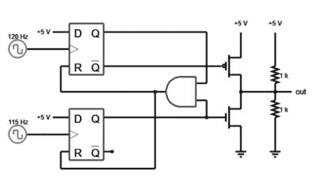
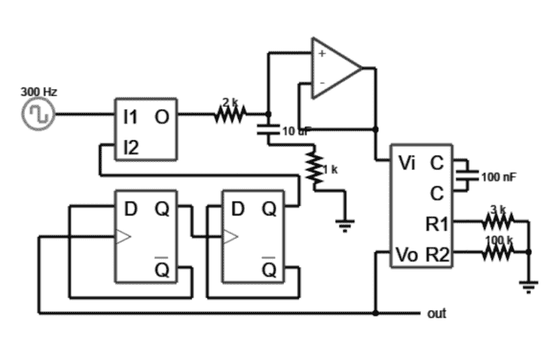

# 解锁锁相环

> 原文：<https://hackaday.com/2016/03/23/unlock-the-phase-locked-loop/>

如果你想要一个稳定的振荡器，你通常会想到使用晶体。石英的压电特性意味着它可以以特定的方式切割，从而以非常精确的频率振荡。如果你提供一个恒定的负载并保持温度稳定，晶体振荡器将比大多数其他选择更好地保持其频率。

然而，水晶也有不好的一面。正如你所料，因为晶体非常稳定，当你想要一个不同的频率时，很难改变频率。你可以用一个微调电容来拉一点频率，但要真正改变频率，你必须改变晶体。

还有其他种类的振荡器频率更灵活。然而，它们通常不那么稳定。要将灵活性与晶体般的稳定性结合起来，可以使用锁相环(PLL)。许多现代系统使用直接数字频率合成，但 PLL 是一项历史悠久、久经考验的技术。

## 基础

基本想法很简单。PLL 使用晶体振荡器，但它不是主要输出。主要输出来自可调振荡器，通常是压控振荡器(VCO)。考虑一个简单(但不切实际)的例子。假设 VCO 应该输出与晶体振荡器相同的频率。PLL 的环路部分比较两个频率输出，并产生与差值成比例的电压。该电压调整 VCO，直到输出匹配。

这就产生了两个问题:第一，为什么不直接用晶振的输出呢？第二，如何比较振荡器的输出？

## 相位比较器

 我们先来回答第二个问题。考虑两个振荡器都输出方波的情况。你可以认为低电平是逻辑 0，高电平是逻辑 1。将两个输出都输入到 XOR 案例中会产生一个有趣的输出。

如果两个信号完全同相，那么输入将是 00 或 11。在这两种情况下，异或门将输出零。输入能够始终同相的唯一方法是它们的频率完全相同(当然是同相)。任何频率或相位误差都会产生高输出。更好的是，异或门的输出将具有与误差量成比例的占空比。

考虑极端的情况。一种极端情况是晶体和 VCO 输出完全匹配。异或门的输出将是稳定的低电平。另一种极端情况是 VCO 输出保持低电平(0 Hz)。那么异或门的输出将与晶体振荡器的输出相同。其他情况会导致脉冲输出，两个频率越接近，输出为高的总时间越短。

这可能比阅读更容易想象。法尔斯塔德模拟器可以在你的浏览器中向你展示一个相位检测异或门。尝试将频率从 105 Hz 更改为其他频率，并观察输出。如果在仿真运行时改变频率以匹配，可能仍会有相位误差。尝试重置按钮，看看当频率和相位匹配时会发生什么。

## 低路

给定一系列脉冲，您可以使用 RC 电路对脉冲进行积分(即产生与脉冲面积成比例的电压)。这是反馈到压控振荡器的合适电压。根据 VCO 的不同，您可能需要对电压进行一些处理，但这完全取决于您使用的电路。

还有其他方法来进行相位检测。例如，下面是另一种方法(见右图)。可能还有很多其他方法。主要思想是比较两个频率，并产生一个可以影响 VCO 的输出。当相位(以及频率)匹配时，输出电压将稳定在匹配频率所需的水平。

## 那又怎样？

到目前为止，我们的 PLL 有点不给力。很难想象为什么你不直接使用晶体振荡器。当你以某种方式改变输出频率时，奇迹就发生了。在很大程度上，这意味着在相位比较器之前对输出频率进行分频。如果你这样做，环路将锁定分频频率与晶体相同。这将在输出端产生更高的频率。

例如，上面是一个 PLL，它产生的频率[是基准振荡器](http://www.falstad.com/circuit/circuitjs.html?cct=$+1+0.000005+6.724437240923182+61+5+50%0A158+400+176+432+176+0%0Ac+496+176+496+208+0+1e-7+-0.991047200149304%0Ar+496+240+560+240+0+3000%0Ar+496+272+560+272+0+100000%0Aw+560+240+560+272+0%0Ag+560+272+560+304+0%0AR+112+128+48+128+0+2+300+2.5+2.5+0+0.5%0Ag+368+208+368+240+0%0Aw+400+144+400+176+0%0Aa+320+80+400+80+1+15+-15+1000000%0Aw+288+64+320+64+0%0Aw+320+96+320+144+0%0Aw+320+144+400+144+0%0Aw+400+144+400+80+0%0A161+112+128+160+128+0%0Ar+208+128+288+128+0+2000%0Aw+288+64+288+128+0%0Ac+288+128+288+160+0+0.000009999999999999999+2.7966242794108256%0A155+112+224+128+224+0+0%0Aw+112+192+112+160+0%0Aw+208+288+208+320+0%0Aw+208+320+80+320+0%0Aw+80+320+80+224+0%0Aw+80+224+112+224+0%0Aw+112+256+48+256+0%0Aw+48+256+48+336+0%0Aw+48+336+400+336+0%0Aw+400+336+400+272+0%0AO+400+336+464+336+0%0Ar+336+160+336+208+0+1000%0A155+224+224+240+224+0+5%0Aw+368+208+336+208+0%0Aw+112+192+256+192+0%0Aw+288+160+336+160+0%0Aw+320+192+256+192+0%0Aw+224+320+320+320+0%0Aw+320+320+320+304+0%0Aw+320+192+320+224+0%0Aw+208+224+208+256+0%0Aw+208+256+224+256+0%0Aw+224+224+224+320+0%0Aw+320+304+320+288+0%0Ao+6+8+0+46+5+0.000048828125+0+-1%0Ao+28+8+0+46+5+0.00009765625+0+-1%0A)的四倍。两个触发器将输出频率除以 4，因此相位比较器将输出频率锁定为基准频率的 4 倍。尝试将参考时钟更改为 10 Hz。然后试试 100 Hz 或者 500 Hz。您会注意到，当您修改时钟时，需要一点时间来锁定循环。例如，下面是从 10 Hz 到 100 Hz 参考的输出切换(40 Hz 到 400 Hz 输出)。

在输出稳定下来之前，您可以看到它有一点抖动。当然，除以 4 只是一个例子，您可以除以任何数字(通常称为 N 分频电路)来产生不同的频率。

这个方案有几个优点。首先，晶体振荡器可以是低频的，它更容易制造和稳定。如果有可编程分频器，就可以产生许多不同的输出频率。然而，你不能随便创造任何你想要的频率。例如，假设您的参考频率为 100 kHz。如果将输出除以 10，则输出为 1 MHz。如果你除以 9，你会得到 900 千赫。祝你创造 925 千赫的好运。

提高频率的一个常见解决方案是对参考时钟进行分频。这通常称为 N/M 分频方案。在上例中，假设您可以将参考时钟除以 1、2 或 4。现在将 N 设为 10，可以产生 1 MHz、500 kHz 或 250 kHz。除以 9 将得到 900 kHz、450 kHz 和 225 kHz。你仍然不能产生任何任意的频率，但是你可以得到更多的频率。以前做不到的 925 kHz？就用 M=4，N=37。那么，参考频率是 25 kHz，925/37 是 25。你也可以把它想成输出频率除以 N/M 得到原来的参考频率(925/(37/4))=100)。

## 使用

到目前为止，您已经看到 PLL 实际上将参考时钟乘以某个整数因子。然而，它能做的不仅仅是这些。例如，PLL 可以解调 FM 和 AM(提示:鉴相器的电压输出告诉您 FM 信号离中心有多远)。PLL 还可以从数据中恢复时钟，消除长线传输的时钟偏差，并且使用[锁定放大器](https://en.wikipedia.org/wiki/Lock-in_amplifier)，类似 PLL 的电路可以从非常嘈杂的信号中恢复数据。

有很多细节我都忽略了，还有很多关于这个主题的书。然而，如果你想探索更多，Jeri Ellsworth 和我们自己的 Bil Herd 制作了一个关于这个主题的视频，你会喜欢的(见下文)。有许多实现选项。甚至可以在软件中创建 PLL。如果你想要一个单芯片解决方案，我想到了 CMOS 4046 IC。

 [https://www.youtube.com/embed/_PPeHExUbqs?version=3&rel=1&showsearch=0&showinfo=1&iv_load_policy=1&fs=1&hl=en-US&autohide=2&wmode=transparent](https://www.youtube.com/embed/_PPeHExUbqs?version=3&rel=1&showsearch=0&showinfo=1&iv_load_policy=1&fs=1&hl=en-US&autohide=2&wmode=transparent)

