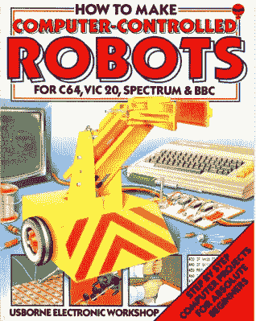

# Usborne 发行更多 20 世纪 80 年代计算机书籍

> 原文：<https://hackaday.com/2017/03/20/usborne-release-more-1980s-computer-books/>

20 世纪 80 年代对技术感兴趣的孩子确实很幸运。就像第一代家用电脑一样，他们期望给电脑编程，而这是后一代人所没有的。

传统的儿童出版商热情地拥抱了家用电脑的繁荣，而且可能是历史上唯一一次出现了针对儿童的书籍，涵盖了机器代码或微处理器接口等主题。

Kid’s books were better when we were young! Usborne(Fair use)

如果你是英国人，这些书中最令人难忘的是来自 Usborne 出版社。他们丰富多彩的漫画格式和易于消化的布局使他们成为第一次收到他们的成年人的崇拜对象，Usborne 自己也聪明地利用他们的遗产，通过发布一些 pdf 来推广他们当前的产品。现在，为了宣传他们的最新标题“使用 Python 为初学者编码”，[他们又发布了五个](https://usborne.com/browse-books/features/computer-and-coding-books/)(向下滚动查看)。标题是“练习你的基础”，“更好的基础”，“电脑控制的机器人”，“用你的电脑做实验”，以及“键盘&电脑音乐”，它们加入了他们已经发布的 15 个。

显然，它们主要基于 20 世纪 80 年代的微型计算机，但当然，对于大多数业余读者来说，这将是它们的主要吸引力。无论哪种方式，它们都是有趣的读物，如果你碰巧有一些旧的微型电脑，那么也许你可以尝试一些项目。

如果基本列表对您来说有点陌生，[我们可以建议一些地方来找到基本信息](https://hackaday.com/2016/11/18/the-basic-issue-with-retro-computers/)。