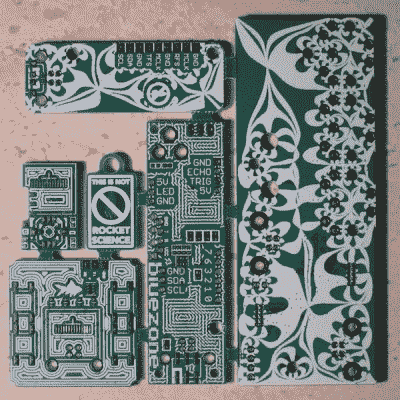

# 使用 PCB 镶板的所有额外空间

> 原文：<https://hackaday.com/2017/07/04/use-all-that-extra-space-with-pcb-panelization/>

任何制作 PCB 的人都遇到过这样一个难题:必须为你不使用的空间付费……例如，设计一个圆形 PCB，却发现边角被浪费了。解决办法？更小的木板被添加到空白处。

一个逻辑上的绊脚石可能是你根本没有准备好小型 PCB 设计。拉脱维亚黑客[Arsenijs]创建了一个可以放入这些空白点的小型 PCB 的资源，以及一个如何将 gerbers 组合成单个面板的教程。

英雄所见略同，本指南紧随【Brian bench off】[关于小组讨论](http://hackaday.com/2017/06/21/panelizing-boards-the-easy-way/)的文章之后。他们都是很好的读物。有趣的是，不久前我们会在家用蚀刻板上看到多个指南，而现在我们已经爬上了生产阶梯，以帮助更好地利用 PCB 工厂的指南。整洁！

这个项目似乎是[Arsenijs]的 [ZeroPhone](http://hackaday.com/2017/01/18/zerophone-gives-smartphones-the-raspberry-pi/) Pi 智能手机项目的合乎逻辑的副产品，该项目是 2017 年 Hackaday 奖的决赛项目，使用一堆 PCB 制造低成本手机。有人会想象，在制作手机原型的时候，Arsenijs 浪费了很多空间！用更小的设计来填满它，比如突破，或者装饰物品，比如黑客空间的名片。如果你在寻找小型 PCB，你可以在 Hackaday.io 上的项目的[文件区](https://hackaday.io/project/19202/files)找到一些。否则，你可以分享你的文件，[Arsenijs]会添加它们。