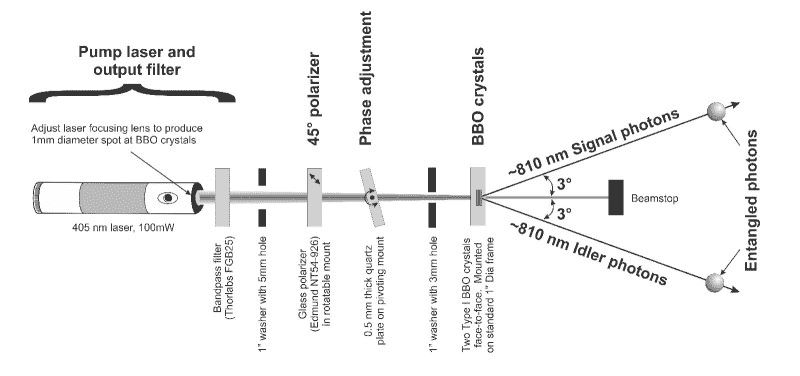
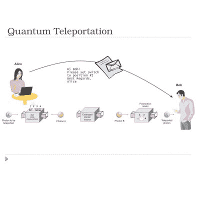
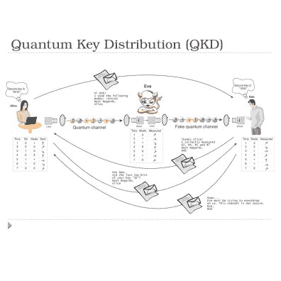

# Shanni Prutchi 量子纠缠的应用

> 原文：<https://hackaday.com/2015/11/30/uses-for-quantum-entanglement-with-shanni-prutchi/>

对于那些没有参加[黑客日超级会议](http://hackaday.io/superconference)的人来说，它以一场非常激烈的谈话开始，任何人都很难跟上。然而，[Shanni Prutchi]以一种平易近人的方式介绍了她关于光子的量子纠缠的演讲，并给你留下了许多进一步研究的线索。看看下面的视频，休息后加入我们，浏览一下她演讲的内容。

 [https://www.youtube.com/embed/tn1sEaw1K2k?version=3&rel=1&showsearch=0&showinfo=1&iv_load_policy=1&fs=1&hl=en-US&autohide=2&wmode=transparent](https://www.youtube.com/embed/tn1sEaw1K2k?version=3&rel=1&showsearch=0&showinfo=1&iv_load_policy=1&fs=1&hl=en-US&autohide=2&wmode=transparent)

## 光子的量子纠缠

[ [Shanni Prutchi](http://www.prutchi.com/) ]正在罗文大学学习电子和计算机工程，并且已经发表了关于射电天文学和辐射测量的论文。但与这次演讲更直接相关的是她与人合著的《T2》《T3》一书，该书通过动手项目《T4》《T5》探索量子物理。

 【山尼】解释了目前识别两个纠缠光子的方法。她不仅解释了一只**如何能**进行这个实验，她还解释了她**是如何**进行这个实验的。首先，紫外激光束通过非线性光学晶体。另一边，随机偏振的纠缠光子被发射出来。这些对的偏振将永远联系在一起，测量一个对的偏振角可以指示另一个对的偏振角。接下来的问题就是识别哪些光子是链接在一起的，并利用这种纠缠来达到某种目的。

### 量子隐形传态和量子密钥分发

这两种粒子具有相互联系的性质，使得一个粒子的量子态与其纠缠的粒子呈现出直接的相关性，即使粒子是分离的。当然，正是这些粒子的分离使得 trait 最有用。

第一个例子是一种量子隐形传态。发送者操纵一个纠缠光子，而接收者测量它。不管两者之间有多远，操纵都是瞬间发生的。粒子本身并不移动，但本质上接收端的纠缠粒子表现出与发送端完全相同的性质。这给人一种粒子被从一个地方传送到另一个地方的感觉。[Shanni]提到它实际上是一个粒子的破坏和再造，而不是运动。

    

她介绍的第二个应用是量子密钥分发。这是量子密码术的一种形式，其中几对纠缠光子被用在某种公钥/私钥对中。该系统优点在于，它可以立即检测到中间人攻击。然而，正如[Shanni]提到的，目前有研究指出了该系统的漏洞。

随着[Shanni]通过自己的方式完成学业，我们希望看到和听到她更多的消息；与此同时，我们将复习物理词汇。如果你没有机会在 SuperCon 与[Shanni]交谈，你可以在 Twitter 上找到她的名字 [@shannirosa](http://twitter.com/shannirosa) 。