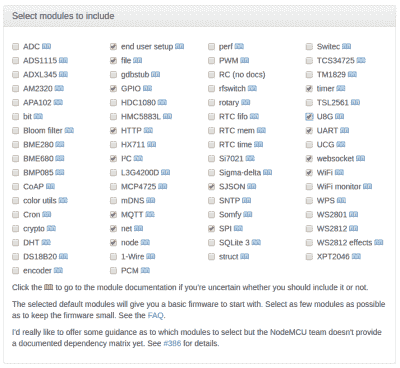
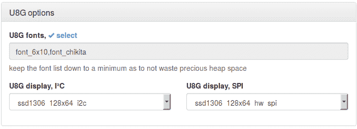
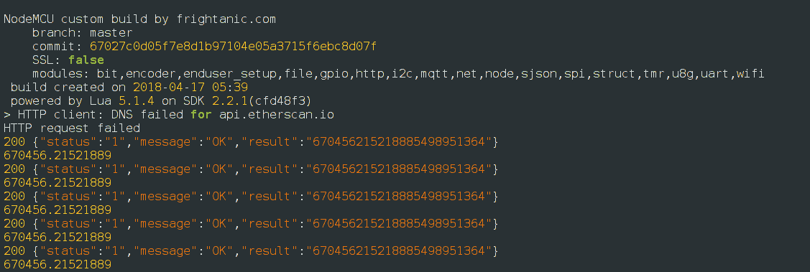

# 使用 NodeMCU 板在 ESP8266 上访问区块链

> 原文：<https://hackaday.com/2018/05/02/using-blockchain-explorer-apis-on-nodemcu/>

区块链声称自己是公开的、分布式的、实际上不可变的总账。不幸的是，它们也倾向于变得有点大——目前比特币区块链为 194GB，以太坊为 444GB。这给我带来了相当大的不便，因为我正在考虑制作一些有趣的“以太坊区块链感知”小工具，这在一个微控制器上要处理几个数量级的数据，更不用说使用 3G 的带宽成本了。

想象一个可以集成到我的手机套(或者……钱包)中的轻薄设备？)对付整个区块链显然是不可能的。我可以使用一个 [VPS 或路由器](http://hackaday.com/2017/11/09/iot-with-the-ethereum-blockchain/)来有效地下载必要的数据并响应查询，但即使这样看起来开销也很大，所以我研究了可用的 API。

事实证明，一些区块链探索者提供了我想要的 API。我让 ESP8266 参与区块链的努力始于两个可用的 API:eth plorer 和 Etherscan。

## 区块链和微控制器的碰撞

从简单的开始，我着手构建一个小工具，它包含一个硬编码的以太坊地址，使用 Etherscan API 通过 Wi-Fi 检索该地址的 Eth 余额，并将其显示在一个小的有机发光二极管屏幕上(当然不需要任何安全密钥)。

几天后，我将使用 websockets 协议的应用程序来创建一个简单的自动化服务控制器。想象一下，你可以用以太坊租一个会议室，房间的供电时间取决于发送到一个地址的以太网的数量。换句话说，一个以太坊控制的带定时器的开关！

像往常一样，我将使用 NodeMCU 板(我真的订购了很多)，它使用 ESP8266，但这没有理由在基于 Arduino 的设备上难以实现。我选择了基于 SSD1306 控制器的 128×32 像素有机发光二极管屏幕。我真的很喜欢这一行屏幕，因为它们对比度高，易于阅读，有多种形式，价格低廉，而且只要选择正确的 NodeMCU 编译选项，就很容易使用。

## API 选项的利与弊

Ethplorer ( [Github](http://github.com/EverexIO/Ethplorer) )用数据响应 HTTP GET 请求。一些关键特性是它允许你检索交易数据，如硬币和代币的价格和交易量。[价格跟踪工具在](http://wiki.das-labor.org/w/EtherNode)之前就已经完成了，这看起来是一个很好的实现方式。

另一方面，以太扫描关注更多我感兴趣的东西。它有一些基本的智能契约特性，比如检查执行状态，除了 HTTP GET 请求之外，它还支持 websockets，以实现接近实时的警报。

这两项服务目前都是免费使用的，可以检查 Eth 余额、交易历史和你在这种类型的区块链浏览器中期望的其他功能。我为这个项目选择了 Etherscan，因为我对价格数据不感兴趣，并且我想到了 websockets 允许的一些有趣的事情。这两个服务都以 JSON 格式提供数据，这非常方便，我们将在后面看到。

## 使用 NodeMCU-build 准备固件很容易

[](https://hackaday.com/wp-content/uploads/2018/05/screenshot-from-2018-04-30-13-18-33.png)

NodeMCU-build tool makes adding module support very simple.

对于我的应用程序，我需要在 NodeMCU 中编译对一些比平常更多的特性的支持，所以让我们详细讨论一下。优秀的 [NodeMCU-build](http://nodemcu-build.com) 工具将使这变得容易

除了默认模块，我至少需要 I2C、SPI、HTTP、websocket 和 SJSON。我还建议添加 MQTT 和最终用户设置，以获得一点灵活性。

有几个可选的图形库来处理 LCD 屏幕。我可以使用的大多数屏幕都在 U8G 模块下(或者偶尔在 UCG 模块下)。当您选择其中一个时，该工具会提供字体选项，以及 I2C 和 SPI 显示驱动程序。字体占用了宝贵的空间。我个人的偏好是删除两个默认选项(按下“选择”链接打开菜单)，选择 u8g.font_profont17r 和 u8g.font_profont15r，因为这两个都易于阅读，给我留下两个字体大小的选择和一个体面的字符集。



最后，我从下拉列表中选择显示驱动程序，列为芯片组/屏幕大小/协议，并点击建立按钮。我需要浮点固件，而不是整数版本——我没有足够的以太坊没有小数点值！

在等待构建的时候，[我去了 Etherscan 并注册了一个 API 密匙](http://etherscan.io/login)。一旦固件完成，我就刷新它，我们就可以开始了。

## 该计划

硬件设计好了，模块也添加到了固件中，是时候写代码了。我只需要四个基本部分来实现这一点:一个网络连接、一些 API 调用、一种在屏幕上显示数据的方法，以及一个定时更新的定时机制。

#### WiFi:

我们将从连接 Wi-Fi 开始:

```

wifi.setmode(wifi.STATION)
wifi.setphymode(wifi.PHYMODE_B)
station_cfg={}
station_cfg.ssid=&quot;my_ssid&quot;
station_cfg.pwd=&quot;my_password&quot;
station_cfg.save=true
wifi.sta.config(station_cfg)

```

我设置了 PHYMODE_B，以功耗为代价提高了续航里程。我不用电池，所以我想我也有不错的无线覆盖范围。

#### 正在检索钱包余额:

接下来，我们将定义一个函数来检索特定钱包地址的帐户余额。这将返回魏(1 Eth = 1，000，000，000，000，000，000，000 魏)的余额。用您的值替换“目标地址”和“API 密钥”。

```

function amount()
http.get(&quot;http://api.etherscan.io/api?module=account&amp;action=balance&amp;address=target address&amp;tag=latest&amp;apikey=API key&quot;, nil, function(code, data)
    if (code &lt; 0) then
      print(&quot;HTTP request failed&quot;)
    else
      print(code, data)
      t = sjson.decode(data)
      wei = (t[&quot;result&quot;])
      eth = wei/1000000000000000000
      print (eth)
  end)
end

```

上面，我们看到 sjson 库是多么的整洁。如果您查看 NodeMCU 接收的原始 JSON 数据，它看起来像这样:



上面，sjson.decode 将接收到的数据转换成表格。运行 t["result"]返回与名为' result '的字段相关联的值(我们将它从 Wei 转换为 Eth)。这是处理许多返回 JSON 数据的 API 的一种非常干净简单的方法！

#### 将数据推送到有机发光二极管显示器:

接下来，我们扩展该函数以在屏幕上显示数据。

```

function amount()
http.get(&quot;http://api.etherscan.io/api?module=account&amp;action=balance&amp;address=target address&amp;tag=latest&amp;apikey=API key&quot;, nil, function(code, data)
    if (code &lt; 0) then
      print(&quot;HTTP request failed&quot;)
    else
      print(code, data)
      t = sjson.decode(data)
      wei = (t[&quot;result&quot;])
      eth = wei/1000000000000000000
      print (eth)
-- Setup screen
sda = 1
scl = 2
   sla = 0x3C
   i2c.setup(0, sda, scl, i2c.SLOW)
   disp = u8g.ssd1306_128x32_i2c(sla)
   disp:setFontRefHeightExtendedText()
   disp:setDefaultForegroundColor()
   disp:setFontPosTop()
   disp:firstPage()
   repeat
-- choose font
   disp:setFont(u8g.font_profont17r)
-- display balance
   disp:drawStr(2, 22, eth)

   until disp:nextPage() == false

    end
  end)
end

```

#### 等待游戏:

最后，我们添加了一个计时器，以便 Wi-Fi 在该功能尝试检索您的 Eth 余额之前有时间连接，然后每 10 秒更新一次。有更好的方法来做到这一点(例如，只运行一次连接)，但目前这种方法非常有效。一旦我决定是使用静态 Wi-Fi 配置还是最终用户配置工具，我很可能会将其更改为后一种方法。

```

--wait 10 seconds for wifi to connect before trying to 
access the Eth balance

tmr.alarm(0,10000,tmr.ALARM_AUTO,amount)

```

## 构建…代码…利润！

我们做到了！一个简单的设备，检索和显示从区块链新鲜的 Eth 平衡。不，这不是我的帐户，我用了 API 文档中的一个来看看它实际上是如何处理大数的。

有许多途径可以用新的功能来扩展它，不管是琐碎的还是有用的。请关注 Hackaday，因为我很快会有后续文章来实现类似会议室租赁的概念。但是我完全可以做一个屏幕，让你在工作的时候给我打电话！对于与区块链交互的微控制器，你的最佳和最差想法是什么？