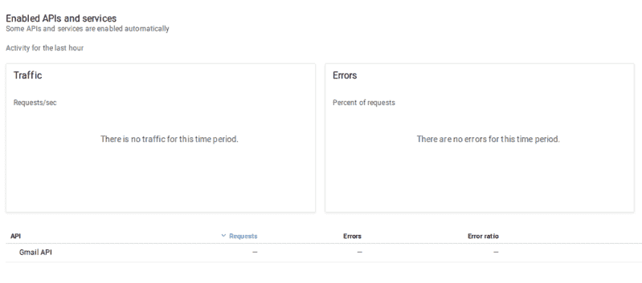
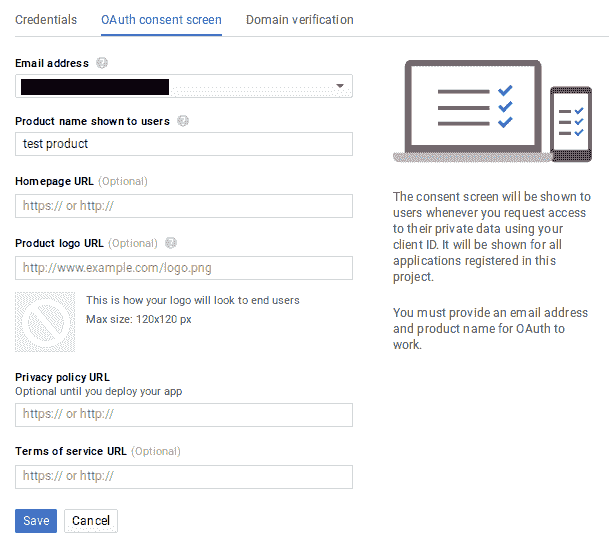
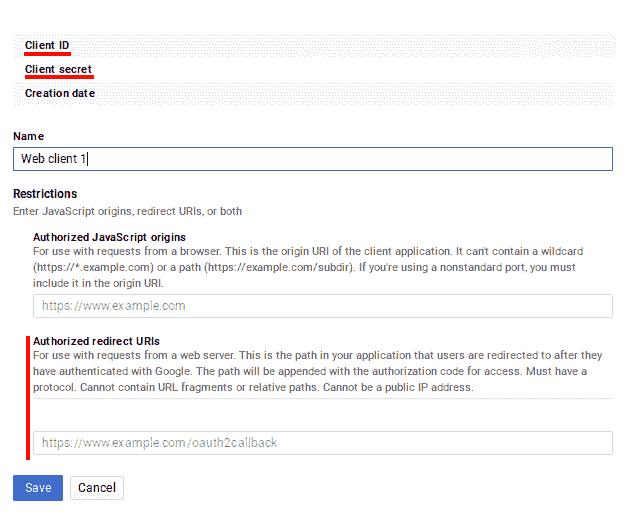

# 在 Linux 和 ESP8266 上使用 Gmail 和 OAUTH2

> 原文：<https://hackaday.com/2017/12/14/using-gmail-with-oauth2-in-linux-and-on-an-esp8266/>

我害怕的任务之一是配置一个网络服务器来正确地通过 Gmail 发送电子邮件。发送电子邮件最简单的方式是 SMTP，有许多脚本提供了一种简单的方法，只需最少的配置就能以这种方式发送邮件。甚至还有 PHP `mail()`，尽管它不太可靠。

开箱即用，Gmail 需要 OAUTH2 进行身份验证和共享用户数据，其主要优势是不需要您在需要访问您帐户的应用程序中存储您的用户名和密码。虽然他们有一个“允许不太安全的应用程序”选项，即[允许微软 Outlook](http://support.microsoft.com/en-us/help/2984937/outlook-cannot-connect-to-gmail-after-july-15--2014) 等传统产品的 SMTP 访问，但这似乎不是正确的前进方向。Google 记录了如何使用 OAUTH2 与他们的 API 进行交互，那么为什么不直接使用 oauth 2，而不是将我的用户名和密码明文放在一堆原型和测试脚本中呢？

这些都是我每次在项目中想到的想法，每次我都不知何故忘记了做这件事的步骤，也忘记了写下来，最后由于我自己的愚蠢浪费了相当多的时间。作为补偿，我决定记录这个过程并与大家分享，然后让它在运行 Arduino 开发环境的 ESP8266 板上工作。

在我们继续之前，现在是非技术性复习 OAUTH 如何工作的好时机。OAUTH 和 OAUTH2 之间的主要区别在于，后者需要 HTTPS，并且允许应用程序在用户帐户中使用特定服务的访问令牌是有期限的。

要在 OAUTH2 上使用 Gmail，我们需要从五件事情开始:一个在 Google APIs 中注册的应用程序，它的客户端 ID 和客户端密码，[一台运行 LAMP](http://en.wikipedia.org/wiki/LAMP_(software_bundle)) 的计算机(一个按小时计费的 VPS 在这里就可以了)，以及一个指向它的域名。

用 Google API 注册一个应用程序很容易。到 [Google API 控制台](http://console.developers.google.com/apis/)，登录，新建一个项目，输入。启用 Gmail API 应该在首页建议。



With the project created and the Gmail API enabled, the dashboard should look something like this

然后点击侧边栏上的“凭据”，创建凭据，最后点击“创建 OAUTH 客户端 ID”。在继续之前，您需要创建一个同意屏幕。此时您真正需要填写的唯一条目是“向用户显示的产品名称”。



保存该表单后，选择“Web 应用程序”作为您的应用程序类型。请注意名为“授权重定向 URIs”的字段，我们稍后将返回该字段。重要的是要正确设置，以便我们能够在此过程的稍后阶段接收刷新令牌。



现在，只需按“创建”即可。将显示一个包含您的客户端 ID 和客户端密码的弹出窗口。你很快就会用到它们，所以现在最好把它们复制/粘贴到你电脑上的本地文件中。

接下来，我们将使用这两段数据来请求访问令牌和刷新令牌。通过在我们的 web 服务器上安装流行的 PHP 邮件发送器 PHP mailer T1，我们可以同时完成两件事。它包括一个请求 OAUTH2 访问/刷新令牌的工具，并且能够轻松发送快速测试电子邮件。为了安装它，我们将使用 [Composer PHP 依赖管理工具](http://getcomposer.org):

```
$sudo apt-get install composer
```

然后我们应该导航到我们的 web 可访问目录，在我的例子中是`/var/www/html`，并安装一些 PHP 脚本。请注意，这不应以 root 用户身份完成，因此如果需要，创建另一个用户，并授予他们访问目录的权限:

```
$composer require phpmailer/phpmailer
$composer require league/oauth2-client
$composer require league/oauth2-google
```

现在进入目录`vendor/phpmailer/phpmailer`。会有一个剧本叫`get_oauth_token.php`。将这个脚本向上移动三个目录到您刚才运行“composer”命令的目录中。从网上看到的这个脚本的位置需要输入到我们前面看到的谷歌 API 的“授权重定向 URIs”字段。在这种情况下，应该是`[https://mydomain.com/get_oauth_token.php](https://mydomain.com/get_oauth_token.php)`。公共 IP 地址将不会工作，这就是为什么一个域名指向你的网络服务器是一个要求。

现在，在文本编辑器中打开`get_oauth_token.php`，在需要的地方粘贴你的客户 ID 和客户密码。不要尝试在本地运行脚本，它会失败。在任何计算机上打开网页浏览器，导航到您输入的“授权重定向 URI”的 URL。然后从电子邮件服务列表中选择 Google 此时如果成功，您将被要求登录，然后在警告提示下的“高级”下授权未经验证的应用程序，此时您将最终收到一个刷新令牌。如果出于某种原因，您只需要一个访问令牌，那么您必须编辑脚本来回显它。

如果这不起作用，有两个常见的原因:一个错误的重定向 URI 或脚本无法找到其依赖关系。在前一种情况下，来自 Google 的错误消息将告诉您它所看到的脚本 URL，您可以使用该信息来更新 Google API 控制台中的重定向 URI 以修复该问题。对于后者，检查您的 apache 错误日志，可能位于`/var/log/apache2/error.log`中，看看没有找到什么依赖关系。您可能会看到类似这样的内容:

```
PHP Warning: require(vendor/autoload.php): failed to open stream: No such file or directory in /var/www/html/mydomain/get_oauth_token.php on line 59, referer: http://mydomain.com/get_oauth_token.php
```

如果你收到了你的刷新令牌，那么恭喜你:痛苦的部分结束了。你可以直接进入 PHPMailer Github 页面，填写他们的 OAUTH2 示例(`gmail_xoauth.phps`)，应该就可以了。如果你需要做的只是从你的 VPS 上的一个项目中发送邮件，你或多或少已经准备好进入你的项目中更有趣的部分了:

```
$email = 'someone@gmail.com';
$clientId = 'RANDOMCHARS-----duv1n2.apps.googleusercontent.com';
$clientSecret = 'RANDOMCHARS-----lGyjPcRtvP';
//Obtained by configuring and running get_oauth_token.php
//after setting up an app in Google Developer Console.
$refreshToken = 'RANDOMCHARS-----DWxgOvPT003r-yFUV49TQYag7_Aod7y0';
```

在继续之前，请记住清除包含刷新令牌和其他敏感数据的任何不必要的脚本。

## ESP8266:我们不需要讨厌的服务器

现在，如果我们想使用这些令牌在 Raspberry Pi 上直接从 project 发送电子邮件，而不需要中间的服务器，会怎么样呢？结果是，一旦我们有了客户机 ID、客户机密码和刷新令牌，我们就不再需要我们到目前为止一直使用的服务器和域名，并且一个邮件发送应用程序，例如 PHPMailer，可以安装在任何可以访问互联网的计算机上，只要它配置了这些值。

当我们试图在 ESP8266 上这样做时，事情变得有点复杂。OAUTH2 要求我们使用 SSL，访问令牌定期过期，需要刷新。谢天谢地，[jalmoroth]慷慨地[写了一份概念证明，并发表在 GitHub](http://github.com/jalmeroth/ESP8266-OAUTH2) 上。如果提供了访问令牌，它可以访问您的 Gmail 帐户并使用它发送电子邮件。它还可以直接从 Google Sheets 更新/获取数据，但我没有测试这个。然而，如果访问令牌过期，它无法检测到这一点，尽管它确实包含实际请求新令牌的工作代码，但不能解析它并使用它。

为了增加概念验证的功能，我[分叉了这个项目并做了一些改变](http://github.com/seanboyce/ESP8266-OAUTH2)。首先，我改变了代码中的操作顺序，让它在做其他事情之前检查当前的访问令牌是否有效。第二，如果访问令牌无效，Google API 会响应“400 错误请求”,除了“200 OK”之外的所有响应都会被代码过滤掉。最后，我编写了几个 JSON 解析器来检查“400 错误请求”的原因，并在请求新的令牌时提取和使用 Google API 返回的访问令牌。

它可以工作，但几乎不可靠——考虑到我以前从未真正使用过 Arduino 平台，这并不奇怪。值得注意的是，Google API 的 SHA1 指纹经常失败。从我的本地机器检查，SHA1 的指纹也在两个签名之间有所不同。检查它们中的任何一个都相当容易，或者只是继续尝试，但是我宁愿先了解发生了什么。(仅仅是 CDN 还是别的？)或者也许我应该用 Lua 重写整个应用程序，因为我更有能力。

在上面的基础上构建的一个有趣的小应用程序是在我的办公室放置一个按钮，向我的手机发送电子邮件。我不希望人们轻率地用那个电子邮件地址联系我，但我确实想立即知道是否有人在我办公室外面等着。红色大按钮用于正常请求，但紧急请求需要开锁。如果很紧急，最好也很有趣。


最后，你知道 Hackaday 提供了[一个访问 hackaday.io](http://hackaday.io/project/5602-hackaday-api) 的 API 吗？它使用更简单的 OAUTH(而不是 OAUTH2)身份验证，因此在 ESP8266 上实现应该比上面更简单。你们有人用过吗？