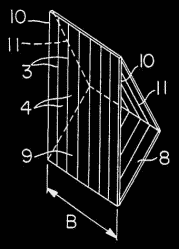
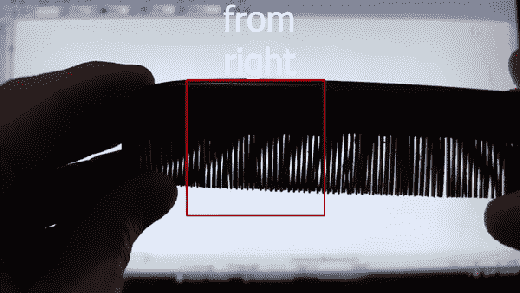
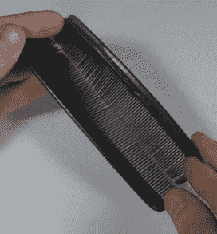

# 用云纹图案引导船只

> 原文：<https://hackaday.com/2018/04/07/using-moire-patterns-to-guide-ships/>

Moiré screens for arrows

[汤姆·斯科特]偶然发现了一种有趣的视觉效果[，这种视觉效果是用云纹图案创造的，用于引导船只](https://www.youtube.com/watch?v=d99_h30swtM)，但我们确信它可以在某个地方被黑客采用。在没有任何马达或 LED 动画的帮助下，当用户从不同角度观看时，图像会发生变化。当直接观看时，用户看到的是垂直线，但是从左边看，他们看到的是向右的箭头，从右边看，他们看到的是向左的箭头。它和船运一起使用来引导船只。例如，一个用途是引导他们到桥的中心点。当飞行员看到笔直的垂直线时，他们就知道如何驾驶船只。

美国专利第 4，629，325 号“领先标记指示器”解释了它的工作原理和制作方法。两个屏幕相互分离。前面的是垂直的，而后面的是一分为二并成角度的。当从左边或右边看时，这个角度造成了箭头的倾斜。我们必须说服自己，我们理解的是正确的，用两把梳子做的快速测试表明我们理解了。请参见下面的实际测试以及[Tom]的真实海运视频。

  Creating slanted lines with combs  The two combs

测试是通过在浅色背景下举起两把发梳来完成的，在我们的例子中，电脑显示器显示的大部分是白色。两把梳子的齿在底部相接触。前面的梳子保持垂直，后面的梳子向后倾斜。不是移动相机从左和右看梳子，而是将梳子作为一个左右旋转。正如您在动画 GIF 中看到的那样，查看方框区域，莫尔图案的倾斜度会发生变化，就像运输灯中箭头的上部或下部一样。

不相信莫尔条纹对黑客有用吗？看看这些使用莫尔效应的 DIY 精密卡尺。

 [https://www.youtube.com/embed/d99_h30swtM?version=3&rel=1&showsearch=0&showinfo=1&iv_load_policy=1&fs=1&hl=en-US&autohide=2&wmode=transparent](https://www.youtube.com/embed/d99_h30swtM?version=3&rel=1&showsearch=0&showinfo=1&iv_load_policy=1&fs=1&hl=en-US&autohide=2&wmode=transparent)

感谢[Lindsay Wilson]发送这条提示。