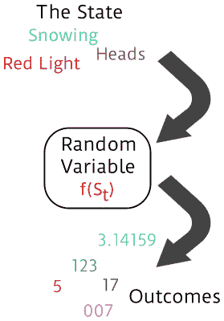
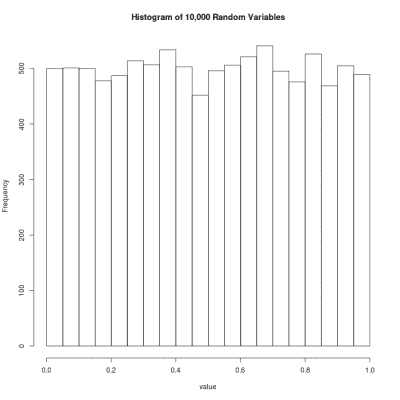
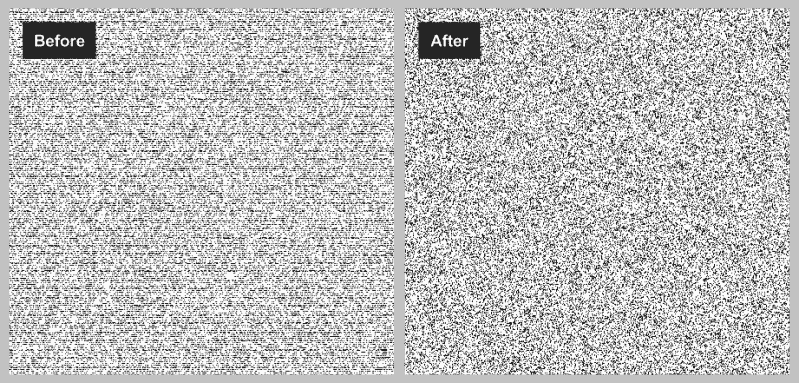

# V8 Javascript 修复(可怕！)随机数发生器

> 原文：<https://hackaday.com/2015/12/28/v8-javascript-fixes-horrible-random-number-generator/>

根据 V8 Javascript 官方博客上的这篇文章，V8 Javascript 在`Math.random()`中使用的伪随机数发生器(PRNG)存在严重缺陷，正在被更好的东西取代。V8 是谷歌为 Chrome 开发的快速 Javascript 引擎，它被用于 [Node.js](https://nodejs.org/en/) 和基本上任何地方。事实上，在过去的六年中，没有人注意到这样的事情，这有点令人担忧，但它已经被发现和修复，很快就会好起来。

在这篇文章中，我将带你经历一次随机性的数学之旅，直到伪随机性，然后再回头讲述坏 PRNG 及其替代品的历史。如果你一直在等待进入 [PRNGs](https://en.wikipedia.org/wiki/Pseudorandom_number_generator) 的借口，你可以用这个奇怪的失败及其修复作为你的借口。

但首先，一些智慧的话:

> 当然，任何考虑用算术方法产生随机数的人都是有罪的。因为，正如已经多次指出的那样，没有随机数这种东西——只有产生随机数的方法，而严格的算术程序当然不是这种方法。
> [约翰·冯·诺依曼](https://en.wikiquote.org/wiki/John_von_Neumann)

约翰·冯·诺依曼是个非常聪明的人——这不用说。但在两句话中，他传达了一些关于随机变量及其数学定义的极其深刻和极其重要的东西。事实上，当你真正理解这两句话时，你会比你遇到的大多数人更了解随机性。

## 随机变量

在高等概率课程中，你学到的第一件事是数学家思考随机性的奇怪但非常重要的方式。一旦你有了这个概念，每当你听到有人说“随机数”这个词时，你就会有点退缩。也不迂腐。这是根本。

数字不是随机的。句号。我们都知道数字是什么。我们用它们来计数，我们把它们扩展到不可数，甚至无理数，但是一个数没有的一点是随机的。七是七，对亚里士多德来说是七，在以后的时间里也是七。毕竟，正是这种非随机性使得数字对计数有用。

[](https://hackaday.com/wp-content/uploads/2015/12/random_variable.png) 要将随机性概念融入数学，需要一个*函数*。函数吐出数字，但数字本身不是随机的——它们是随机过程的“结果”。随机性在输入端进入函数。一位数学家说,“随机变量”是一个函数，它的值取决于世界随着时间的推移而演变的某种状态。如果在时间`t`世界的相关状态是`S[t]`，那么一个随机变量`x[t]=f(S[t])`。

如果世界的状态从现在(时间`t`)到明天(时间`t+1`)不可预测地演变，那么明天`x`的值将是不可预测的。如果你能说出世界将处于哪种状态的概率，那么你也可以将概率分配给`x`的未来值。

例如，如果我掷骰子，我可以非常确定世界上相关状态的各自概率——哪一边朝上——但在明天到来之前，我不能说我明天会掷出 3 还是 4。一旦掷出来，结果就是一个简单的数字，四永远是四。

这就是冯·诺依曼的用武之地。“……没有随机数这种东西——只有产生随机数的方法……”如果方法是已知的，如果从`S[t]`到`S[t+1]`的方法是数学的，因此在时间`t`完全可以预测，就没有办法让明天的结果不可预测。QED，稳操胜券。

## PRNGs？

如果你能写下`S[t]`如何随时间演变，那么你的函数就不是随机的，因此所有计算机实现的 PRNGs 也不是随机的。(就是那个“伪——”。)那它们是什么？如果他们不能产生随机性，他们应该做什么呢？这里列出了三个标准，每一个都建立在前面的基础上。

[](https://hackaday.com/wp-content/uploads/2015/12/histo.png) 您希望 PRNG 做的最起码的事情是输出整个可能值集。如果你有一个 8 位 PRNG，你希望它能取从 0 到 255 的任何值。在此基础上，您希望每种可能的结果以相同的频率出现(对于统一的 PRNG)。最后，你希望下一次抽奖(`x[t+1]`)的结果是不可预测的，因为你已经看到了一大堆以前的抽奖。

涵盖所有可能值的 PRNG 被称为具有“完整周期”，所有结果以相同频率出现的是“等分布的”。这些标准在数学上很容易计算或测试——只需取许多值，看看其中一个值是否太多，或者另一个值是否没有。如果一个 PRNG 不能覆盖所有的值，它就不能真正均匀分布。如果它不是均匀分布的，你的预测能力将是有限的；如果五个经常出现，就预测五个。

然而，可预测性可能更加微妙，有一堆有趣的统计测试。当然，“可预测性”有点用词不当。我们*知道*状态如何更新，所以“可预测性”这个词只有在我们假装不知道`S[t+1]`，并且只关注`x`值的历史时才有意义。我们毕竟处于冯·诺依曼的“罪恶状态”中。

## 和 Javascript

这让我们想到了 V8 Javascript 的`Math.random()`。在过去的六年里，使用的算法非常糟糕。因此，想想我们上面提出的三个标准，看看下面的输出图。(或者再抬头看看横幅。)哪些期望的标准失败了？

[](https://hackaday.com/wp-content/uploads/2015/12/untitled-drawing.png)

如果你说的是“全周期”,那你就对了。尽管结论性的测试需要的不仅仅是一个图，但是仍然存在随机数不出现的漏洞。如果你说“平均分配”，你也是对的。看看那些黑色的条纹。这些数字出现的频率比应该出现的要高。

最后，如果你说“不可预测性”,你基本上是对的。“好”消息是条带基本上是水平条纹，这意味着即使一些 y 轴值被过度表示，它们似乎也不依赖于 x 轴值。但是因为 y 轴值无条件地分布不良，所以您可以在具有暗带的区域中进行预测，并且您的预测将优于机会。

因此，在判断 PRNG 的三个可能的标准中，这一个得分为零，仅仅基于看一些值的图。[生成图像的代码在这里](http://bl.ocks.org/mmalone/bf59aa2e44c44dde78ac)。(测试你浏览器的 PRNG。)

为了量化上面的观察，我在上面链接的官方 V8 Javascript 帖子指出，在 64 位浮点可以表示的可能的 2 个 ^(52 个)均匀分布值中，覆盖率只有 2 个 ^(32 个)值。这是“全周期”标准的巨大失败。

[](https://hackaday.com/wp-content/uploads/2015/12/birthday-cake.jpg)

This is actually a problem

此外，有一些短周期取决于起始状态的特定选择。也就是说，对于不幸的州选择，PRNG 重复之前的时间甚至更短。现在 2 ^(32) 个可能的数字看起来很多，直到你意识到可用的数值少了 2 个 ^(20) [*](http://hackaday.com/2015/12/28/v8-javascript-fixes-horrible-random-number-generator/#comment-2857002) 。也就是说，你遗漏了 99.999905%的空间。而[生日问题](https://en.wikipedia.org/wiki/Birthday_problem)使得这种短缺成为一个大问题。

PRNGs 中更好的可预测性测试将着眼于许多更高的维度，并测试结果是否在各种滞后和用于预测下一个值的不同数量的先前输出下相互依赖。TestU01 现在是 PRNG 最先进的测试工具，并且可以很容易地下载，所以如果你愿意，你可以测试你最喜欢的程序。其他的，长期以来最受欢迎的包括最初的[顽固的测试组合](https://en.wikipedia.org/wiki/Diehard_tests)(明白吗？)和[改进的硬核电池](http://www.phy.duke.edu/~rgb/General/dieharder.php)(双关语会停止吗？！).但是这个 PRNG 从表面上看太难看了，没必要白费力气。

## 发生了什么事？

在 Betable 首席技术官迈克·马龙的博客中，有一篇关于整个失败事件的精彩文章。他的公司在他们的服务器上使用 Node.js 中的`Math.random()`为用户分配每个会话的令牌。他们认为自己很好，因为如果 PRNG 号正常工作，相撞的可能性微乎其微。他们估计在接下来的 300 年里，他们有 60 亿分之一的几率会发生碰撞。(他们错了——他们无法从 PRNG 获得比整个国家周期更多的价值，也就是 2 ^(64) 。但是他们基本上是对的，在我们有生之年不应该看到碰撞。)

事实上，他们在三月份就在二月份推出的一个系统上发生了冲突。哎呀！这导致[迈克]对有缺陷的 PRNG 做了非常深入的分析，值得一读。他还指出了[预言性的评论 f](https://codereview.chromium.org/126113) [rom【迪安·麦克纳米】](https://codereview.chromium.org/126113)关于引入了有缺陷的 PRNG 的代码更改:

> 我会选择 [Mersenne Twister](https://en.wikipedia.org/wiki/Mersenne_Twister) ，因为其他人都在用它(python、ruby 等)。

确实如此。

被选中的算法“MWC1616”的故事就更奇怪了。似乎[【乔治·马萨格利亚】](https://en.wikipedia.org/wiki/George_Marsaglia)，上面最初的顽固测试的作者，梅森扭扭乐的开发者，[在 1999 年 1 月 12 日发布了这个程序的一个版本](https://groups.google.com/forum/#!msg/sci.stat.math/5yb0jwf1stw/ApaXM3IRy-0J)，然后[在 1 月 20 日发布了一个改进版本](https://groups.google.com/forum/#!msg/sci.math.num-analysis/yoaCpGWKEk0/UXCxgufdTesJ)。读完这个帖子的人得到了好的，这包括[数字食谱](https://en.wikipedia.org/wiki/Numerical_Recipes)和许多其他的。不知何故，那些为 V8 Javascript 实现 PRNG 的穷人只是得到了错误的版本。

## 下一步是什么？

但是 bug 被发现并打了补丁。最后，V8 Javascript 使用了一个 [XorShift](https://en.wikipedia.org/wiki/Xorshift) 生成器，它似乎是最先进的，并且通过了我们上面提到的所有测试套件中的所有统计测试。此外，它的速度非常快，只需要几次移位和异或运算。它是新的，这总是一个问题，但它测试非常好。

XorShift128+也被并入了 [Mozilla](https://bugzilla.mozilla.org/show_bug.cgi?id=322529#c99) 和 [Safari](https://bugs.webkit.org/show_bug.cgi?id=151641) 以及 Chrome。你应该很快就会得到更好的随机数。

如果你想玩这些 PRNGs，这里有 MWC1616 的代码(不！):

```

uint32_t state0 = 1;
uint32_t state1 = 2;
uint32_t mwc1616() {
  state0 = 18030 * (state0 &amp; 0xffff) + (state0 &lt;&lt; 16);
  state1 = 30903 * (state1 &amp; 0xffff) + (state1 &lt;&lt; 16);
  return state0 &lt;&lt; 16 + (state1 &amp; 0xffff);
}

```

而这里同样适用于 XorShift128+(耶！):

```

uint64_t state0 = 1;
uint64_t state1 = 2;
uint64_t xorshift128plus() {
  uint64_t s1 = state0;
  uint64_t s0 = state1;
  state0 = s0;
  s1 ^= s1 &lt;&lt; 23; s1 ^= s1 &gt;&gt; 17;
  s1 ^= s0;
  s1 ^= s0 &gt;&gt; 26;
  state1 = s1;
}

```

如果所有这些伪 RNG 的东西让你渴望一些真实的、诚实的、不知道状态更新函数的随机性，你有几个好的选择:使用[放射性衰变](http://hackaday.com/2015/08/16/hackaday-prize-entry-nuclear-powered-random-number-generator/)或[结合无线电噪声和量子隧道](http://hackaday.com/2014/10/31/dual-mode-avalanche-and-rf-random-number-generator/)。最后，如果你想让你的随机性得到认证，看看[美国国家标准和技术研究所的随机性信标](http://hackaday.com/2014/12/19/nist-randomness-beacon/)。