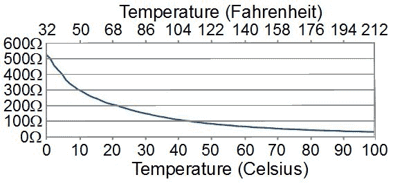
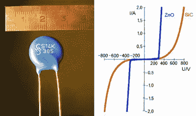
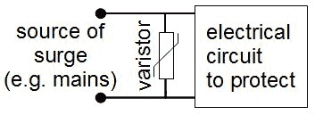
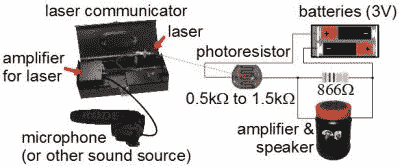
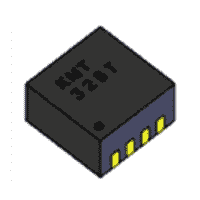
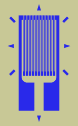
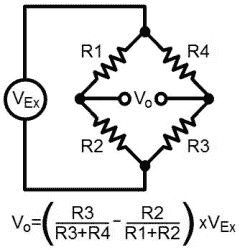

# 自动电阻:由环境控制的电阻

> 原文：<https://hackaday.com/2016/09/27/variable-resistors-controlled-by-the-environment/>

电阻器是电子电路中使用的基本元件之一。他们做一件事:抵制电流的流动。给猫剥皮的方法不止一种，电阻器工作的方法也不止一种。在以前的文章中，我谈到了[固定值电阻器](http://hackaday.com/2016/09/06/what-is-there-to-know-about-resistors/)以及[可变电阻器](http://hackaday.com/2016/09/16/resistance-in-motion-everything-you-should-know-about-variable-resistors/)。

还有另外一组主要的可变电阻我没有讲:无需人工干预就能改变阻值的电阻。这些变化是由环境因素引起的:温度、电压、光、磁场和物理应力。它们通常用于自动化，如果没有它们，我们的生活将会非常不同。

## 热敏电阻

热敏电阻，由 Ansgar Hellwig [CC BY-SA 2.0 DE]，via[Wikimedia Commons](https://en.wikipedia.org/wiki/File:NTC_bead.jpg)

从名字的一部分你大概就能看出来，thermal，意思是“属于或关于热”，这些都是电阻的阻值随温度而变化的电阻。虽然所有电阻都是如此，但热敏电阻的变化更大，也更理想。

它们有两种类型:

*   NTC，即负温度系数热敏电阻，当温度升高时，其电阻降低，以及
*   PTC，即正温度系数热敏电阻，当温度升高时，其电阻增加。

许多黑客读者可能熟悉 3D 打印机中的 NTC 热敏电阻，它们用于测量挤出机热端的温度。如果您的打印机有一个加热床，它也可能是由 NTC 监控。

此外，它们还可用于测量温度，如数字温度计、烤面包机、咖啡机、冰柜等。

但是除了测量温度，NTC 热敏电阻还用于限制电流。作为浪涌电流限制器,它们在设备首次开启时限制任何高电流冲击。基本上，当设备打开时，热敏电阻仍然相对较冷，因此充当高电阻，限制电流。随着时间的推移，当更多的电流流过热敏电阻时，其温度升高，电阻降低。这使得更多的电流流过它，这是好的，因为高电流的初始冲击到那时已经结束。

我对 NTC 热敏电阻的唯一体验是摆弄一个汽车传感器的一部分。传感器将被拧入发动机舱，可能用于测量冷却液或机油温度。当然这不是直接测温度。取而代之的是在其上施加电压。随着温度的变化，电阻变化，电压也变化。车辆的计算机然后使用表格或公式将电压映射到温度。

  Automotive temperature sensor_thermistor  Thermistor graph

我找不到汽车部件的数据表，也不知道热敏电阻的温度和电阻之间的关系，所以我把它放在炉子上的一壶水中。当我慢慢将水烧开时，我测量了水温和热敏电阻的电阻，得到了这里显示的图表。

正温度系数(PTC)热敏电阻，其电阻随着温度的升高而增加，也有其用途。

一个例子是作为保险丝的替代品。随着电路中电流的增加，由于正常的电阻加热，热敏电阻的温度也会增加。这些热量散失到周围环境中。但是如果电流比它应该的要高，那么在某一点上它会变热，比它失去热量的速度要快。在这一点上，电阻将增加，限制电流。

随着平板显示器的出现，CRT 显示器越来越少，但一些读者会记得 PTC 热敏电阻曾用于显示器的[消磁线圈电路](http://hackaday.com/2016/05/25/wtf-is-degaussing/)。消磁线圈需要短暂通电，然后逐渐关闭。通过线圈的电流会产生消磁所需的磁场，并且电流还会加热热敏电阻。事实上，热敏电阻的电阻会以预期的方式逐渐增加，减少通过线圈的电流，直到电路关闭。

## 压敏电阻

变阻器，作者 Michael Schmid【CC By-SA 3.0】，via [Wikimedia Commons](https://en.wikipedia.org/wiki/File:Varistor_S14K385_photo.jpg) 和电压-电流图

变阻器这个名称并没有多大帮助，因为这个名称的来源是“可变电阻器”，这是对本文和该系列其他部分的描述。变阻器的电阻随着电压的变化而变化，所以记住它以“V”开头可能会有所帮助。在变阻器中，电压越高，电阻越低，电流的方向无关紧要。它也很像一个二极管，直到某个最小电压时，它关闭，然后打开(见电压-电流图)。

变阻器的大多数应用是电涌保护，保护电路免受电源瞬变、感性负载和雷电的影响。它们通常被放置在被保护电路的两端，以便当电压上升到足够高时，变阻器将导通并充当电流的短路，而不是电流通过电路。

  Varistor protected circuit  Lightning arresters

我自己关于变阻器的经验来自于我做太阳能承包商的时候。我们会在太阳能系统的各种组件上安装避雷器:两个避雷器用于逆变器，其中一组电线通向室外的发电机，另一组通向小屋中的负载，一个避雷器用于充电控制器，电线通向太阳能电池板。这些都是电线运行的地方，电压可能会被附近的闪电感应到破坏性的水平。

每个避雷器都包含一个金属氧化物变阻器(MOV)。变阻器连接在电线和地之间。只要电压足够低，电流就不会传导。但是当闪电击中附近的某个地方时，电线上的电压上升，并达到变阻器接地的点(例如 385 伏)。这防止了电压进一步上升。只要太阳能组件能够承受这一电压，它就会受到保护。根据一些标准，太阳能组件被设计为在这些电线连接的地方处理高达 2300 伏的电压。

## 光存在/ldr

Photoresistor

光敏电阻的电阻随着光强的增加而减小。你也可以看到它被称为 LDR(光敏电阻)。它在黑暗中的电阻可以达到几兆欧，但在正确的波长和足够的光强下，它可以只有几兆欧。

光敏电阻不适合检测光强的快速变化。在从完全黑暗到光明的过程中，在电阻完全减小之前，可能会有多达 10 毫秒的延迟。当从明亮到完全黑暗时，电阻可能需要 1 秒钟才能增加到兆欧范围。然而，有些应用需要这种延迟，例如音频压缩。这里，LED 或电致发光面板用于控制光敏电阻的电阻，并影响音频信号增益。据说这样做通过软化攻击和释放比不使用光敏电阻听起来更平滑。

另一个典型的应用是光传感器检测是否应该打开夜灯。

Laser communicator to photoresistor circuit

在我的案例中，我制作了一个激光通信器，它使用音频信号来调制一元店玩具激光器的输出。然后，我将波动的激光束照射到远处的光敏电阻上。光敏电阻是为[放大器](http://hackaday.com/2013/08/11/a-crystal-radio-amplifier-in-a-jar)供电的电路的一部分，其结果是通过光传输音频信号，并在放大器的扬声器上再现。这违反了我上面提到的不使用它们来快速改变光强度，但作为一个有趣的实验，它工作得足够好。

## 磁阻传感器

Magneto resistive sensor (KMT32B) from Digikey

磁电阻的电阻可用于检测磁场的位置、方向和强度。它利用磁阻效应。19 世纪发现的各向异性磁阻(AMR)效应对磁场强度和电流与磁场之间的角度非常敏感。还有其他最近发现的效应，但大多数传统电阻都使用 AMR 效应。围绕这些电阻器构建的磁阻传感器可从 [Digikey](http://www.digikey.com/en/ptm/m/measurement-specialties-inc/kmt32b-magneto-resistive-sensor) 和 [Mouser](http://www.mouser.be/search/refine.aspx?Ntk=P_MarCom&Ntt=112106310) 等公司获得。

我自己没有使用过磁阻传感器，但一个常见的应用是作为汽车中的轮速传感器。其他还有[磁强计](https://en.wikipedia.org/wiki/Magnetometer)，各种角度、旋转、线性位置传感器，以及用于检测道路上车辆的传感器。

这些传感器有很多有趣的潜在应用。在 2013 年开放硬件峰会[上，一个来自斯坦福的团队展示了一个名为 Hapkit](http://hackaday.com/2013/09/07/open-hardware-summit-2013-part-1-demos) 的单自由度触觉反馈套件。他们使用磁阻传感器来检测钟摆的位置。然后，微控制器使用该位置来驱动电机，使用手移动钟摆感觉就像移动弹簧或点拨轮一样。

## 应变仪

应变仪内部，【CC BY-SA 2.5】，via[Wikimedia Commons](https://en.wikipedia.org/wiki/File:Strain_gauge.svg)

应变仪是一种电导体，它在拉伸或压缩时会改变电阻，但不会断裂、弯曲或以其他方式永久变形。为了获得足够大的影响，使电阻发生有益的变化，导体通常以之字形或蛇形排列，长端朝向预期的应变方向。

电阻的变化非常小，因此为了有助于测量，在惠斯通电桥中加入了应变仪。关于应变计及其在惠斯通电桥中的应用，可以写一篇完整的文章，所以这里只是一个简单的概述。

惠斯通电桥由两个分压器组成，R1 和 R2 是其中之一，R3 和 R4 是另一个。输入电压称为激励电压(V [Ex] )，跨接在电桥外侧，产生的输出电压(V [o] )取自两个分压器的中心。

Wheatstone bridge and voltage output formula

电压输出 V [o] 可以使用所示公式计算。如果 R1/R2 的比率等于 R4/R3 的比率，那么计算 V [o] 你会发现你得到 0 伏特。但是如果其中一个电阻被应变仪替代，那么当它被应变时，V [o] 将变为非零。可以使用进一步的公式将其转换为实际上称为“应变”的单位值。

多个应变仪也可用于进一步放大数值和补偿温度。

应变仪存在于称重传感器和压力传感器中，两者通常都包含在惠斯通电桥中。压力传感器中的传感器通常由硅、多晶硅、金属膜、厚膜或粘合箔制成。

## 结论

电阻系列到此结束。另外两篇文章是关于[固定值电阻器](http://hackaday.com/2016/09/06/what-is-there-to-know-about-resistors/)和[由人工干预操纵的可变电阻器](http://hackaday.com/2016/09/16/resistance-in-motion-everything-you-should-know-about-variable-resistors/)。如果你错过了，就去看看吧。如果我们在此过程中遗漏了任何电阻，或者您有什么想补充的，请在评论中告诉我们。