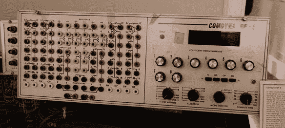

# VCF·伊斯特:在有阿杜伊诺之前，我们有球

> 原文：<https://hackaday.com/2017/04/02/vcf-east-before-there-was-arduino-we-had-balls/>

今天，如果你想教孩子们从一数到一的艺术，你可以拿出一台电脑或一台 iPad。安装 Scratch。弄个 Arduino 什么的。这是解决教授 and 和 or，计数到 0x0F，以及非常基础的算法的简单问题的高科技。

在今年的东方复古计算机节上，一个奇妙的非计算机设备博物馆的所有者展示了他们最好的展品。这些包括机械计算器，60 年代的玩具，以及模拟计算机，它们现在更多的是放在计算机科学系的储藏室里，而不是教室里。这是很棒的东西，它确切地展示了你可以从一些设计非常巧妙的机械硬件中学到多少东西。

          

System Source 在巴尔的摩北部的办公室里有一个小型的计算机博物馆，主要集中在“教练”和“玩具”计算机上。从技术上来说，这些不是计算机，它们更像是数字逻辑训练器，旨在教孩子们 and 和 or 或 xor 或 NAND 之间的区别。我们之前已经看过他们的一些东西，包括使用 EL 线的数字逻辑的伟大可视化[(在 VCF 出席)。除了用卡车运到穷人的波特兰，这是我们见过的最好的收藏。](http://hackaday.com/2015/03/31/visualizing-digital-logic-with-el-wire/)

digi comp II 是系统源带来的最好例子，也是本文的标题。这是一台 20 世纪 60 年代玩具机械计算机的复制品，能够进行加、乘、减、除和计数。几年前，邪恶疯狂的科学家用数控胶合板再造了这个廉价的塑料玩具，系统资源公司将它展出。11 毫米弹球优雅地流过触发器寄存器，最终落在与释放下一个球的杆相连的杠杆上。我们最近赠送了一台 EMSL DigiComp II 作为 1 kB 挑战赛的奖品。很美，但肯定没有系统源码收藏的程度。

其他机械电脑玩具包括[Nim 博士](https://en.wikipedia.org/wiki/Dr._Nim)，这是一个玩具，它质疑“电脑”作为一种玩名为 Nim 的游戏的设备的定义，游戏的目标是成为最后一个从堆中移除物体的玩家。通过用几个字母给 Nim 博士“编程”,只要人类玩家总是先走，这个游戏就是不可战胜的。

对于 Digi-Comp II 来说，唯一合适的系统源是 Digi-Comp I，这是一个由塑料、电线和几个表盘制成的奇怪的机械计算机玩具。

机械玩具计算机只能做这么多，还有一些作品展示了前微控制器数字逻辑的进展。值得注意的是 CES ED-Lab 700，这是一款模拟计算机，于 20 世纪 80 年代生产，用于教授学生数字逻辑的基础知识。这个巨大的香蕉插孔盒中包括一个时钟，它有两个 180°相位差的输出，触发器，AND，NAND，NORs 和 ORs。甲板上还有 Comdyna GP-6，这是一个巨大的金属盒，旨在教授控制系统和模拟计算。

如今，我们理所当然地认为我们的微控制器可以成倍增长。我们有编译器和各种新奇的技巧让计算机快速运算，如果这些都不行，我们可以在 ROM 中放一个巨大的查找表。它并不总是这样，是的，仍然有人在学习这类工具。很高兴在现实世界中看到这种硬件，即使每年只有一个周末是复古计算节。