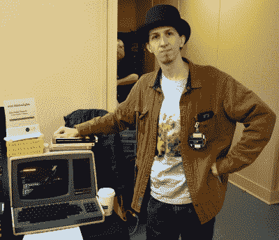
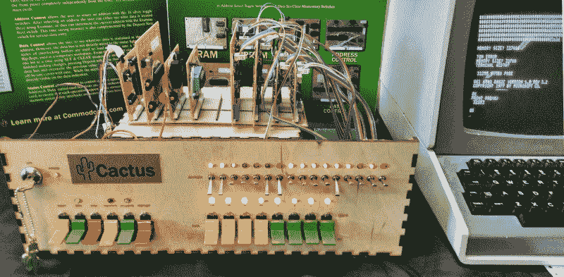
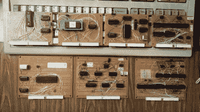
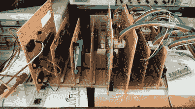

# VCF 东:仙人掌，复古，因为它想成为

> 原文：<https://hackaday.com/2018/06/13/vcf-east-cactus-retro-because-it-wants-to-be/>

在一排排数字恐龙中，一个闪烁的前面板引人注目。它看起来肯定是复古电脑的一部分；一排排闪烁的发光二极管和彩色的拨片开关。但仔细观察后，激光切割的木制前面板暴露了这台机器是冒牌货的事实。它可能看起来像是令人兴奋的日子里的一台机器，在那个时代，家用电脑看起来可以兼作柯克的*企业*的桥梁上的一个道具，但它实际上是一个更现代起源的产品。

 [它被称为仙人掌](http://commodorez.com/cactus.html)，一封写给 20 世纪 70 年代自制微型计算机的情书，由至少年轻 20 岁的人设计和制造，他们第一次体验到它们。亚历山大·皮尔森(Alexander Pierson)创造了 Cactus，不是因为他对 1975 年组装 Altair 8800 有美好的回忆，而是因为他对复古的计算机体验着迷:前面板的外观，符合时代要求的开关的令人满意的沉闷声，以及计算机内部工作不是抽象的黑匣子，而是你可以互动和研究的东西的想法。从仙人掌在 VCF 东十三得到的关注来看，他不是唯一一个。

让我们来看看亚历山大在这个逆向计算机建筑中倾注的一切。

## 两全其美

理论上，仙人掌是一个非常简单的想法。以古老的 6502 8 位微处理器为例，它(以某种形式)驱动了传奇的家用电脑，如 Apple II 和 Commodore 64，并为它提供了之前的微型电脑的经典前面板界面。这种计算机的吸引力显而易见。您将获得早期套件电脑的经典外观和体验，但拥有更现代(相对而言)的处理器和功能。

这已经不是第一次有人想要这样的机器了。过去，我们已经看到人们在 Z80 上增加了“闪光灯”,那么为什么不为心爱的 6502 增加呢？毕竟，它只比闪光灯时代晚了几年。此外，在处理 6502 时，已经有令人难以置信的大量信息和现有技术。[正如我们已经看到的其他一些 6502 项目](https://hackaday.com/2017/02/20/a-6502-retrocomputer-in-a-very-tidy-package/)，仙人掌的核心设计是基于格兰特·塞尔的工作，一些灵感来自[奎恩·邓基的维罗妮卡](https://hackaday.com/2014/10/05/hackaday-10th-anniversary-quinn-dunki-and-veronica/)。

前面板界面类似于 20 世纪 70 年代的微型计算机，尽管它有一些过时的细微之处。首先，数据和地址总线用不同颜色的发光二极管和不同组的开关明显分开。这使得新手操作起来更容易，尽管显然增加了面板的零件数量和布线数量。此外，前面板通过一系列触发器与实际的数据总线隔离，允许[Alexander]所谓的“临时工作区”。

但是，也许现代家酿计算机带有前面板界面的最大优势是:你实际上可以触摸它。虽然有大量的 Altair 和 IMSAI 机器可供参观，但很少有主人邀请人们坐下来摆弄它们。奇怪的是，40 多岁的年龄和价值数千美元的东西让这些机器的主人从未离开过它们一两步。

但亚历山大确实在仙人掌前排了一排座位，并邀请任何人尝试检查机器的 RAM 或使用附加的希斯基特 H89 终端运行基本程序。我花了几分钟打开仙人掌上的开关，虽然坐在我旁边的自豪的创造者的感染兴奋可能与它有关，但我可以报告说，它绝对是一个使用的爆炸。

## 解剖仙人掌

Cactus 具有一个背板布局，其中包含七个手接线卡。CPU、RAM 和 EPROM 卡组成了 6502 系统本身，其余的卡专用于前面板操作。虽然仙人掌上没有什么可以被称为奢侈，但亚历山大在一些领域使用了比历史上严格准确的更高端的组件。例如使用 WDC 65C02 处理器(6502 的 CMOS 版本)和单个 32K SRAM 芯片，而不是大量的 DRAM。

    

当亚历山大向我介绍仙人掌的布局时，他确实提到了未来会有更多的卡片。最终，他想增加一些功能，比如更多的串行端口、声卡，甚至是显卡。他甚至想到了像磁带驱动器和核心存储器这样的东西，但它们更多的是教育实验，而不是实用设备。

## 激情项目永无止境

亚历山大强调仙人掌并没有结束，他的旅程才刚刚开始。在开始拼凑仙人掌的最早版本之前，他花了几个月的时间进行研究和规划，这已经是一年多以前的事了。这个项目对他来说既是体验也是最终目标，很明显他并不急于停止他的创作。不需要很长时间就可以意识到他是一个典型的完美主义者，仙人掌被“完成”的想法可能会永远远离他，因为他会不断地找到新的方法来改进系统。

这与包括我在内的许多人在 VCF 问他的问题有些矛盾:“我什么时候能买一套？”亚历山大说，出售仙人掌从来不是他的目标，但随着展会期间人们的兴趣不断涌现，他承认这是他需要考虑的事情。希望下次 VCF 东区出现时，我们能看到更多的仙人掌冒出来。

 [https://www.youtube.com/embed/3Sv3pIyMBEk?version=3&rel=1&showsearch=0&showinfo=1&iv_load_policy=1&fs=1&hl=en-US&autohide=2&wmode=transparent](https://www.youtube.com/embed/3Sv3pIyMBEk?version=3&rel=1&showsearch=0&showinfo=1&iv_load_policy=1&fs=1&hl=en-US&autohide=2&wmode=transparent)

