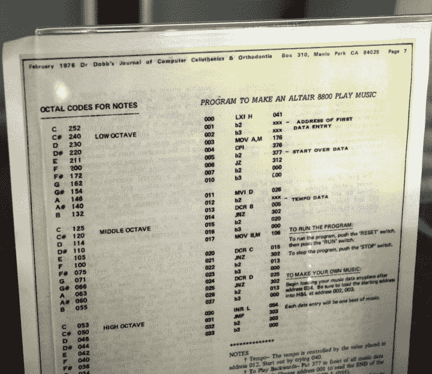
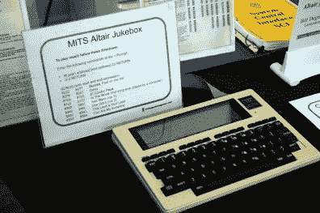
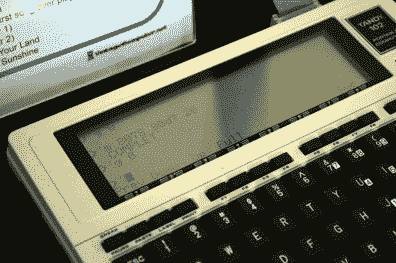

# VCF 东部:牵牛星 8800 上的 SDR

> 原文：<https://hackaday.com/2018/06/08/vcf-east-sdr-on-the-altair-8800/>

如果你认为软件定义无线电(SDR)是一个相对较新的发现，你会被原谅。毕竟，在发现廉价的 USB 电视调谐器可以用作从几百 MHz 一直到 GHz 范围的相当不错的接收器之前，几乎没有业余无线电爱好者圈子以外的人熟悉这个概念。2012 年 RTL-SDR 项目的出现，一夜之间有效地将入门级 SDR 硬件的成本从数百美元提高到了几十美元。今天，通过软件欺骗在电波中漫游的黑客比以往任何时候都多。

 但事实证明，RTL-SDR 项目并不是第一次软件和硬件意外地结合起来，让黑客们拉开无线电世界的帷幕。早在 1975 年，Steve Dompier 写的一篇文章发表在人民计算机公司的时事通讯上，并在 1976 年的【Dobb 博士的《计算机健美操杂志&正畸学上再次发表，描述了一个非常奇怪的发现。在雷神公司的一个团队创造“软件无线电”这个术语的近十年前，这篇文章表明，只需几行代码，就可以从他们的 MITS Altair 8800 产生 am 无线电传输。

在当时，这是一件大事。一些人甚至认为，这使得 AM 收音机成为与 Altair 8800 配合使用的首批 I/O 设备之一。据报道，在家酿计算机俱乐部的一次会议上，代码演示在一片热烈的掌声中结束，比尔·盖茨后来将它描述为“我见过的牵牛星最好的演示程序”之一。一个特别强有力的支持，考虑到在这一点上，盖茨将一直推动微软的 Altair 的基本语言，这一技术没有使用。

在最近的东方复古电脑节上，比尔·德格南展示了一个由多姆皮尔最初概念演变而来的版本，他称之为“牛郎星点唱机”(在这个页面上你还可以找到史蒂夫·多姆皮尔 1975 年文章的 PDF 版本)。即使在发现牛郎星可以完成这样的壮举 43 年后，它仍然让每个驻足在桌旁的人感到高兴。随着附近的老式 AM 收音机传来强烈而清晰的歌曲，led 灯闪烁着，整个事情看起来几乎是不可思议的。难怪比尔·盖茨对此印象深刻。

## 它是如何工作的？

自然，很多人想知道音乐是如何产生的。有一段时间，比尔甚至把牵牛星的顶部打开，这样你就可以看到里面；类似于魔术师拉起袖子，让你看到他没有隐藏任何东西。不，牛郎星内部没有隐藏任何小型 AM 无线电发射器，这种效果只是精心产生的电磁干扰(EMI)的产物。事实上，这更多的是由于 Altair 的设计缺陷，而不是其他原因。

 [https://www.youtube.com/embed/fgYhVnmeWrk?version=3&rel=1&showsearch=0&showinfo=1&iv_load_policy=1&fs=1&hl=en-US&autohide=2&wmode=transparent](https://www.youtube.com/embed/fgYhVnmeWrk?version=3&rel=1&showsearch=0&showinfo=1&iv_load_policy=1&fs=1&hl=en-US&autohide=2&wmode=transparent)

计算机中不充分的 EMI 屏蔽允许附近的无线电拾取电子设备的开关噪声，当它运行时，在低 AM 频率中引起相当大的干扰。在那个时代的其他计算机上也观察到了类似的效果，比如 PDP-8。不管 Altair 上运行的是什么程序，你都可以拾取干扰，只是大多数程序会产生非结构化的噪声。但是通过对这种效果的巧妙处理，有可能创造出一些听起来非常好听的东西。

碰巧的是，这几乎正是最近[允许使用廉价的 USB VGA 适配器作为软件定义的发送器](https://hackaday.com/2018/04/23/spoofing-cell-networks-with-a-usb-to-vga-adapter/)的机制。该设备产生的干扰，通常只不过是一种烦恼，经过专业的磨练，成为一种有用的传输。似乎最好的把戏永远不会过时。

## 接受请求

比尔采用了发表在多布博士的《T1》中的原始研究，创造了一个更加完美的体验。用户现在可以访问一个菜单，允许他们从程序中存储的预定义曲目中进行选择，而不必在前面板上为你想听的每首歌曲切换数据。所有这一切的结果是，任何人都可以坐在桌旁，调出一首歌曲，而不需要任何软件知识，甚至不需要 Altair 本身的知识。

作为一个额外的奖励，比尔设置了一个绝对崭新的 TRS-80 102 型作为当天展示的终端。这既是 100/102 型仅用 AA 电池就能获得令人难以置信的电池寿命的绝佳例子，也是与会者在绿色和橙色 CRT 终端的海洋中及时获得不同东西的机会。

    

牛郎星与它的黄铜发光二极管疯狂闪烁之间的二分法和公开的 1980 年的 102 型绝对在展示场上脱颖而出，看起来坦迪前面的椅子很少是空的。仅仅根据人们在节目过程中听到它进入*星球大战*主题的次数，可以有把握地说这次演示今天大受欢迎。就像多年前在家酿计算机俱乐部一样。