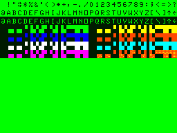
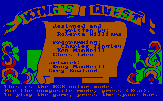
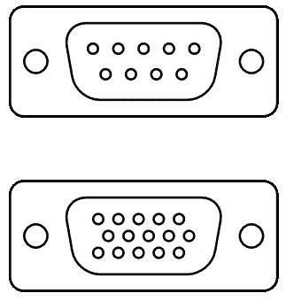

# 内存中的 VGA

> 原文：<https://hackaday.com/2016/01/29/vga-in-memoriam/>

VGA 连接器死亡的报道被大大夸大了。VGA 连接器消亡的谣言已经流传了十年，但 VGA 在面临即将到来的厄运时表现得非常顽强；这篇文章是在一台九个月大的笔记本电脑上写的，它通过一根非常熟悉的粗电缆连接到外部显示器上，电缆有两个蓝色的末端。VGA 是一个仍然可以在今年出货的数百万台电视和显示器背面找到的端口。

然而，今年是 VGA 最终消亡的一年。30 年后，在被多种技术贬低后，在从八引脚微控制器到树莓派的一切设备上安装 VGA 输出变得容易后，VGA 已经死亡。它不支持最新的英特尔芯片，而且很难找到一个带有非常熟悉的 VGA 连接器的主板。

### 计算机视频的历史

A character and color set for the Motorola 6847 VDG, found in the TRS-80 Color Computer. This image is displayed at the VDG’s full resolution of 256 by 192 pixels.  [Image source](https://commons.wikimedia.org/wiki/File:Cocobvdg.png).

在 1987 年推出 VGA 之前，个人电脑的图形芯片要么是定制芯片，要么分辨率低，要么特别怪异。第一批内置视频输出的计算机之一，Apple II，只是在字符发生器、移位寄存器和其他一些支持电路上投入了大量的 CPU 时间，以将内存写入视频输出。

1980 年视频显示器的技术水平包括摩托罗拉 6845 CRT 控制器和 6847 视频显示发生器。在现代人看来，这些芯片是可怕的；它们的最大分辨率为 256×192 像素，以现代标准来看是非常小的。

在当时的家用电脑中发现的其他定制芯片并不那么有限。VIC-II 是为 Commodore 64 定制的视频芯片，可以显示多达 16 种颜色，分辨率为 320×200 像素。在 Commodore 64 演示场景中，诡计比比皆是，这些图形功能可以比最初的设计者梦想的更进一步。

当最初的 IBM PC 发布时，视频在最基本的机器上是不可用的。视频是额外的，IBM 提供了两种选择。单色显示适配器(MDA)可以显示 80 列 25 行的高分辨率文本。这不是一个图形显示；MDA 只能显示 127 个标准 ASCII 字符或另外 127 个附加字符，这些字符仍然可以在几乎每个文本编辑器的“特殊字符”选项中找到。红心、方块、梅花和黑桃♥·♣♠在为 DOS 开发 21 点游戏时特别有用。

The IBM CGA displaying the title screen of King’s Quest in 300×200 resolution. [Image source](https://en.wikipedia.org/wiki/File:KQ_CompVsRGB.png).

IBM 为最初的个人电脑提供的第二个选项更加丰富多彩。彩色图形适配器(CGA)把个人电脑变成了家用电脑。CGA 卡可以显示多达 16 种颜色，分辨率从 40×25 和 80×25 文本模式图形到 640×200 图形模式。

IBM 提供的 MDA 和 CGA 适配器都是基于摩托罗拉 6845 的，带有几个额外的硬件位，用于与 8 位 ISA 总线接口，在许多卡的情况下，还有一个并行端口。这个基本电路将变成 1982 年发布的超级显卡，大力神显卡。

Hercules 提供了 80×25 文本模式和分辨率为 720×348 像素的图形模式。Hercules 的分辨率在当时是巨大的，并且在推出高级 VGA 后的许多许多年里仍然有用。DOS 时代的大多数双显示器设置使用 Hercules 作为第二显示器，一些软件包，包括 AutoCAD，使用第二个 Hercules 显示器作为 UI 元素和对话框。

尽管如此，即使 IBM 个人电脑有如此多的显示适配器可供选择，桌面上的图形仍然是一个混乱的命题。视频卡包括几十个独立的芯片，在一块板上实现视频电路很困难，分辨率也没有那么高，而且一切都是基于摩托罗拉的 CRT 控制器。必须做点什么。

### VGA 简介

当 PC 世界正在处理由几十种不同芯片组成的图形适配器，所有这些芯片都基于 70 年代末设计的 CRT 控制器时，计算世界的其余部分看到了稳步的改进。1987 年推出了麦金塔 II，这是第一台配有彩色显示屏的 Mac 电脑。分辨率在当时是巨大的，全彩色图像是可能的。设计师和数字艺术家更喜欢 MAC 是有原因的，在 80 年代末和 90 年代初的一段时间里，图形功能使其成为合乎逻辑的选择。

在此期间，其他视频标准蓬勃发展。Silicon Graphics 推出了他们的 IRIS graphics，Sun 开发了 1152×900 分辨率的显示器。用于 10，000 美元机器的工作站图形非常好。事实上，如此之好，以至于这些机器上可用的分辨率经常胜过今天廉价消费者笔记本电脑上的分辨率。

到 1986 年，个人电脑上的图形状况非常糟糕。80 年代初，人们竞相追求更快的处理器、更大的内存，还有一场常常被遗忘的竞赛，那就是在屏幕上增加像素。对更多像素的竞争是如此激烈，以至于在规格中定义了 [3M 计算机](https://en.wikipedia.org/wiki/3M_computer)——一种具有兆字节内存、百万亿次处理能力和百万像素显示器的计算机。在显示器上增加像素与拥有快速处理器一样重要，在 1986 年，分辨率最高的 PC 显卡——Hercules——只能显示 25 万像素。

The DE-9 connector (above) used for CGA, MDA, and Hercules cards, and DE-15 connector (below) used for VGA

1987 年，IBM 定义了一个新的图形标准，将 PC 上的图形推向只有苹果、Sun 和 SGI 的工作站才能与之竞争的水平。这是 VGA 标准。它不是在 CRT 控制器上构建的；相反，VGA 芯片组的核心是一个定制的 ASIC、一个晶体、一点视频 RAM 和一个数模转换器。在接下来的 20 年里，这种基本设置将出现在几乎每台个人电脑中，asic 将经历几次芯片缩小，并最终集成到英特尔芯片组中。它是第一个视频标准，也是迄今为止个人电脑上寿命最长的端口。

在讨论 VGA 的历史时，定义什么是 VGA 很重要。对于今天的每个人来说，VGA 只是电脑背面用于视频的老式蓝色端口。这在某种程度上是正确的，但这是一个省略的谎言 VGA 标准不仅仅是一个蓝色的 DE-15 连接器。VGA 的规格定义了视频信号、适配器、图形卡和信号时序的一切。第一批 VGA 适配器有 256kB 的视频内存，16 色和 256 色调色板，最大分辨率为 800×600。没有 blitter，没有精灵，也没有硬件图形加速；VGA 标准只是一种将值写入 RAM 并在显示器上显示出来的方法。

不过，所有 VGA 之前的显卡都使用 DE-9 连接器进行视频输出。该连接器(与旧“硬件”串行端口中使用的连接器相同)有九个引脚。VGA 将 15 个针脚塞入同一个连接器。这些额外的引脚在未来几年将会非常有用；数据线将用于识别显示器的品牌和型号，它可以处理什么分辨率，以及什么刷新率可以工作。

### VGA 的衰落

随着 SVGA、XGA 和超级 XGA 的引入，VGA 在 20 世纪 80 年代和 90 年代得到了改进，所有这些都通过相同的笨重连接器提供了更高的分辨率。这个连接器本来是为 CRT 设计的；VGA 连接器上的 H-sync 和 V-sync 引脚对液晶显示器毫无用处。除非你正在观看的显示器重量超过 20 磅，并且正在向你的眼睛发射 x 射线，否则你的显示器没有理由使用 VGA 连接器。

2000 年代中期，随着液晶显示器的推出，VGA 逐渐被淘汰。到 2010 年，不祥之兆已经出现:VGA 将被 DisplayPort 或 HDMI 取代，或者被另一种为今天的 LCD 所需的数字信号而设计的电缆取代，而不是过去的 CRT 所使用的模拟信号。

尽管如此，DE-15 端口在工作空间中比比皆是，直到几年前，大多数主板都提供 D-sub 连接器，以防有人想要使用集成显卡。然而今年，VGA 死了。英特尔的 Skylake，他们的最新芯片现在出现在本月 CES 期间推出的笔记本电脑中， [VGA 支持已被移除](http://www.phoronix.com/scan.php?page=news_item&px=MTc4NDc)。不能再买带 VGA 的新电脑了。

VGA 从最新的 CPU 中消失了，但英特尔的一项声明是一个爆炸；VGA 本来就应该悄无声息。不知何故，在没有人注意到的情况下，你无法在 Newegg 上搜索带有 VGA 连接器的主板。VGA 正在慢慢从显卡中消失，目前你只能买到使用多年技术的入门级显卡。

VGA 静静地死去了，它的电缆被塞在壁橱的一个盒子里，显示器背面的端口积了一层灰尘。它的持续时间远远超出了近 30 年前任何人的想象。对于 80 年代初最终脱离 CRT 控制器芯片的技术，VGA 会被它取代的技术杀死。VGA 在技术上与 DisplayPort 和 HDMI 等真正的数字协议不兼容。它有一个传奇的历史，但 VGA 终于死了。