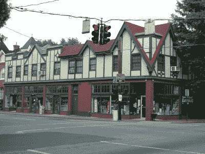

# 维多利亚人和光纤，路易斯维尔对快速互联网的追求

> 原文：<https://hackaday.com/2017/04/17/victorians-and-fiber-louisvilles-quest-for-fast-internet/>

那是一个黑暗的、暴风雨的下午，是这个国家东部常见的那种。我喝着咖啡，坐在门前的野营椅上，像老鹰一样等待奸诈的有线电视员出现。这一天将无处可逃。在匆忙赶去参加另一个工会规定的咖啡休息时间之前，不会用柔软的羊皮手套轻轻地敲门。我在等待，我有点暴躁，老天作证，就是今天。今天将会是这样的一天:在等了几个小时之后，在错过了三次约会之后，在他们两次丢失了我的记录之后；我会得到一个答案，他们是否真的可以为我的公寓提供互联网服务。如果我幸运的话，答案是肯定的，那么大约两到三千年后，他们会从电线杆上铺设一条电缆到我家，我就可以不再从我对面的披萨店霸占 WiFi 了。

需要注意的是，我当时在市中心。我没去过乡下。除了我的房子，这个街区的每栋房子都有有线电视。虽然这是愚蠢的，但当你深入历史时，它开始变得更有意义。肯塔基州的路易斯维尔是个奇怪的地方。它曾经是通往西方的门户。船只会沿着河流爬行，直到抵达瀑布。然后，搬运工会收取高昂的费用，将所有这些货物运送到瀑布底部，在那里它们会被装上一艘船，然后被送往西部。导致该地区的每一个富商、船长和制造商都在那里拥有一栋漂亮的房子。想知道为什么德比马赛在路易斯维尔举行，女王有时会来参观吗？这可能与它拥有纽约市之外最集中的维多利亚式建筑和豪宅有关。

### 历史与现代相遇:特许经营权的诞生

这是一家五金店。从基础设施的角度来看，这意味着这个城市是一个可怕的烂摊子。步行街被改成了马路。鹅卵石直接铺上沥青。1900 年的水泵站仍在工作(尽管用的是电泵而不是蒸汽)，直到最近所有的木质水管才被替换。此外，每两栋建筑都是无价的注册历史地标，谢天谢地，现代建筑的脏手碰不到它们。

美国的互联网是一部好心变坏的喜剧。在我们拿到干草叉之前，重要的是要记住，如果你生活在一个陆地面积较小的国家，美国大得离谱。这是他妈的巨大的，只是没有那么多的人。所以，当互联网开始成为一个东西时，想要互联网的人很快发现没有人会给他们。除非他们有很多钱。这很有道理。谁会为了每月 30 美元的服务费，花 50，000 美元去铺设一条通往奶奶家的电缆线路呢？在日本，同样的费用你可能会碰到 500 个顾客，在美国，你能走到郊区街道尽头的半路就算幸运了。

为了解决这个问题，立法者承诺电信、电视提供商和互联网服务提供商如果为整个地区提供服务，只要他们为整个地区的每个人提供服务，他们就会认可垄断。于是，“特许经营协议”诞生了。这很有效，每个人都很开心。也就是说，直到我们想出了一堆非常非常酷的互联网技术，发现没有人有任何动力花钱升级。

### 谁不想要快速上网？

路易斯维尔开始寻求真正快速的互联网，因为谁不喜欢真正快速的互联网？另外，他们可能嫉妒查塔努加和他们极其廉价的市政光纤。首先，它联系了现有的基础设施供应商。当时，这些都是 Insight 和 AT & T。据我所知，他们的答案是，“为什么？”。从他们的角度来看，他们有一个签名和盖章的垄断，花任何钱做繁琐的事情，如客户服务，基础设施维护，甚至获得新客户，只是不吸引他们。

因此，路易斯维尔发出了一个普遍的呼吁，“请把我们从我们缓慢的互联网中拯救出来”，一些公司做出了回应。当这些公司开始计算运行光纤的确切成本时，问题就来了。例如，为什么不直接在电话线和电线杆上铺设光纤呢？一家公司发现，他们不能只在电线杆上铺设电缆。有一个巨大的干预和无意义的法律需要克服的历史。不，他们必须把电缆放在柱子顶端的槽里。不幸的是，上面的位置和下面的位置都被占了。这意味着他们不得不花钱把其他电缆都拆掉。对于每个电极。这要花很多钱。

### 双臂交叉，纹丝不动

随着意识到电信公司多年来所做的各种合同、操纵和欺骗实际上构成了一个难以逾越的法律堡垒，公司退出了，路易斯维尔的人们变得有点绝望。一些组织参与进来，提出了诸如将光纤穿过水或污水管道之类的东西，但是这些都没有成功。然后，大众转向了一家愚蠢和金钱比例恰当的公司。一家公司会看着堆积如山的官僚机构说，“我们有律师来做这个。”确切知道你看的是哪种工程色情片的公司，现在被允许出售这些信息，谷歌。

这需要大量的请愿，但路易斯维尔设法成为谷歌光纤令人欣慰的千兆手臂拥抱的最后一个城市之一，然后谷歌在下一个闪亮的项目后蹒跚而行，这是一个气球，卫星，或其他同样奇怪的东西。

当然，这一切都还悬而未决。谷歌“非常致力于”将互联网带到路易斯维尔。这显然足以鼓励美国电话电报公司突然承认，事实上，它有一个部门能够安装光纤一直以来，他们迅速开始这样做。一家当地公司紧跟潮流，将光纤铺设到富人区。另一家巨头 Insight 被时代华纳有线电视公司吞并。后来被特许吞并了。出于某种原因，他们立即将自己重新命名为“ [Spectrum](http://www.wdrb.com/story/34290213/spectrum-replaces-time-warner-cable-in-louisville) ”，并重新设计了他们的品牌，使他们看起来像一个可疑的俄罗斯域名注册商，但对每个人来说都是他们自己的。

尽管这种特殊的情况很奇怪，但这是一个在美国各地上演的故事。通常，对邪恶的电信公司哀叹和咬牙切齿是最容易的，但当你认真对待它时，通常历史和良好的意愿才是阻碍进步的真正原因。这就是为什么重要的是要记住，在脸书抱怨它没有任何作用，而且通常市政厅会议是空的，即使是在大城市。到目前为止，路易斯维尔看起来需要当地居民、黑客空间、企业和官员做很多工作。他们花了无数的时间来团结、调查和参与他们的政府。不管怎样，在路易斯维尔的每个人都拥有漂亮的互联网还需要一段时间。至于我上网的要求，他们从来没有出现在公寓里；我住在那里的两年里没有。你有自己当地的噩梦故事吗？