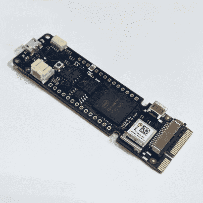
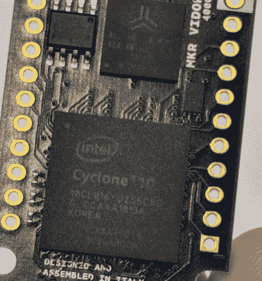
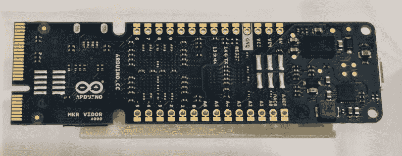

# Maker Faire 上的 Arduino FPGA 板演示视频

> 原文：<https://hackaday.com/2018/05/20/video-of-the-arduino-fpga-board-demo-at-maker-faire/>

本周，Arduino 宣布了许多新的硬件，包括[一个非常有趣的 FPGA 开发板](https://hackaday.com/2018/05/18/arduino-just-introduced-an-fpga-board-announces-debugging-and-better-software/)，旨在帮助任何想涉足 VHDL 和可编程逻辑开发领域的人。我们认为这是 Arduino 自他们最初的开发板以来发布的最有趣的硬件，每个人都想知道硬件实际上是什么，它能做什么。

 [https://www.youtube.com/embed/v9lIn2mYdlo?version=3&rel=1&showsearch=0&showinfo=1&iv_load_policy=1&fs=1&hl=en-US&autohide=2&wmode=transparent](https://www.youtube.com/embed/v9lIn2mYdlo?version=3&rel=1&showsearch=0&showinfo=1&iv_load_policy=1&fs=1&hl=en-US&autohide=2&wmode=transparent)

本周末在 Maker Faire Bay Area，Arduino 正在为他们所有的产品进行演示，是的，Arduino MKR Vidor 4000 就在现场，正在一个工作演示中展示。我们有发行日期和价格。它将于下个月(2018 年 6 月)上市，售价约为 60 美元。

但是硬件呢，它能做什么？从最初的新闻稿来看，我们甚至无法判断该 FPGA 有多少个 lut。关于迷你 PCIe 连接器有很多问题，我们不知道这种 FPGA 如何用于解码视频流等高性能计算。现在我们有了答案。

  Maker:S,Date:2017-2-27,Ver:6,Lens:Kan03,Act:Lar02,E-Y  Maker:S,Date:2017-2-27,Ver:6,Lens:Kan03,Act:Lar02,E-Y  

Arduino Vidor 上的 FPGA 是 Altera Cyclone 10CL016。该芯片有 16k 逻辑元件和 504 kB 存储块。这是在 Altera 的 FPGA 产品线的低端，但它仍然没有懈怠。在下面的演示视频中，显示了实时解码视频和识别二维码。这对于我的第一块 FPGA 板来说相当不错。

Vidor 还搭载了一个 SAMD21 Cortex-M0+微控制器和一个 uBlox 模块，其中包含一个 ESP-32 WiFi 和蓝牙模块。这是一套非常棒的芯片，如果你想进入 FPGA 开发领域，这可能就是适合你的主板。我们还没有看到将用于 FPGA IP 的图形编辑器(对于那些不关心编写自己的 VHDL 或 Verilog 的人来说)，但我们期待着新软件的推出。