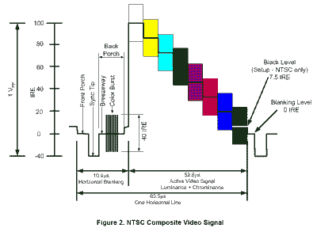
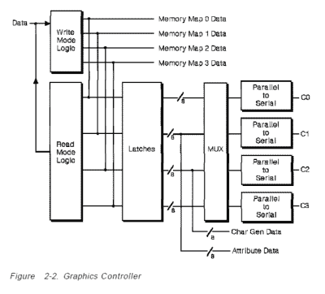
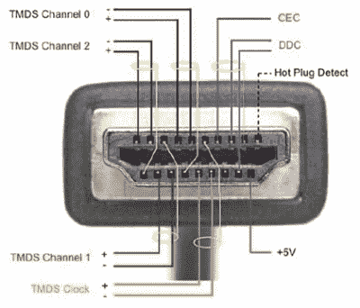
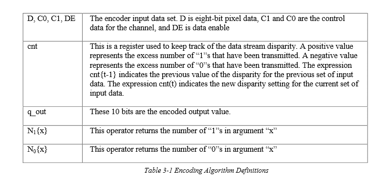

# 视频标准不仅仅是视频信号

> 原文：<https://hackaday.com/2015/11/19/video-standards-are-more-than-video-signals/>

我们花在盯着屏幕上的时间可能最好是未知的，但是在屏幕上制作视频的技术怎么样呢？我们都在电视或电影中见过卷对卷投影仪，或者也许你已经足够大，可以拥有一台了，当然你们中的一些人仍然有一台藏得非常好。无论你是享受操作投影仪的乐趣，还是仅仅在电影中观看，这个概念都非常简单。包含许多单独帧的长胶片在高强度灯前通过，而快门隐藏了我们眼睛的胶片运动，我们的大脑从一帧到一帧画出想象的运动。盯着蓝光播放器看不会有同样的直觉，虽然我们不会深入了解从蓝光光盘解码视频的痛苦细节，但我们会了解一些视频标准，以及我们如何破解它们。

## 观察一瞥

我相信我们大多数人都注意到，一个 HDMI 连接器有相当多的连接，19 个引脚组成一个 HDMI 连接器。所有这些引脚都是用于将视频从机顶盒(插入您的媒体播放器)传输到显示器，还是有其他原因？HDMI 在质量上比我拥有的任何 VGA 显示器都要好几个数量级。我知道 VGA 使用 15 针 D-SUB 连接器，但你需要知道，不是所有的针都通过 VGA 连接传输独特的信号，也不是所有的针都传输我们在屏幕上看到的图像的一部分。回顾更久远的视频历史，我们会看到 composite，一根辉煌的黄头 RCA 电缆。简单中的美，一根信号线和一个屏蔽。

## 复合材料

Source: [ON Semi AND8261 Datasheet](http://www.onsemi.com/pub_link/Collateral/AND8261-D.PDF)

复合视频信号通过一根屏蔽导线传输。信号被分解成帧，帧被分解成行。这与听起来完全不同，帧是覆盖显示器整个屏幕的静态图像，线是从屏幕左边缘到右边缘的较小单元，从屏幕顶部到底部一个接一个堆叠在一起，构成一个帧。你觉得是这样吗？好吧，那我想听起来确实如此，不是吗？

复合信号被分解成更小的信号，代表由同步信号分隔的水平线，如图 2 所示(我不能告诉你图 1 发生了什么，它一定是在你到达这里时从后门溜走了)。我们在屏幕上看到的画面可以在水平线信号的有效部分找到。信号的幅度决定了亮度，而颜色信息作为正弦波添加到亮度信号中。颜色可以被识别为色同步参考和信号相位之间的相位差。在一个更容易理解的版本中:单个颜色的强度由调制幅度决定，而色调由相位决定。

这没什么意思，而且这里的非视频信息很少，只包括水平和垂直同步。水平同步可以在信号的消隐部分看到，而垂直同步添加在帧的最后一行水平线之后。这并不像看起来那样虎头蛇尾，这种视频标准的低复杂性使得 8 位黑客可以轻松制作视频。你可以在 8 位 arcade 克隆中找到大量这样的黑白实现，如 [Hackvision，一个控制器形状的 PCB，在 ATMega328](https://hackaday.com/2010/10/24/hackvision-is-build-your-own-retro-game/) 上运行音频和视频输出。我们也看过用 8 位 AVR 制作的[的彩色视频。](https://hackaday.com/2013/03/27/color-ntsc-video-directly-from-an-avr-chip/)

## 视频图形阵列

Source: [1992 IBM VGA Spec](http://www.mcamafia.de/pdf/ibm_vgaxga_trm2.pdf)

视频图形阵列(VGA)在相当长一段时间内一直是标准。凭借 640×480–16 色或 320×200–256 色(“模式 13H”)的分辨率和有时无闪烁的视频，这是一个梦想成真。虽然用 VGA 画一条水平线的时间是 composite 的两倍，但仍有改进的余地。那些想要更多的人可以根据自己的喜好更改图形控制器代码。这变得非常流行，寻找代码和/或帮助编写自己的代码变得非常容易。迈克尔·阿布拉什公开流行的方法之一被称为“X 模式”,他在《多布斯博士杂志》的专栏中分享了这一方法。模式 X 很有趣，因为它并没有被 IBM 记录在案，但它无疑是开发人员的最佳模式，反过来对用户也更好。与其他可用模式相比，模式 X 的优势非常大，正如[Abrash]在他的书 *[图形编程黑皮书](https://github.com/jagregory/abrash-black-book)* 中陈述的 5 个主要优势:

1.  模式 X 具有 1:1 的纵横比，这意味着您可以将圆编码为圆，而不必考虑拉伸，拉伸会导致编码椭圆以显示圆。
2.  模式 X 利用内存翻页渲染更流畅的动画。
3.  允许在并行处理像素时使用面向平面的硬件，这相当于比模式 13H 提高了 4 倍。
4.  模式 X 和模式 13H 都具有每像素字节模式，用一个字节的存储器控制每个像素，这是其它模式所没有的。为了解决这个问题，其他模式必须进行位屏蔽，因为每个字节包含一个以上像素的数据。
5.  与模式 13H 相比，模式 X 具有过剩的可用屏幕外存储器来存储图像数据，并在与固有 VGA 锁存器一起使用时一次将图像数据写入显示存储器 4 个字节(或 4 个像素)。

虽然模式 X 不容易编程，但对于一个有经验的 VGA 程序员来说，这是值得的，也不是一项令人望而生畏的任务，同时还要有好的文档，比如[阿布拉什的]书。

VGA 连接是一个 15 针 D-SUB，其中有 3 根导线用于彩色视频信号。这些信号与组成分量信号 Y-Pr、Y 和 Y-Pb 的信号相同。这使得连接器上多了 12 个引脚，或者如果您有一个键控连接器，则多了 11 个引脚。这些导体中有六个是专用的 GND 信号，我们有一个水平同步和垂直同步，剩下 4 个导体未考虑。我们不讨论其中的两个，只指出 VGA 中的 12 号和 15 号引脚上有一条 I2C 总线，它们分别是 SDA 和 SCL。根据您的硬件和操作系统，这些线路可能被劫持并用作标准 I2C 引脚。正如你所想象的，这不是一个新概念，正如你所看到的[我们发现的最好的例子之一是在你的画龙博客](http://www.paintyourdragon.com/?p=43)上，可以追溯到 2008 年。

将 VGA 嵌入 8 位微控制器项目比复合视频要困难得多。随着 VGA 扫描速度的提高，时序成为一个问题。但这是可以做到的。我们已经看到了 8 色的 Arduino do 640×480，最近它被【Arko】用于 LayerOne 演示板的[。毕竟，demoscene 就是这么回事；更少的比特，更多的浮华。ARM 通常速度更快，所以](https://hackaday.io/project/3877-layerone-demoscene-board)[我们已经看到 VGA 也有](http://hackaday.com/2015/01/04/800-x-600-vga-with-the-stm32f4/)。但真正让 VGA 大放异彩的是 FPGA 硬件。这是一个易于实现的协议，FPGA 硬件的大规模并行特性意味着这是几乎所有大学 FPGA 课程的一个课堂作业。在 FPGA 中实现“肉仔”[而获得课程学分，还有什么更棒的呢？](http://hackaday.com/2013/03/26/playing-meat-boy-on-an-fpga/)

## 高清晰度多媒体接口

Source: [HDMI.org](http://www.hdmi.org/installers/insidehdmicable.aspx)

高清多媒体接口(HDMI)第一个值得注意的区别是，该协议还包括音频信号的传输。更具体地说，HDMI 2.0 提供 32 个通道(4 个流)的音频和双流视频。19 导体引脚排列包含 3 组屏蔽、双绞线、差分信号对(这是一个总结为“高速”的术语)。

更具体地说，数据线使用一种称为“最小化转换差分信号”(TMDS)的技术。HDMI 中使用三个 TMDS 通道，每个通道由数据、数据+和屏蔽导线组成。值得一提的是，每一对的屏蔽都隔离到一个单独的引脚，而不是像我们在 USB 中常见的那样，全部连接到连接器的同一个外部屏蔽，并最终连接到接地层。

Source: [1999 Rev1 DVI Spec](http://www.cs.unc.edu/Research/stc/FAQs/Video/dvi_spec-V1_0.pdf)

为了恢复时钟信号并保持信号的完整性，需要平衡数据流中的比特。TMDS 使用电信行业使用的标准 8b/10b 编码的修改版本。这个想法是平衡每个 8b 长的数据中 1 和 0 的数量。第 9 位和第 10 位描述如何实现平衡。第一阶段从使用算法确定原始字节中设置了多少位开始。通过系统地修改除 LSB 之外的所有位，系统更接近 1 和 0 的平衡数量。如果 1 比 0 多，或者每个 1 有 4 个，那么我们进入 XNOR 系统。如前所述，LSB (D[0])保持不变，其值用于通过对 D[0]和 D[1]求 xnor 并将结果放入 D[1]来确定 D[1]中保存的内容。该过程继续，将 D[1]与 D[2]进行异或运算，并将结果放入 D[2]。如此等等，直到 D[7] XNOR D[6]并放入 D[7]中，系统现在需要留下信息，说明使用了 XNOR 过程，而不是 XOR，如果原始字节的 0 多于 1，就会出现这种情况。这是通过为 XNOR 设置 D[8]=0，为 XOR 设置 D[8]=1 来完成的。编码过程的第二部分是在必要时反转前 8 位，以平衡 1 和 0。如果发生这种反转，第 10 位将被置位。现在，数据已经平衡，可以发送到另一台设备。

这已经超出了普通嵌入式黑客的范畴。这并不意味着做不到，我们现在离复合视频还很远。我们最喜欢的 HDMI 技术之一仍然是允许视频叠加的中间人。

TMDS 通道中的数据线仅占 9 根导线，还有一根用于时钟信号的 TMDS 双绞线，导线总数达到 12 根。我们已经介绍了 HDMI 2.0 如何以高达 2.25 GB/s 的速度编码和传输图片数据，现在让我们看看其他一些导体及其用途。

### HEC/ARC

HDMI 以太网通道(HEC)和音频返回通道(ARC)都分配给引脚 14，我可以说我已经使用 ARC 功能将音频信号从电视发送到立体声接收器。但是据我所知，我从来没有使用过 HEC 函数，也没有遇到过这个特性的实际应用。我确信它们存在，如果你在 HDMI 连接中使用过 HEC，请在下面的评论中告诉我。

### I2C

引脚 15 和 16 分别是专用的 SCL 和 SDA，这是高清数字内容保护(HDCP)发生的地方。早在三月份，我们就报道过一个使用分割器解密 HDCP 的例子。

## 导体++

很明显，技术的进步导致视频标准需要更多的导体，但这有必要吗？毕竟，大多数宽带不是通过同轴电缆传输的吗？进入我家的比特通过单屏蔽铜导线插入路由器，负担着整个互联网和数百个我们不想要或不想看的高价有线电视频道。然后，这些信号被分配到整个房间的设备和显示器，这些设备和显示器使用多几个数量级的导线来传递信号的最后阶段。

我的估计是，导体数量将继续上升，但将使用什么样的通信协议，我们将看到什么样的新功能？I2C 是视频通信的既定协议吗？英特尔会继续用 I2C 来代替 HDCP 吗？或者是时候改变了？你认为下一个标准会是什么？