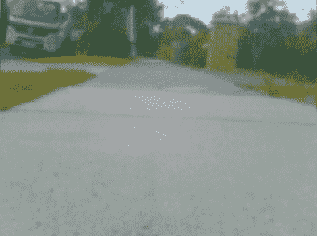

# 像你的树莓派视频流依赖于它

> 原文：<https://hackaday.com/2017/09/12/video-streaming-like-your-raspberry-pi-depended-on-it/>

Raspberry Pi 是一个非常通用的计算平台，尤其是在嵌入式应用方面。它们被用于各种安全和监控项目，以拍摄静态照片或录制视频片段供日后查看。这非常容易做到，而且有各种各样的工具可以用来完成这项工作。

然而，如果您需要尽可能少延迟的实时视频，事情会变得更加困难。我正在建造一辆使用蜂窝数据网络进行通信的遥控车辆。最大限度地减少等待时间是使车辆易于驾驶的关键。因此，我向最近的搜索引擎出发，开始研究我的问题。

我迎接挑战的第一个方法是古老的 VLC 媒体播放器。可悲的是，最初的实验充满了问题。让软件识别插入我的 Pi Zero 的网络摄像头花了很长时间，当我最终启动并运行时，它太慢了，没有用。通过 WiFi 播放视频，并在镜头前挥舞双手，显示我至少有两三秒钟的延迟。虽然我可能会进一步优化它，但我决定继续前进，尝试找到一些更轻量级的东西。

### 原生 MJPEG 流—如果您的网络速度很快

我转向的下一个流媒体工具是微软 Lifecam VX-2000，它本身提供高达 640×480 分辨率的 MJPEG 输出。这让我找到了一个名为 MJPEGStreamer 的工具。通过使用专用于该格式流的工具，我可以避免任何耗时的网络摄像头视频转码，这可能会给流带来延迟。起初，看起来这可能是我的问题的完美解决方案。一旦安装在 Raspberry Pi 上，就可以通过 web 界面远程访问 MJPEGstreamer，在 web 界面上呈现流。

为了测量延迟，我在手机上下载了一个秒表应用。我把手机放在通过 WiFi 显示视频流的屏幕旁边。然后用另一个摄像头拍摄手机&的数据流，我可以检查记录，并查看秒表上的时间和数据流上显示的时间之间的差异。

延迟低于 500 毫秒，我认为这是可以接受的。然而，有一个问题。MJPEGstreamer 没有很好地处理低速连接。该软件坚持无论如何都要发送每一帧，因此如果连接遇到困难，MJPEGstreamer 会一直等到帧发送完毕。这意味着虽然初始延迟为 500 毫秒，但在流运行的短短几分钟内，它就会爆发到几秒钟。这根本不行，所以我继续寻找。

### Gstreamer 是流媒体的瑞士军刀

我最终发现了一个名为 Gstreamer 的实用程序。这是一个真正的视频流工具的瑞士军刀，卷成一个神秘的命令行实用程序。Gstreamer 通过使用“管道”来配置，管道是一系列命令，指定从哪里获取视频，如何处理和编码视频，然后将视频发送到哪里。为了理解这是如何工作的，让我们看看我在下面的低延迟应用程序中使用的管道。

让我们先来看看事情的树莓派的一面。这是我使用的 GStreamer 命令:

```
gst-launch -v v4l2src ! "image/jpeg,width=160,height=120,framerate=30/1" ! rtpjpegpay ! udpsink host=192.168.2.3 port=5001
```

让我们把它分成几个部分。“gst-launch”是指 gstreamer 可执行文件。“-v”启用了详细模式，它告诉 Gstreamer 告诉我们正在发生的所有事情。当您试图对一个不起作用的流进行故障诊断时，这很有用。“v4l2src”告诉 Gstreamer 我们希望它从视频捕获源获取视频，在我们的例子中，是使用 Video4Linux2 驱动程序的网络摄像头。以下部分表明我们希望以每秒 30 帧的速度从 160×120 分辨率的相机中直接获取 JPEG 帧。“rtpjpegpay”将 JPEG 帧编码成 RTP 数据包。RTP 代表“实时传输协议”，是通过 IP 网络传输音频和视频的标准。最后,“udpsink”命令表示我们希望通过 UDP 连接将 RTP 流发送到端口 5001 上的主机 192.168.2.3。

现在我们来看看事情的接收端。为了观看流媒体，我使用了 Windows 10 笔记本电脑，最初的测试是通过 WiFi 进行的。这是管道:

```
gst-launch-1.0.exe -e -v udpsrc port=5001 ! application/x-rtp, encoding-name=JPEG, payload=26 ! rtpjpegdepay ! jpegdec ! autovideosink
```

 ``gst-launch-1.0.exe`指的是可执行文件，这里“-v”开关的功能相同。"-e "告诉远程机器在我们停止观看视频流时停止发送视频。这一次，我们使用“udpsrc ”,因为我们想要获取从端口 5001 传入的 RTP 流。我们必须告诉 Gstreamer，它正在查看 JPEG 格式的 RTP 流，这是应用程序、编码名称和有效负载命令所做的事情。“rtpjpegdepay”然后将 RTP 流解包为单独的 JPEG 帧，然后由“jpegdec”解码，并由“autovideosink”发送到屏幕上。

这看起来似乎很简单，但是要让管道两端都工作起来，需要进行大量的实验。弄清楚问题是出在发送端还是接收端通常会非常令人困惑。像使用带有不同图形卡的接收计算机这样简单的事情可以完全停止管道的工作，并且需要不同的插件或视频接收器。当我的笔记本电脑在英特尔和英伟达显卡之间切换时，我遇到了这个问题。值得庆幸的是，像“videotestsrc”和“testsink”这样的插件可以用来排除故障。

### 实践中的 Gstreamer

总的来说，性能很棒。即使切换到 4G 蜂窝数据连接，测得的延迟也始终低于 300 毫秒。天气好的时候，我可以轻松地使用高达 320×240 分辨率的视频流，没有任何问题。我怀疑发送 JPEG 帧效率非常低，我想尝试发送 H264 流来代替。



The resolution of the stream is very low, still very usable for remote piloting, but begs for a resolution upgrade.

虽然一些 Raspberry Pis 确实有硬件 H264 编码，但我更喜欢从原生流开始，以获得最高性能。我已经订购了一台使用 Pi 相机接口的 1080P 相机，我已经迫不及待地开始尝试了。

从根本上来说，Gstreamer 被证明是适合这项工作的工具，原因有很多。首先，它是开源的，基于高度灵活的插件架构。其次，它是轻量级的，很容易丢帧，所以接收机器总是显示最新的图像。这很难掌握，但当它起作用时，它就起作用了。

要获得更全面的使用各种设置来设置 Gstreamer 的教程，我强烈推荐艾纳·桑德伦的这篇文章，它教会了我很多我需要知道的东西。下面，我附上了我的远程车辆恶作剧的视频，由 Pi Zero、Gstreamer 提供，以及用几瓶冰啤酒度过的漫漫长夜。

最后，我也想听听更广泛的社区的意见——你最喜欢用什么方式来运行树莓 Pi 的低延迟网络摄像头流？在下面的评论里告诉我们吧！

 [https://www.youtube.com/embed/CfL4Pqm9kXI?version=3&rel=1&showsearch=0&showinfo=1&iv_load_policy=1&fs=1&hl=en-US&autohide=2&start=128&wmode=transparent](https://www.youtube.com/embed/CfL4Pqm9kXI?version=3&rel=1&showsearch=0&showinfo=1&iv_load_policy=1&fs=1&hl=en-US&autohide=2&start=128&wmode=transparent)

`