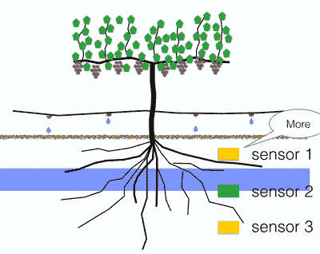
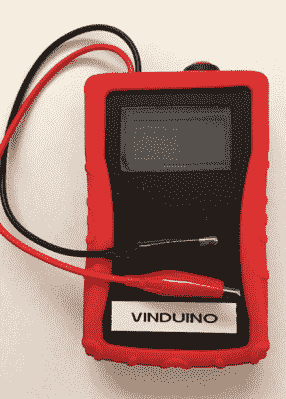

# Vinduino:节水 25%的充分灌溉

> 原文：<https://hackaday.com/2015/12/11/vinduino-full-irrigation-with-25-less-water/>

灌溉是一种相当原始的做法。当然，有计时器，和雨水传感器，但总的来说，我们基本上是把水倒在地上，并猜测正确的数量。[Reinier van der Lee]想要一种更好的方法来确保他葡萄园中的植物得到适量的水。这是金发姑娘版的“对”，不算少，也不算多。南加州正处于极度/异常干旱之中。水要花很多钱，但它也很稀缺，节约用水的影响不仅仅是底线。

他的解决方案是 Vinduino 项目。这是一套湿度传感器，与手持设备配合使用，测量灌溉效果。多个湿度传感器埋在不同的深度:接近地表，在根水平，和根水平以下。这让你知道什么时候水到达了根系，什么时候水渗透得比需要的更深。该项目被评为 [2015 年黑客日奖](http://hackaday.io/prize)的最佳产品，【Reinier】在[黑客日超级大会](http://hackaday.io/superconference)上发表演讲时介绍了该项目。请观看下面的视频，休息后加入我们，看看这款令人印象深刻的产品的开发过程。

 [https://www.youtube.com/embed/wonIS6WJl9I?version=3&rel=1&showsearch=0&showinfo=1&iv_load_policy=1&fs=1&hl=en-US&autohide=2&wmode=transparent](https://www.youtube.com/embed/wonIS6WJl9I?version=3&rel=1&showsearch=0&showinfo=1&iv_load_policy=1&fs=1&hl=en-US&autohide=2&wmode=transparent)

[Reinier]是南加州的移民，2010 年，在西装革履地工作了几年后，他决定买一个葡萄园。2011 年将标志着加州历史上最严重的干旱之一的开始，[Reinier]需要一种更好的方法来跟踪他的葡萄树的耗水量。

Vinduino 背后的想法是监测土壤湿度。在过去的几年里，他在葡萄园管理公司的帮助下给他的葡萄树浇水，该公司每周来一次，计算植物需要多少水，然后打开灌溉。

Vinduino’s 3-sensor setup.

给植物浇水是件棘手的事情。如果你只是打开灌溉，水就会通过土壤向下渗透，最终到达根部。确保植物的根部得到足够的水分比仅仅打开洒水器要难一些；把水开得太久，水会渗到比根部更深的地方。给根部浇水是浪费的，如果你施肥，一些养分会被冲走。

[Reinier]的解决方案是将多个土壤湿度传感器埋在不同深度——两个在根区，一个在下面。通过测量这些传感器周围的湿度，[Reinier]可以计算出何时停止给葡萄树浇水。这是一个相当出色的解决方案，因为你可以很容易地判断植物何时缺水，并解决了检测植物何时缺水的困难问题。

Vinduino’s Handheld Sensor

传感器本身也令人印象深刻。它们是基于石膏的传感器，由聚氯乙烯模具中的熟石膏制成。扔进几个不锈钢螺栓，并在模具中放一些玻璃纤维筛网进行加固，你就有了一个足够简单的湿度传感器，可以完成工作，而且足够便宜，可以分布在整个葡萄园。

制造一个成本不到一美元的灌溉传感器是一个伟大的创新，但这并不意味着什么，除非传感器可以很容易地集成到灌溉系统中。为此，[Reinier]开发了两种类型的阅读器，一种是手持的，另一种是连接到灌溉系统的无线节点。手持式传感器围绕 Arduino Pro Mini 构建，包括一个字符 LCD 显示器和两个鳄鱼夹。当传感器连接到这些鳄鱼夹时，传感器会显示地面的相对湿度。RF 和 WiFi 板包括用于连接三个传感器的螺丝端子，并将信息无线传回灌溉控制系统。

2014 年，[Reinier]仍然在一家葡萄园管理公司的帮助下管理农场，总共花费了大约 4300 美元来确保他的植物全年得到灌溉。2015 年，他用 Vinduino 经营他的葡萄园，消除了管理公司的成本，并设法减少了 25%的用水量。[Reinier]不仅成功节约了 430，000 加仑的水，还在不到一年的时间内收回了 Vinduino 项目的实施成本。如果这还不能改变加州农业的游戏规则，那就没什么能改变了。