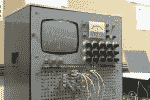
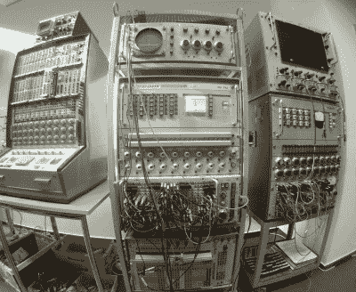
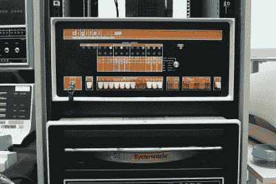
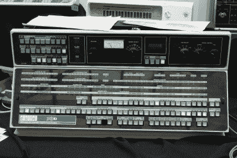
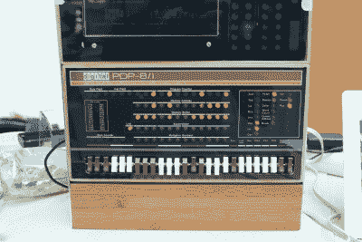
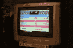
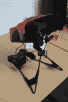
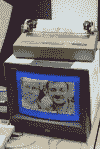

# 老式电脑节:柏林 2015

> 原文：<https://hackaday.com/2015/10/09/vintage-computer-fest-berlin-2015/>

 柏林是上周末成为极客的好城市。除了[柏林创客节](http://wp.me/pk3lN-IXj)，还有 2015 年柏林复古计算节(VCFB)。每个 VCFB 都有一个特殊的主题，今年是模拟计算机，但也不乏大大小小的旧计算机、图文电视机、老式视频游戏机和普遍的书呆子怀旧情绪。

## 模拟计算

我们花了很多时间玩来自[海因茨·尼克斯多夫电脑博物馆](https://www.hnf.de/en/home.html)收藏的[电子联合公司](http://www.computerhistory.org/brochures/companies.php?alpha=d-f&company=com-42b9d80c49332) EAI Mini-AC。这是一台微型模拟计算机，可能是为培训目的而设计的，但也可以用于一些有趣的演示。它有你做数学所需的大部分模拟电路:积分器、加法器、乘法器、限幅器、比较器、开关等。它是在一个盒子模拟器中用一个弹跳球编程的(有重力！).

这种电脑的一个非常巧妙的特点是，整个面板可以撕下来，这样你就可以保存一个工作程序。(你可以看到另一个程序牌放在机器的顶部。)正确安装后，插针会穿过面板并与内部接触。不幸的是，对于现代老式电脑策展人来说，这意味着这台机器与展出的其他使用常规香蕉插头的机器相比，具有特殊的引脚。

EAI Mini-AC 的另一个非常酷的功能是它有一个运行/停止按钮。你会问，如何停止模拟计算？许许多多的内部开关和一些巧妙的电路。除了手动布线(编程)计算机之外，在每个放大器电路之前，内部还有一个开关，用于断开输入信号。当按下停止按钮时，所有放大器的所有输入都断开，该值应该保持一段时间。如果你是我们，你会期望电容器上的电压随着时间慢慢下降。当我们站在那里观看并谈论它的内部构造时，显示的数字在第三个小数位至少五分钟内没有变化。

这个怪兽体内还有很多其他奇特的电路。当时的运算放大器都是由分立晶体管构建而成，但仍具有斩波稳定功能，可最大限度地降低失调电压。在模拟计算机中，非常微小的电压差异非常重要，正是模拟对精度的惊人需求最终扼杀了模拟计算机。

【Stephan hlt gen 博士】带来了这些六七十年代的模拟齿轮架。包括一个基于管道的(！)Heathkit EC-1 学习电脑，还有一堆 Telefunken 装备。

即使有美丽的灯光和插上电缆实现数学功能的动手乐趣，我在模拟计算展览中交谈过的人都不想让时间倒流，放弃他们的数字计算机，更不用说花时间来重新制作这些模拟动物之一了。我们认为这是它们被原样保存下来的更多原因:它们玩起来很有趣，但是一旦它们消失了，没有人会有耐心和知识去重建它们。

## PDP 数量众多

如果你认为没有人会再造模拟计算机，那么数字时代的早期样本也会如此，这也许是情有可原的，但你大错特错了。看着展览的东墙，你会以为你在一个 DEC PDP 博物馆。

【Phillipp Hachtmann】带来了一台完整的老式 [PDP-8/e](http://www.pdp8.net/) 运行速度和它建成的那天一样快，它是在专门为节日从慕尼黑带来的磁带中读取的。(为了方便起见，磁带上的所有数据都保存到了更现代的介质上。我们询问时装载的似乎主要是电脑游戏。)计算机本身，甚至它所运行的磁带，看起来都惊人地坚固，从 70 年代中期到今天一直保持可读。祝你在 2055 年对你现在的笔记本电脑和它的硬盘说同样的话。

 在真正的 PDP-8 旁边是一大堆真正的 PDP 面板。[jrg Hoppe]和他的项目让一堆这样的东西又活了过来，尽管有着现代的内部结构。我们之前实际上已经[报道过这个特殊的版本](http://hackaday.com/2014/10/28/restoring-a-pdp-10-console-panel/)，但是简短的版本是有定制的适配器板连接到面板，然后允许它从一个使用 PDP-10 仿真器软件的 BeagleBone 运行。[jrg]也有[非常详细的他的每个面板的模拟器](http://www.retrocmp.com/projects/blinkenbone/176-blinkenbone-download-and-run-simulated-panels-for-free)供你在线查看。根据真实面板的真实照片建造，每个 LED 都是独一无二的，许多开关都有点不稳定；这些模拟装置有实际面板的 95%的魅力，但重量却轻了约 100 磅。如果你使用触摸屏，你甚至不会错过其中的区别。

 从复古到半复古，我们来到了最早的 PDP-8 型号之一 [PiDP-8/l](https://hackaday.io/project/4434-pidp-8i) 的完全现代化的重建，这也是 Hackaday.io 上竞争 2015 年 Hackaday 奖[最佳产品奖](https://hackaday.io/list/7403-2015-best-product-finalists)的一个项目。当我问[奥斯卡·维穆伦]为什么是这台电脑时，他指出这是有最多闪光灯的 PDP-8 型号。我们不需要进一步的说服。

无论如何，PiDP-8 项目将[jrg]对旧 PDP 面板的改编更进了一步，并完全从头开始重新创建它们，大大简化了所有的接口电子设备，缩小了一个完全逼真的 PDP-8 克隆体，它运行在 Raspberry Pi 上，可以舒适地放在您的桌面上。如果实际的 PDP-8/e 需要一辆小型移动货车来携带，并且面板可能适合您的掀背车，那么 PiDP-8 项目将为您提供一个 PDP 克隆，您可以将其放在您的随身行李中。但是你没有那种老式磁带机的味道。

## 视频游戏

在 VCFB 花费的大部分时间都是在谈论旧电脑，但是当休息的时候，有一整个房间都是旧游戏机，甚至许多经常参展的人在他们展出的电脑上下载他们最喜欢的游戏。在最初的 SNES 版本中，马里奥推车很受欢迎，每次我们试图溜过去，给老耀西的轮胎一个旋转时，它就被占了。

 曾经有一款老款的雅达利动视田径游戏，这些原始的硬件踏板似乎就是为游戏设计的。你不能尽可能快地按下按钮来让你的角色跑起来，你必须用脚轻敲。它给了游戏一个完全更加真实的感觉，并且可能是一个还算不错的练习。Wii Fit 看起来不再那么具有革命性了。

 即使是 3D 游戏似乎也不那么超前。直到上周末，我们才玩了任天堂 1995 年的 3D [虚拟男孩](https://en.wikipedia.org/wiki/Virtualboy)游戏机，这很有趣。它安装了[马里奥的网球](https://en.wikipedia.org/wiki/Mario%27s_Tennis)，很好地利用了 3D 效果。显然，虚拟男孩体内有一个振动镜，它交替地向左右眼投射一个通道，以产生 3D 图像，你可以听到机器发出一点点嗡嗡声。

## 直到下一次…

 如果你有任何类型的技术狂热(我们刚刚发明了这个词)或者只是想看看所有的大惊小怪是什么，看看你附近的[美国](http://www.vintage.org/)或[欧洲(读:德国)](http://vcfe.org)老式电脑节，[浏览我们的档案](http://hackaday.com/?s=vintage+computer+festival)，或者只是继续关注更多的报道，因为我们肯定会回来。

如果你有什么特别的旧电脑癖，想要倾诉，或者只是让我们留意，请在评论中告诉我们。