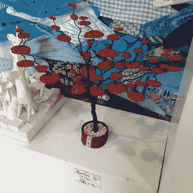
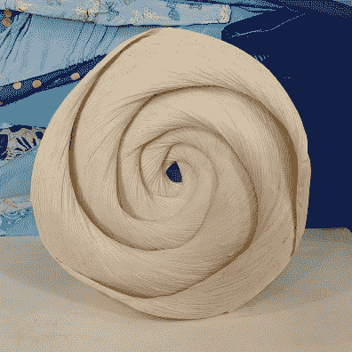
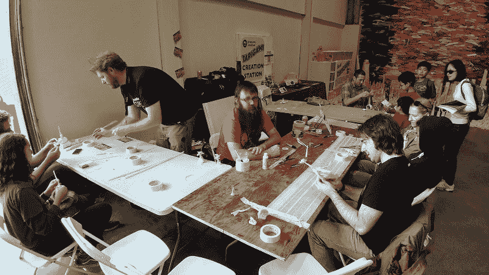

# 参观 Tapigami 磁带城，在那里磁带是社会的结构

> 原文：<https://hackaday.com/2018/05/19/visit-tapigami-tape-city-where-tape-is-the-fabric-of-society/>

湾区创客节上有这么多很酷的事情，要想脱颖而出需要一些特别的东西。在几百平方英尺的地板和墙壁上贴上胶带就可以了。欢迎来到 [Tapigami](http://www.tapigami.com/) 胶带城，这是一个由【Danny Scheible】举办的巡回艺术展。

我们中的许多人在年轻时使用建筑用纸、胶水和胶带来表达我们的创造力。塔皮加米的极简主义放弃了纸张和胶水，艺术实践者坚持使用胶带。这是一种容易获得的日常材料，因此开始享受乐趣没有任何障碍。虽然磁带确实有一些明显的局限性，但它可以非常有创造性地进行精心制作，并且仍然几乎只使用磁带。

    

Tapigami 展位非常乐意接待那些希望学习磁带的人。在他们的桌子前，年轻人和老年人都可以坐下来，开始用胶带制作基本的形状。这从圆锥体、圆柱体和立方体开始，然后组合成更复杂的作品——有点像 OpenSCAD，但都是用胶带。

湾区创客集会的参与者不应该错过亲自观看胶带城，它位于 2 区的东南角，非常值得一看。(离 Tindie/Hackaday 展台不远，顺道过来打个招呼！)虽然坚持使用磁带很有趣，但我们可以看到黑客人口将这些概念提升了几个档次。如果你用胶带完成了令人兴奋的事情，你知道我们的提示线在哪里。

 [https://www.youtube.com/embed/T7cgp0i2jrU?version=3&rel=1&showsearch=0&showinfo=1&iv_load_policy=1&fs=1&hl=en-US&autohide=2&wmode=transparent](https://www.youtube.com/embed/T7cgp0i2jrU?version=3&rel=1&showsearch=0&showinfo=1&iv_load_policy=1&fs=1&hl=en-US&autohide=2&wmode=transparent)

