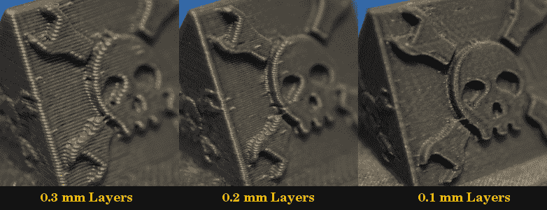
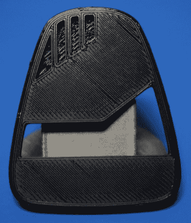
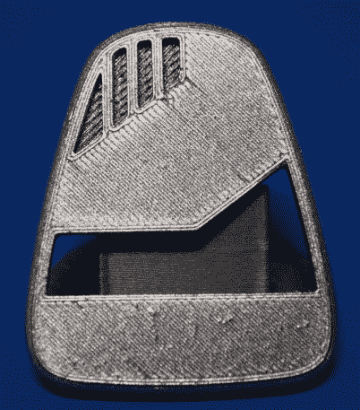
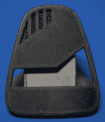
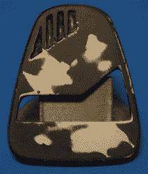
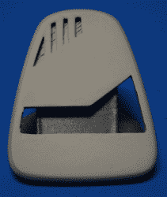

# 可视化 3D 打印装订指南

> 原文：<https://hackaday.com/2017/11/15/visual-3d-print-finishing-guide/>

随着 3D 打印机的价格降至创纪录的低价，越来越多的人加入了增材制造的行列。作为消费级桌面 3D 打印的长期信徒，这对我来说是一个非常激动人心的时刻；像 Thingiverse 或 Reddit 上的 3D 打印社区这样的地方产生的创造力绝对令人难以置信。但我这个现实主义者知道，尽管制造商的宣传材料可能会让你相信，这些不是《星际迷航》级别的复制体。从这些机器里出来的东西通常都是千疮百孔的(从微小到灵魂粉碎)，在它们看起来像成品之前，可能需要相当多的清理工作。

如果你希望从你的 3D 打印机中得到的只是一些像样的玩具船和一些廉价的 T2 口袋妖怪，那么不要害怕。即使是最挑剔的廉价打印机也能打印一整天。但是，如果你想制作展示品、角色扮演道具，甚至是值得向投资者展示的原型，你有一些工作要做。

随着时间、耐心和一些商业产品，你可以完成最终目标:将 3D 打印的物体变成看起来不像 3D 打印的东西。为了这个演示的目的，我将创建一个*星际迷航:航海家* 中“紧急医疗全息图”使用的[移动发射器的复制品。我既不能确认也不能否认我选择这个例子是因为我现在正在网飞重新观看*航海家*。让我们把它变得好看些。](http://memory-alpha.wikia.com/wiki/Mobile_emitter)

## 选择图层高度

在你拿出砂纸或颜料之前，在印刷开始之前，你需要做出决定。任何使用过 3D 打印机的人都会告诉你，图层高度是影响整体打印时间的最大因素。较厚的层速度更快，但会导致表面细节的损失。您甚至需要在打印开始之前就决定，更高的分辨率设置是否值得花费额外的时间，唯一的方法是清楚地了解打印机的分辨率将如何影响您的最终产品。

下图说明了三种最常见的图层高度(0.3 毫米、0.2 毫米和 0.1 毫米)对最终打印质量的影响。作为参考，Hackaday 标志中的头骨比美国硬币上的林肯头像稍大一点。

看着这张图片，你可能会认为你应该把切片器设置为 0.1 毫米，并处理增加的打印时间。但我故意创造了一个例子，将真正强调层高度之间的差异。你不会总是处理这么小的表面细节，除非你有一个很好的理由，否则打印 0.1 毫米的层是没有意义的。

为了向您展示为什么层高对您的特定型号可能重要，也可能不重要，让我们翻转这些演示，看看背面:

在 0.3 毫米的印刷品上，这些层次仍然更明显，但总体而言，三者之间的差异并不明显。没有细节显示层的高度，一个平坦的表面最终是…嗯，平坦的。这个故事的寓意是:如果你的模型没有值得使用分辨率的表面细节，就不要使用较低的图层高度。

如果你打算用下面的方法完成一个印刷品，我个人会坚持 0.2 毫米，如果是一个形状相对简单的大印刷品，把它提高到 0.3 毫米以节省时间。无论哪种方式，成品都是平滑的，所以当它第一次从打印机出来时，没有理由担心可见的层线。

## 步骤 0:打印

所以现在你已经很有希望地找到了适合你的模型的图层高度，你需要把它打印出来。这第一步听起来很容易，但请记住，如果你想生产出高质量的作品，你需要从一台校准良好的 3D 打印机开始。确保你的床是水平的，[并检查你的挤压乘数，以确保你没有过度挤压或挤压不足](https://hackaday.com/2016/01/27/3d-printer-tool-set-your-extruder-steps-with-ease/)。打印一些基准非常有助于让您的打印机拨入，您真的应该花时间来做好它，因为从长远来看，这只会让您更加烦恼。

### 控制示例

所以你可能想知道为什么你不能在你的机器支持的最低层高度打印你的作品，等待它出来，然后只是在它离开床的时候涂上颜色。好吧，你可以*可以*，但是结果和只是用彩色细丝打印出来没有太大的不同。但这是您要求的，所以让我们来看看它是如何产生的，并在本演示中将它称为我们的“控件”:

  Straight off the Printer  Printed and Painted

如果这是在你不得不参加万圣节派对的几个小时前，这可能会看起来足够好，你可以侥幸逃脱。但是在我的詹姆斯·斯科蒂·杜汉签名照旁边的架子上？不，先生，这不行。

## 第一步:打磨

你喜欢打磨吗？不，你当然不知道。没人知道。但是你会做很多，所以你最好习惯这个想法。这个早期，我用 80 粒度的干砂块，真的攻击它。我发现黑色打印在这个阶段很有帮助，因为黑色细丝在打磨后会变成白色/灰色，这样更容易看到你在做什么。一旦你去掉了所有的光泽，作品开始看起来暗淡无光，你就在正确的轨道上。

## 第二步:环氧涂层

 我是 [XTC-3D 的忠实粉丝，这是一种由两部分组成的环氧树脂产品，专门用于平滑和密封 3D 打印品](https://www.smooth-on.com/product-line/xtc-3d/)。它相当便宜，走了很长一段路，我认为结果不言自明。我不想把这变成使用 XTC-3D 的指南(查看 YouTube 上制造商的一些官方指南)，但一般来说:一次混合大约 7 毫升，一旦它开始变得有点粘，就用一次性刷子刷上。这个想法是，当它仍然有足够的流动性找到自己的水平时，把它放在上面，这允许它填充层线，给你留下坚硬光滑的表面。

XTC 3D 肯定有一个学习曲线。很容易涂得太多，擦掉表面细节，但太薄，涂层没有效果。我建议事先试一些碎花，感受一下它应该如何流动。XTC-3D 的固化时间大约是 24 小时，所以在继续之前，为这一步留出足够的时间。

## 第三步:沙子和填充物

 在这一点上，我用一张 220 粒度的湿纸将固化的 XTC-3D 的光泽去掉，为底漆做好准备。就像当你用砂纸打磨未加工的印刷部分时，你希望继续打磨，直到整个表面看起来暗淡无光。任何打磨后仍有光泽的地方都将是一个低点，需要填补。[我选择的填料是田宫“基本型”腻子](https://www.tamiyausa.com/items/paints-finishes-60/tamiya-maintenance-material-62000/putty-87053)。这基本上是塑料模型套件的 Bondo，干燥*极快*。从你把它从管子里挤出来到它变硬，你大概有 30 秒的工作时间，所以不要试图一次做太多。

在你用油灰填满低点后，你要用 220 湿纸再检查一遍。这里的目标是用油灰填充凹陷和缺口，并将其融入表面。油灰的边缘通常应该有“云”的外观，如果你用手指在表面上滑动，你肯定感觉不到它。

## 第四步:底漆

 一旦你对作品的平滑程度感到满意，就该给它涂色了。我使用[防锈油填充底漆](https://www.rustoleum.com/product-catalog/consumer-brands/auto/primers/filler-primer-spray)，因为它便宜而且基本上在任何地方都能找到。顾名思义，这款底漆相当厚，可以进一步填补你在前面步骤中遗漏的任何瑕疵。我喜欢涂三层底漆，然后用 400 粒度的湿砂纸打磨。在这一点上，你的作品应该基本上感觉像玻璃。

如果你计划进行一项真正显示表面瑕疵的油漆工作，你可以用 800 粒度的湿纸进行最后一遍打磨，去除底漆上的任何痕迹或干燥时可能落在工件上的灰尘。

## 第五步:油漆和透明涂层

 现在剩下的就是做你最后的画了。事实证明，我对画笔或者任何与艺术有一点点相似的东西都很糟糕，所以我只使用五金店的喷雾罐。对于这件作品，我使用了基本的银色金属喷漆，然后是透明的哑光，以消除光泽，给人一点更真实的表面纹理。

## 最后的想法

虽然这种方法可能看起来很费力，但我认为它说明了一个事实，越来越多的人开始意识到:3D 打印机不会创造奇迹，它们和其他任何工具一样。同样，你也不能把一棵树扔向桌锯，然后期望餐桌从另一端出来，重要的是要明白，3D 打印应该被视为将想法从数字变为物理的整个过程中的一步。诚然，这是一大步，但不一定是最后一步。

有些人可能会看这个例子，并声称我“作弊”，因为大部分的作品表面被砸到床上，因此相对平坦的开始。这可能是真的，但是如果你按照步骤并寻找图像中展示的视觉线索，这种方法将在印刷对象的侧面和顶部和底部一样有效。这是我去年在我的 [ThinkGeek 启发的*Star Trek*phone dock](https://hackaday.com/2016/11/16/star-trek-phone-dock-might-as-well-be-from-picards-night-stand/)上获得光滑金属表面的相同程序，它在打印床上的表面积非常小。

当然，这不是*完成 3D 打印零件的唯一方式*。我们很想听听你是如何完成你的印刷，并在你的项目中获得未印刷的外观。