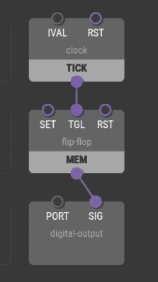

# 用 XOD 进行可视化开发

> 原文：<https://hackaday.com/2017/08/13/visual-development-with-xod/>

早期的程序员必须用二进制、八进制或十六进制数字来表示代码。这很快让位于将程序表示为文本，由计算机进行汇编、编译或解释。即使在今天，这仍然是最常见的编程方式，但是已经有人尝试开发更多的可视化方式来图形化地创建程序。如果你编程像 Arduino 这样的微控制器，你应该看看 [XOD](https://xod.io/) 看看你是如何喜欢可视化地创建软件的。该软件是开源的，目前可以针对 Arduino 或 Raspberry Pi。

[](https://hackaday.com/wp-content/uploads/2017/08/blink.png) 您可以在 web 浏览器中启动 IDE 或下载本地副本。您将节点从面板转移到类似网格的工作区。这些节点可能是输入、输出、处理块，或者代表真实世界的 I/O 设备。节点有特定类型的输入和输出，您将它们连接在一起，只连接相似的类型，尽管有可以转换的块。

例如，右边是一组简单的节点，它们构成了闪烁 LED 程序的原型。一个时钟节点产生一个触发存储元件的脉冲，一个数字输出接受该信号和一个指示它代表哪个端口的常数值。

这是一个简单的例子，但是它展示了加入节点的直观流程。有一个合理的节点类型阵列和足够的[文档](https://xod.io/docs/)。

超声波传感器、温度传感器、伺服系统、液晶显示器、按钮和 H 桥都有现成的节点。您可以创建自己的超级节点(补丁),也可以创建多个不连续的流来一次执行多个任务。

当您生成代码时，您会得到许多设置运行时系统和您使用的节点的样板文件。您的主代码似乎在一个求值函数中。例如，下面是对应于简单图形闪烁程序的代码片段:

```

void evaluate(Context ctx) {
State* state = getState(ctx);
TimeMs tNow = transactionTime();
TimeMs dt = getValue&lt;input_IVAL&gt;(ctx) * 1000;
TimeMs tNext = tNow + dt;

if (isInputDirty&lt;input_RST&gt;(ctx)) {
if (dt == 0) {
state-&gt;nextTrig = 0;
clearTimeout(ctx);
} else if (state-&gt;nextTrig &lt; tNow || state-&gt;nextTrig &gt; tNext) {
state-&gt;nextTrig = tNext;
setTimeout(ctx, dt);
}
} else {
// It was a scheduled tick
emitValue&lt;output_TICK&gt;(ctx, 1);
state-&gt;nextTrig = tNext;
setTimeout(ctx, dt);
}
}

```

有一些粗糙的边缘，这对于新软件来说并不奇怪。首先，节点有固定数量的输入和输出。例如，如果你想要一个 10 输入的与门，你必须建造它。另一个明显的问题是我们没有办法一次选择很多项目。如果你决定要把一大堆节点下移，为新的东西腾出空间，你会有很多工作要做。

当然，还有其他拖放式编程语言。我们之前已经报道过 Arduino 和 T2 树莓 Pi 的 Scratch。然而，这是用最少的设置尝试基于流的编程的非常简单的方法。