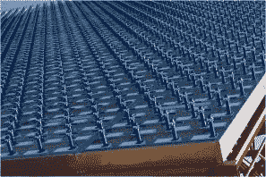
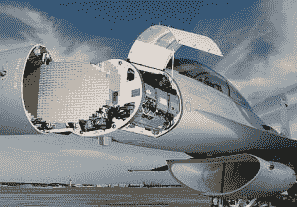
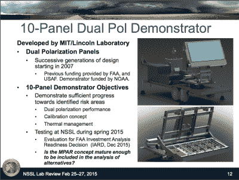
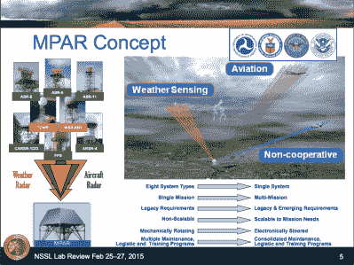
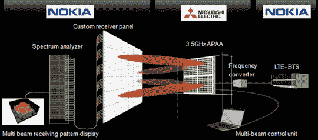
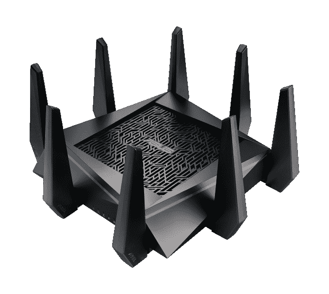
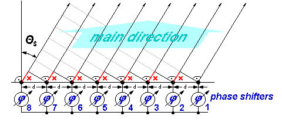
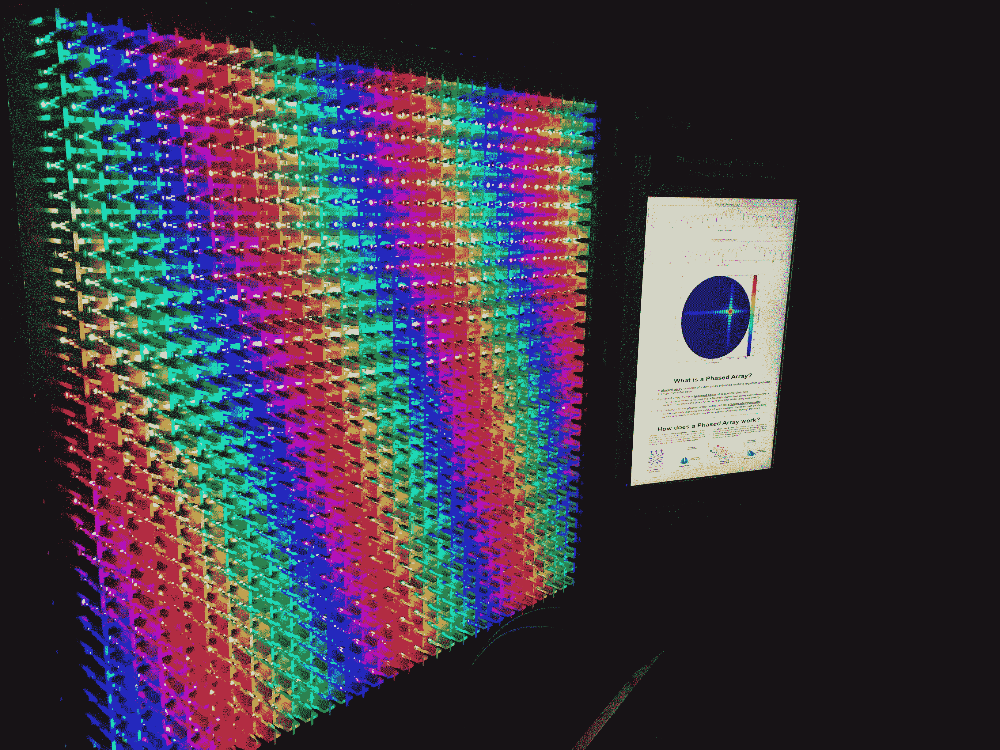

# 相控阵天线系统的可视化

> 原文：<https://hackaday.com/2017/01/05/visualization-of-a-phased-array-antenna-system/>

相控阵天线系统无处不在。我们现在可以在 WiFi 路由器上看到多输入多输出(MIMO)天线系统。很快，相控阵天气雷达系统将有助于预测天气，确保航空旅行安全，相控阵基站将成为下一代无线数据通信 5G 的支柱。但是什么是相控阵天线系统呢？它们是如何工作的？借助 1024 个发光二极管，我们将向您展示。

最好先回顾一下相控阵天线技术在过去的用途、现在的情况以及未来的发展方向，然后我们将向您展示它的工作原理。

### 军事工业联合体:相控阵技术的先驱

相控阵技术是军事应用的先驱。第二次世界大战后，飞机和军械的速度不断提高，这使得对天线扫描时间的要求从几秒钟提高到了几毫秒。

第一个全尺寸相控阵雷达系统是 [FPS-85](https://en.wikipedia.org/wiki/Eglin_AFB_Site_C-6) ，用于探测和跟踪本质上快速移动的空间物体。

相控阵雷达技术的其他标志性例子包括 SPY-1 相控阵雷达、PAV PAWS 等。

  Phased Array Antenna Systems first realized widespread use in military applications.    

### 民用相控阵雷达技术的首次广泛应用:

为了管理空中交通的增长并整合大量现有的老化雷达基础设施，包括大多数类型的主要空中交通管制雷达和气象雷达，多功能相控阵雷达( [MPAR](https://www.nssl.noaa.gov/about/events/review2015/science/files/Hondl_NSSLReview2015_MPAR_Overview.pdf) )系统正在开发中，原型将很快投入使用。这将成为相控阵雷达技术的第一次(很可能是第一次)大规模民用部署。

The MPAR phased array radar system, for weather and air traffic control.

### 为您的移动设备提供更多无线带宽

第五代无线系统( [5G](https://en.wikipedia.org/wiki/5G) )的关键是使用相控阵天线技术，其中各个无线设备将通过从[基站](http://www.mitsubishielectric.com/news/2015/0408.html)发射/接收的波束进行跟踪，从而实现更大的数据带宽，这些带宽被离散化为各个微波波束。

许多 WiFi 路由器现在使用多输入多输出(MIMO)天线阵列来减少多径信号损失，随着数据速率的增加，多径信号损失迅速成为越来越大的问题。

### 相控阵天线系统是如何工作的？

你如何制造一束“微波能量”并把你的接收器对准太空中的正确点？

Synthesizing a focused beam of microwave radiation with an array of elements fed with the same microwave signal where each element is independently phase controlled.

这里有一个很好的教程，但是关键是，如果我们给一组天线元件馈送相同的微波信号，那么我们可以使用这些元件将微波束指向(或者通常所说的转向)空间中的任何地方。这种波束控制是通过使用与每个天线单元串联的移相器(或其等效物)来实现的。

为了让上面的解释更有趣和更容易理解，我在[麻省理工学院林肯实验室](http://www.ll.mit.edu/)的朋友创建了这个天线阵列如何工作的直接可视化([最近在 2016 年 IEEE 国际相控阵系统和技术研讨会上展示了](http://www.array2016.org/))。这几乎就像你戴上一副“微波护目镜”,看着天线阵列！

MIT Lincoln Laboratory Phased Array Demonstrator, on display at the 2016 IEEE Intl. Symposium on Phased Array Systems and Tech.

一个由 MIT/LL 建造的实际相控阵天线系统的树脂玻璃复制品塞满了[NEO Pixel](https://www.adafruit.com/category/168?gclid=CM7Sjo-G-c8CFcdbhgodtmgAEQ)led。每个天线元件由两个 NEO 像素照亮，这是一个双极化相控阵，使用一个 LED 用于垂直极化，另一个用于水平极化。

每个近地天体像素的颜色被映射到其相应天线元件的相位，以在任何给定方向上投射微波能量束，该波束图案由阵列旁边的平板显示器绘制。

每个 LED 的亮度与其各自天线元件的发射功率成比例。该阵列支持幅度渐变，以合成低旁瓣波束模式和许多先进的阵列模式。

 [https://www.youtube.com/embed/mzhMUH-Q8kY?version=3&rel=1&showsearch=0&showinfo=1&iv_load_policy=1&fs=1&hl=en-US&autohide=2&wmode=transparent](https://www.youtube.com/embed/mzhMUH-Q8kY?version=3&rel=1&showsearch=0&showinfo=1&iv_load_policy=1&fs=1&hl=en-US&autohide=2&wmode=transparent)

借助这一可视化系统，您可以使用操纵杆手动移动天线波束，并实时查看发光模式和波束图的变化，从而对相控阵波束控制和波束模式有一个即时、直观的了解。绝对惊艳！

### **总结**

相控阵天线系统将在我们的现代生活中发挥核心作用，促进更大的无线带宽，使航空旅行更安全，天气预报更准确。像这里显示的阵列这样引人注目的可视化将有助于广泛理解电磁学和现代天线技术。