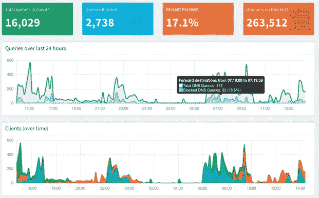

# 用 Pi Sense Hat 可视化被屏蔽的广告

> 原文：<https://hackaday.com/2018/04/14/visualizing-blocked-ads-with-the-pi-sense-hat/>

Pi-hole 是一个开源项目，旨在将您抽屉中收集灰尘的树莓 Pi 变成一个全网络广告拦截设备。它不仅能阻止广告出现在你所有的电脑和移动设备上，还能记录有多少广告被屏蔽，以及它们来自哪里。以防万一，你想知道在一段时间内你错过了几千个广告。

 虽然 Pi-hole 的 web 界面中生成的图形非常漂亮，但是如果您只是想要一种快速的方式来可视化您的广告拦截系统有多有效呢？你并不太担心确切的数字，你只是希望你的桌子上有东西闪现，让你知道所有的广告都将被`/dev/null`。进入由[simianAstronaut] 精心命名的 [pi-hole-visualizer。](https://github.com/simianAstronaut/pi-hole-visualizer)

通过向运行广告拦截的 Pi 添加一个 Sense HAT，这个 Python 脚本将生成一个动画可视化，即使从远处也可以很容易地解释。主要显示的是 DNS 流量的条形图，其中每列的高度和颜色表示特定时间间隔内的相对活动。第二个屏幕显示了一个螺旋图，让你知道在广告进入你的设备之前被屏蔽的比例。

可以从命令行给脚本一组选项；控制显示器的物理方面，如方向和 LED 亮度，以及不同可用可视化的可配置参数。作为一个额外的奖励，它还支持使用 Sense HAT 操纵杆在模式之间交互切换。

将树莓派变成广告拦截设备可以追溯到最初的树莓派的旧时代，但有趣的是看到这个概念变得如此先进。记住，[不是所有的广告都是不好的](https://hackaday.com/2013/10/04/new-ads-please-whitelist-hackaday-on-adblock/)。