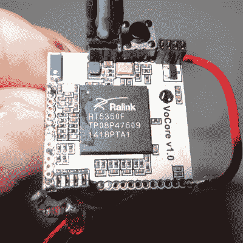

# VOCore 教程让你开始使用微型路由器

> 原文：<https://hackaday.com/2015/11/15/vocore-tutorial-gets-you-started-with-tiny-router/>

[Vadim]写了这篇简短而甜蜜的教程，介绍如何开始使用 Vocore (微型)OpenWRT-router-on-a-stamp。如果你需要比 ESP8266 更多的计算能力，并且你想要一个在一平方英寸的电路板空间中的开源 Linux+Wifi 解决方案，那么 Vocore 看起来相当不错。

我们不久前已经讨论过这个话题了。它有 28 个 GPIOs，都可以通过 OpenWRT 中的系统调用来访问。如果你添加一个扩展 USB 和以太网功能的坞站，它会变得更像计算机，但这也会使价格翻倍。

 入门一个没有多余功能的 Linux 盒子(芯片？)可能会令人生畏。因此，[Vadim]详细介绍了通过 WiFi 和 SSH 的 Vocore 的第一次设置，然后带您浏览一个简单使用 GPIOs 的按钮和 LED 风格的“Hello World”应用程序，这是一件好事。

他说他最终会将它与 TI CC110 sub-gig 无线电单元连接，但这将涉及编写一些驱动程序，并将花费他一些时间。我们很想看看如何连接外设，所以我们在屏息等待。

[Vadim]还为 Vocore 提供了一个解封脚本，可以恢复默认固件，让你摆脱自己陷入的困境。基本上，你通过 USB 串行适配器连接到设备，运行他的脚本，你应该设置。

你们有人在用 Vocore 吗？还是其他 OpenWRT 路由器？给【Vadim】的教程看一眼，让我们知道你的想法。