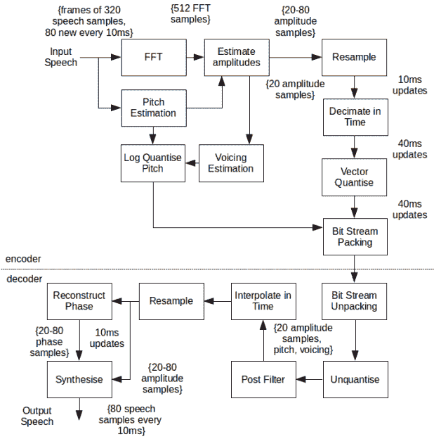

# 每秒 700 比特的声音

> 原文：<https://hackaday.com/2017/01/20/voice-at-700-bits-per-second/>

在其他条件相同的情况下，带宽更宽的信号可以承载更多的信息。有时这些信息是数据，但有时是频率。调幅广播电台(传统上)使用约 30 千赫的带宽，而调频电台消耗近 200 千赫。模拟视频信号过去会占用更多的空间。然而，你的大脑是一个伟大的信号处理器。要理解语音，不需要非常高保真的再现。

无线电运营商多年来一直利用这一事实。传统的短波广播占用了大约 10 千赫的带宽，但是通过去掉载波和一个边带，你可以将声音压缩到大约 3 千赫，而且仍然清晰可辨。典型的语音编解码器(也就是将语音转换为数字数据，然后再转换回来的东西)使用大约 6 kbps 到 64 kbps。

[大卫·罗]想要改变这种状况。他正在开发一种用于业余无线电的编解码器，可以将语音压缩到每秒 700 比特。他试图保持类似于他现有的每秒 1300 比特编解码器的声音质量，你可以在他的帖子中听到来自两者的声音样本。你会注意到声音听起来几乎像老式的语音合成，但它是可理解的。

您的耳朵在频率响应方面不是线性的，编解码器利用了这一点，对低频的采样多于高频。还有其他专门的信号处理和滤波步骤来提高音频质量。下面是框图(你可以在原始帖子中找到更多信息):

窄带宽有很多优点:每个给定的频带有更多的信道，更少的干扰，和更好的抗噪声能力。能够传送语音的 700 Hz 音频信号将对通过语音进行的无线电通信产生重大影响。

该编解码器旨在与 [FreeDV](https://hackaday.com/2015/09/06/hams-talk-digital/) 集成。我们之前已经讨论过 T2 业余无线电产生的技术财富。也许其他人会在与业余无线电无关的其他情况下使用这种编解码器。

感谢[Rob]指出这一点。